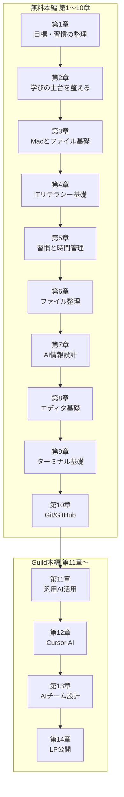

# Rebuild AI Guild — 学習ロードマップ

AI時代の駆け込み寺、**Rebuild AI Guild** の学習ロードマップ（第1〜14章）です。

PCが苦手でも、Cursorで心が折れても、ここから小さく始められます。
1テーマは15〜30分を目安に、手を動かしながら進めてください。

## はじめに

**[▶ 第1章 01 目標を整理する](教材/第01章-目標と習慣/01-目標を整理する.md)** から始めてください。

- [第1章の目次](教材/第01章-目標と習慣/README.md) ｜ [教材一覧](教材/README.md) ｜ [答え一覧](答え/README.md)

## このリポジトリの見方

| 場所 | 内容 |
|---|---|
| このページ | 全体の地図（ロードマップ） |
| [`教材/`](教材/) | 教材本文 |
| [`答え/`](答え/) | 4択チェックの答え合わせ |

理解回では、教材を読んでから答えページへ進みます。答えページから教材本文へ戻るリンクもあります。

## 全体の流れ

**第1〜10章**は無料本編、**第11〜14章**は Guild 本編です。
このリポジトリでは第1〜14章すべての教材と答えを閲覧できます。

---

## 第1章：目標と習慣の整理・管理

まず行動を始める章です。PC操作は前提にしません。
[第1章の目次](教材/第01章-目標と習慣/README.md)

| # | テーマ | 教材 | 答え |
|---|---|---|---|
| 01 | 目標を整理する | [教材](教材/第01章-目標と習慣/01-目標を整理する.md) | — |
| 02 | 一日・一週間の過ごし方を洗い出す | [教材](教材/第01章-目標と習慣/02-一日・一週間の過ごし方を洗い出す.md) | — |
| 03 | 学びの時間を確保し、毎日やる1アクションを決める | [教材](教材/第01章-目標と習慣/03-学びの時間を確保し毎日やる1アクションを決める.md) | — |
| 04 | スタート3週間ルール | [教材](教材/第01章-目標と習慣/04-スタート3週間ルール.md) | [答え](答え/第01章-目標と習慣/04-スタート3週間ルール-答え.md) |
| 05 | 落ち着いて続ける・うまくいかないとき考える | [教材](教材/第01章-目標と習慣/05-落ち着いて続ける・うまくいかないとき考える.md) | — |

---

<strong>第2章〜第14章の目次（クリックで開く）</strong>

## 第2章：学びの土台を整える

急いで進まないための考え方の土台を整えます。

| # | テーマ | 教材 | 答え |
|---|---|---|---|
| 01 | 早く結果が欲しい——その欲に気づく | [教材](教材/第02章-学びの土台/01-早く結果が欲しい-その欲に気づく.md) | [答え](答え/第02章-学びの土台/01-早く結果が欲しい-その欲に気づく-答え.md) |
| 02 | 本質的に変えるのは思考の癖 | [教材](教材/第02章-学びの土台/02-本質的に変えるのは思考の癖.md) | [答え](答え/第02章-学びの土台/02-本質的に変えるのは思考の癖-答え.md) |
| 03 | 学びの4段階——知ったで満足しない | [教材](教材/第02章-学びの土台/03-学びの4段階-知ったで満足しない.md) | [答え](答え/第02章-学びの土台/03-学びの4段階-知ったで満足しない-答え.md) |
| 04 | ゆっくり学ぶ——わからないまま進まない | [教材](教材/第02章-学びの土台/04-ゆっくり学ぶ-わからないまま進まない.md) | [答え](答え/第02章-学びの土台/04-ゆっくり学ぶ-わからないまま進まない-答え.md) |
| 05 | AIは増幅装置——1年後の視点と進め方 | [教材](教材/第02章-学びの土台/05-AIは増幅装置-1年後の視点と進め方.md) | [答え](答え/第02章-学びの土台/05-AIは増幅装置-1年後の視点と進め方-答え.md) |

---

## 第3章：Macとファイルの基礎

PC操作とFinderに慣れます。

| # | テーマ | 教材 | 答え |
|---|---|---|---|
| 01 | ショートカットとは何か | [教材](教材/第03章-Macとファイル/01-ショートカットとは何か.md) | — |
| 02 | Finderとは何か | [教材](教材/第03章-Macとファイル/02-Finderとは何か.md) | — |
| 03 | フォルダを作る | [教材](教材/第03章-Macとファイル/03-フォルダを作る.md) | — |
| 04 | ファイルを移動する | [教材](教材/第03章-Macとファイル/04-ファイルを移動する.md) | — |
| 05 | 命名ルールの入口 | [教材](教材/第03章-Macとファイル/05-命名ルールの入口.md) | — |

---

## 第4章：ITリテラシー基礎

デジタル生活の安全と基本を学びます。

| # | テーマ | 教材 | 答え |
|---|---|---|---|
| 01 | アカウントとパスワードの基本 | [教材](教材/第04章-ITリテラシー/01-アカウントとパスワードの基本.md) | [答え](答え/第04章-ITリテラシー/01-アカウントとパスワードの基本-答え.md) |
| 02 | 二段階認証 | [教材](教材/第04章-ITリテラシー/02-二段階認証.md) | [答え](答え/第04章-ITリテラシー/02-二段階認証-答え.md) |
| 03 | フィッシング・怪しいメール・URL | [教材](教材/第04章-ITリテラシー/03-フィッシング・怪しいメール・URL.md) | [答え](答え/第04章-ITリテラシー/03-フィッシング・怪しいメール・URL-答え.md) |
| 04 | バックアップとデータの守り方 | [教材](教材/第04章-ITリテラシー/04-バックアップとデータの守り方.md) | [答え](答え/第04章-ITリテラシー/04-バックアップとデータの守り方-答え.md) |
| 05 | ソフト更新とメンテナンス | [教材](教材/第04章-ITリテラシー/05-ソフト更新とメンテナンス.md) | [答え](答え/第04章-ITリテラシー/05-ソフト更新とメンテナンス-答え.md) |

---

## 第5章：習慣と時間管理

第1章で決めたルールを、スプレッドシートで運用します。

| # | テーマ | 教材 | 答え |
|---|---|---|---|
| 01 | スプレッドシートテンプレをコピーする | [教材](教材/第05章-習慣と時間管理/01-スプレッドシートテンプレをコピーする.md) | — |
| 02 | なぜ学ぶのかを書く | [教材](教材/第05章-習慣と時間管理/02-なぜ学ぶのかを書く.md) | — |
| 03 | 1週間の時間を見える化する | [教材](教材/第05章-習慣と時間管理/03-1週間の時間を見える化する.md) | — |
| 04 | 学習時間と崩れたときの別案 | [教材](教材/第05章-習慣と時間管理/04-学習時間と崩れたときの別案.md) | — |
| 05 | 日報・週報で振り返る | [教材](教材/第05章-習慣と時間管理/05-日報・週報で振り返る.md) | — |

---

## 第6章：ファイル整理の深掘り

フォルダと命名で、仕事の資料を整えます。

| # | テーマ | 教材 | 答え |
|---|---|---|---|
| 01 | Macの中の「住所」を知る | [教材](教材/第06章-ファイル整理/01-Macの中の住所を知る.md) | [答え](答え/第06章-ファイル整理/01-Macの中の住所を知る-答え.md) |
| 02 | 自分の仕事資料を集める | [教材](教材/第06章-ファイル整理/02-自分の仕事資料を集める.md) | — |
| 03 | 仕事用フォルダに分ける | [教材](教材/第06章-ファイル整理/03-仕事用フォルダに分ける.md) | — |
| 04 | 残す・消す・保留を判断する | [教材](教材/第06章-ファイル整理/04-残す・消す・保留を判断する.md) | [答え](答え/第06章-ファイル整理/04-残す・消す・保留を判断する-答え.md) |
| 05 | 命名ルールと置き場所ルールを作る | [教材](教材/第06章-ファイル整理/05-命名ルールと置き場所ルールを作る.md) | — |

---

## 第7章：AIに渡す情報設計

AIに渡す情報を整え、安全に使う準備をします。

| # | テーマ | 教材 | 答え |
|---|---|---|---|
| 01 | AIに渡す情報とは | [教材](教材/第07章-AI情報設計/01-AIに渡す情報とは.md) | [答え](答え/第07章-AI情報設計/01-AIに渡す情報とは-答え.md) |
| 02 | 渡していい・ダメな情報 | [教材](教材/第07章-AI情報設計/02-渡していい・ダメな情報.md) | [答え](答え/第07章-AI情報設計/02-渡していい・ダメな情報-答え.md) |
| 03 | AIサービス設定と機密・個人情報 | [教材](教材/第07章-AI情報設計/03-AIサービス設定と機密・個人情報.md) | — |
| 04 | 目的・背景・制約・資料の相談セット | [教材](教材/第07章-AI情報設計/04-目的・背景・制約・資料の相談セット.md) | — |
| 05 | AI相談を次の行動に変える | [教材](教材/第07章-AI情報設計/05-AI相談を次の行動に変える.md) | — |

---

## 第8章：エディタ基礎

Cursor / VS Code の基本操作に慣れます。

| # | テーマ | 教材 | 答え |
|---|---|---|---|
| 01 | フォルダを開く | [教材](教材/第08章-エディタ基礎/01-フォルダを開く.md) | — |
| 02 | ファイルを作る・保存する | [教材](教材/第08章-エディタ基礎/02-ファイルを作る・保存する.md) | — |
| 03 | 左サイドバーと検索 | [教材](教材/第08章-エディタ基礎/03-左サイドバーと検索.md) | — |
| 04 | Markdownを書く | [教材](教材/第08章-エディタ基礎/04-Markdownを書く.md) | — |
| 05 | ショートカットと拡張機能の考え方 | [教材](教材/第08章-エディタ基礎/05-ショートカットと拡張機能の考え方.md) | [答え](答え/第08章-エディタ基礎/05-ショートカットと拡張機能の考え方-答え.md) |

---

## 第9章：ターミナル基礎

ターミナルで「今どこにいるか」を理解します。

| # | テーマ | 教材 | 答え |
|---|---|---|---|
| 01 | ターミナルを開く | [教材](教材/第09章-ターミナル基礎/01-ターミナルを開く.md) | — |
| 02 | pwdとls | [教材](教材/第09章-ターミナル基礎/02-pwdとls.md) | — |
| 03 | cdとcd ../ | [教材](教材/第09章-ターミナル基礎/03-cdとcd-dot-dot.md) | — |
| 04 | Tab補完 | [教材](教材/第09章-ターミナル基礎/04-Tab補完.md) | — |
| 05 | mkdir | [教材](教材/第09章-ターミナル基礎/05-mkdir.md) | — |

---

## 第10章：Git / GitHub

変更の履歴を残し、GitHubに上げる体験をします。

| # | テーマ | 教材 | 答え |
|---|---|---|---|
| 01 | GitHubアカウントを作る | [教材](教材/第10章-GitとGitHub/01-GitHubアカウントを作る.md) | — |
| 02 | Gitとは何か | [教材](教材/第10章-GitとGitHub/02-Gitとは何か.md) | [答え](答え/第10章-GitとGitHub/02-Gitとは何か-答え.md) |
| 03 | git status / add / commit | [教材](教材/第10章-GitとGitHub/03-git-status-add-commit.md) | — |
| 04 | リポジトリを作って push する | [教材](教材/第10章-GitとGitHub/04-リポジトリを作ってpushする.md) | — |
| 05 | 変更 → commit → push の一連練習 | [教材](教材/第10章-GitとGitHub/05-変更-commit-pushの一連練習.md) | — |

---

## 第11章：汎用AI活用

情報を整え、AIに相談し、試行錯誤する章です。

| # | テーマ | 教材 | 答え |
|---|---|---|---|
| 01 | 生成AIとは何か | [教材](教材/第11章-汎用AI活用/01-生成AIとは何か.md) | [答え](答え/第11章-汎用AI活用/01-生成AIとは何か-答え.md) |
| 02 | ChatGPT・Claude・Geminiの違い | [教材](教材/第11章-汎用AI活用/02-ChatGPT・Claude・Geminiの違い.md) | [答え](答え/第11章-汎用AI活用/02-ChatGPT・Claude・Geminiの違い-答え.md) |
| 03 | プロンプトの基本 | [教材](教材/第11章-汎用AI活用/03-プロンプトの基本.md) | — |
| 04 | コンテキストを足して回答を改善する | [教材](教材/第11章-汎用AI活用/04-コンテキストを足して回答を改善する.md) | — |
| 05 | 平均的な回答を超える考え方 | [教材](教材/第11章-汎用AI活用/05-平均的な回答を超える考え方.md) | [答え](答え/第11章-汎用AI活用/05-平均的な回答を超える考え方-答え.md) |
| 06 | 業務の困りごとをAIに相談する | [教材](教材/第11章-汎用AI活用/06-業務の困りごとをAIに相談する.md) | — |
| 07 | 回答を次の行動に変える | [教材](教材/第11章-汎用AI活用/07-回答を次の行動に変える.md) | — |
| 08 | 業務文案のたたき台を作る | [教材](教材/第11章-汎用AI活用/08-業務文案のたたき台を作る.md) | — |
| 09 | ビジュアル指示書を作る | [教材](教材/第11章-汎用AI活用/09-ビジュアル指示書を作る.md) | — |
| 10 | Grill Meで思考と成果物を詰める | [教材](教材/第11章-汎用AI活用/10-Grill-Meで思考と成果物を詰める.md) | — |

---

## 第12章：Cursor AI基礎

CursorでAIと一緒にファイルを編集し、成果物のたたき台を作ります。

| # | テーマ | 教材 | 答え |
|---|---|---|---|
| 01 | CursorでAIに質問する | [教材](教材/第12章-Cursor-AI/01-CursorでAIに質問する.md) | — |
| 02 | ファイル編集をAIに依頼する | [教材](教材/第12章-Cursor-AI/02-ファイル編集をAIに依頼する.md) | — |
| 03 | 関連ファイルを見ながら相談する | [教材](教材/第12章-Cursor-AI/03-関連ファイルを見ながら相談する.md) | — |
| 04 | Markdownで業務メモを整える | [教材](教材/第12章-Cursor-AI/04-Markdownで業務メモを整える.md) | — |
| 05 | LP構成案とサービス説明文を作る | [教材](教材/第12章-Cursor-AI/05-LP構成案とサービス説明文を作る.md) | — |

---

## 第13章：AIチーム設計

AGENTS.md・Rules・Skillsで、自分専用のAIチームを設計します。

| # | テーマ | 教材 | 答え |
|---|---|---|---|
| 01 | AIチームとは何か | [教材](教材/第13章-AIチーム設計/01-AIチームとは何か.md) | [答え](答え/第13章-AIチーム設計/01-AIチームとは何か-答え.md) |
| 02 | AGENTS.mdを作る | [教材](教材/第13章-AIチーム設計/02-AGENTS.mdを作る.md) | — |
| 03 | Rulesを作る | [教材](教材/第13章-AIチーム設計/03-Rulesを作る.md) | — |
| 04 | Skillsを作る | [教材](教材/第13章-AIチーム設計/04-Skillsを作る.md) | — |
| 05 | 小さな業務でAIチームを試す | [教材](教材/第13章-AIチーム設計/05-小さな業務でAIチームを試す.md) | — |

---

## 第14章：LP・自社HP公開

サービスを選び、Next.jsでLPを作り、Netlifyで公開します。

| # | テーマ | 教材 | 答え |
|---|---|---|---|
| 01 | LPとは何か | [教材](教材/第14章-LP公開/01-LPとは何か.md) | [答え](答え/第14章-LP公開/01-LPとは何か-答え.md) |
| 02 | サービスを1つ選ぶ | [教材](教材/第14章-LP公開/02-サービスを1つ選ぶ.md) | — |
| 03 | 届けたい相手と悩みを整理する | [教材](教材/第14章-LP公開/03-届けたい相手と悩みを整理する.md) | — |
| 04 | サービス説明・選ばれる理由・料金を書く | [教材](教材/第14章-LP公開/04-サービス説明・選ばれる理由・料金を書く.md) | — |
| 05 | FAQと問い合わせ導線を決めてLP構成案にする | [教材](教材/第14章-LP公開/05-FAQと問い合わせ導線を決めてLP構成案にする.md) | — |
| 06 | Node・mise・Next.jsをざっくり知る | [教材](教材/第14章-LP公開/06-Node・mise・Next.jsをざっくり知る.md) | [答え](答え/第14章-LP公開/06-Node・mise・Next.jsをざっくり知る-答え.md) |
| 07 | miseでNodeを入れてNext.jsプロジェクトを作る | [教材](教材/第14章-LP公開/07-miseでNodeを入れてNext.jsプロジェクトを作る.md) | — |
| 08 | Cursorで開いて開発サーバーを起動する | [教材](教材/第14章-LP公開/08-Cursorで開いて開発サーバーを起動する.md) | — |
| 09 | LP構成案を渡してAIに初期実装させる | [教材](教材/第14章-LP公開/09-LP構成案を渡してAIに初期実装させる.md) | — |
| 10 | エラーや表示崩れをAIに直してもらう | [教材](教材/第14章-LP公開/10-エラーや表示崩れをAIに直してもらう.md) | — |
| 11 | スクショで見た目と文言を改善する | [教材](教材/第14章-LP公開/11-スクショで見た目と文言を改善する.md) | — |
| 12 | スマホ表示を確認する | [教材](教材/第14章-LP公開/12-スマホ表示を確認する.md) | — |
| 13 | GitHubにpushする | [教材](教材/第14章-LP公開/13-GitHubにpushする.md) | — |
| 14 | Netlifyで公開する | [教材](教材/第14章-LP公開/14-Netlifyで公開する.md) | — |
| 15 | 公開URLを確認し、必要に応じて共有する | [教材](教材/第14章-LP公開/15-公開URLを確認し必要に応じて共有する.md) | — |

---

## 学び方のヒント

- **1テーマ15〜30分**を目安に、無理なく進めてください。
- 理解回は、4択に答えてから [答えページ](答え/) で確認します。
- わからないまま先に進まないでください。躓いたら前の章に戻って大丈夫です。
- 「—」の答えは、実践回または振り返り回です（4択チェックなし）。
