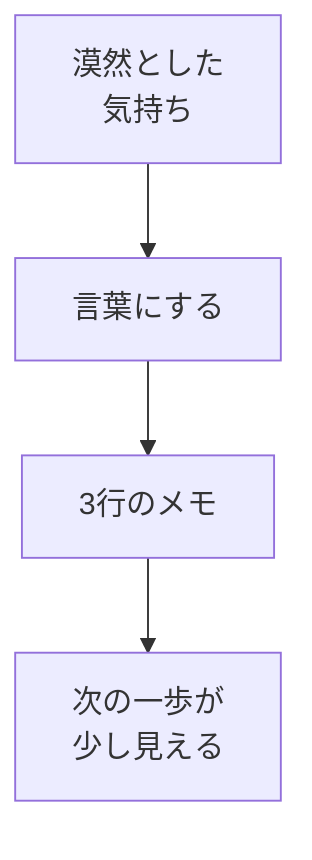

# 目標を整理する（なぜ学ぶか・Rebuildに来た理由）

## たとえ話

> 旅に出ようと思い立った人が、まず地図を開く。けれど「どこへ行きたいか」が決まっていないと、地図はただの線の集まりに見える。行き先が一言でも決まると、同じ地図が急に意味を持ちはじめる。どの道を通るか、どこで休むかが、少しずつ見えてくる。
>
> 学びも、これとよく似ている。道具やアプリの使い方を先に覚えても、「自分はどこへ行きたいのか」が言葉になっていないと、何から手をつければいいかわからず立ち止まってしまう。やりたい気持ちがないのではなく、その気持ちがまだ言葉になっていないだけのことが多い。だから最初に学ぶのは、操作ではなく、自分の行き先を一言にすることなのだ。

## 今日のゴール

Rebuild AI Guild で何を得たいかを、**3行のメモ**に言葉にする。

## 前提確認

- すでにできる前提：Rebuild AI Guild に来た、またはこの教材を開いた
- まだ知らなくてよいこと：PC操作、スプレッドシート、GitHub（今日は紙・メモで完結します）

## このテーマで伸ばす力

**習慣力・整理力** — 漠然とした気持ちを、自分の言葉にして次の一歩につなげる力です。

## 学びの段階

今日の完了条件は **「できる」** です。「知った」で終わらせず、3行を書いて自分の言葉で読み返せるところまで進めます。

## なぜ大事か

AIやPCのスキルを覚える前に、**なぜ学ぶのか**を言葉にしておくと、つまずいたときに戻る場所ができます。

たとえば「お客さまの記録を整理したい」「予約や問い合わせの案内を整えたい」「サービス一覧を見やすくしたい」など、自分の仕事の困りごとと学びがつながります。困りごとは人それぞれですが、学びが仕事の役に立つ形でつながると、続けやすくなります。

Rebuild AI Guild は、コードを一から書ける人を育てる場所ではありません。**作る力・判断する力・続ける力・整える力・相談する力・進める力**を育てる場所です。今日は、その土台の最初の一歩です。

## 読んで学ぶ

「目標」という言葉は、正解が1つあるように感じることがあります。ここでは難しく考えなくて大丈夫です。

次の3行に分けて書きます。

1. **なぜ Rebuild AI Guild に来たか**（きっかけ・今の気持ち）
2. **1年後に「できていてよかった」と思うこと**（ざっくりでよい）
3. **最初の3週間で、小さく試したいこと**（5分でできる大きさ）

正しい目標がわからなくて止まる人は多いです。完璧な文章は不要です。箇条書きでも、口語でも、メモ書きでも大丈夫です。

**個人情報・機密情報の注意**：お客さまの名前・売上の具体的な数字など、仕事の機密は書かないでください。「お客さまの記録を整理したい」くらいのざっくりした言葉で十分です。

### 図解



## 手順

用意するもの：紙とペン、またはスマホのメモアプリ、Macのメモ帳（どれでもよい）

### ステップ1：まず1行だけ書く（5分）

メモを開き、次の文をそのまま書き始めてください。

```text
Rebuild AI Guild に来た理由は、
```

ここで止まったら、次のどれかを続けてください。

- 「何から始めればいいかわからなかったから」
- 「一人だと続かなそうだったから」
- 「仕事の○○を整えたいから」（○○は自分の言葉で）

**わからないまま進まないチェック**：3行すべてが書けない → ここで止まって、この1行だけ書ければOKです。今日はここまでで十分です。

### ステップ2：2行目を書く（5分）

次の質問に答える形で、1行書きます。

```text
1年後にできていてよかったと思うことは、
```

例：

- お客さまの記録の探し方が決まっている
- 予約や問い合わせの案内の文案を自分で直せる
- サービス一覧が1か所にまとまっている
- やりとりの記録をすぐ見つけられる

### ステップ3：3行目を書く（5分）

最初の3週間で試すことを、**5分でできる大きさ**で1行書きます。

```text
最初の3週間で試すことは、
```

例：

- 「毎日5分、メモを開いて1行書く」
- 「予約案内の現状を紙に書き出す」

大きすぎる目標（「サイトを全部作る」など）は、今日は書かなくて大丈夫です。後の教材で小さく分けていきます。

### ステップ4：読み返す（5分）

3行を声に出さなくても、目で追って読み返してください。

「これは自分の言葉か？」と感じたら完了です。直したいところがあれば、1か所だけ直して終わりにしてください。

## できたらOK

- 3行の目標メモが書けている
- 自分の言葉で読み返せる
- 仕事の機密情報を書いていない

## つまずいたら

**躓いたら戻る先**：なし（第1章の最初のテーマです）

よくあるつまずき：

| つまずき | 対処 |
|---|---|
| 正しい目標がわからない | 「今の気持ち」を1行書けばOK |
| 3行書けない | ステップ1の1行だけで今日は終了 |
| 仕事とつながらない | 「お客さまの記録・予約や問い合わせの導線・サービス一覧」から1つ選ぶ |

Discordで質問するときは、次のテンプレをコピーして使ってください。

```text
【今やっている教材】
第1章 01 目標を整理する

【詰まったところ】
（例：3行目が大きすぎる気がして書けない）

【試したこと】
（例：1行目だけ書いた）

【スクショやエラー文】
（紙のメモの写真でもOK。なくても大丈夫）

【どうなればOKか】
（例：3行目の書き方の例がほしい）
```

## 今日の成果物

- **目標を3行で書いたメモ**（紙・スマホ・Macのメモ帳）

任意：Discordに3行のうち**1行だけ**共有してみてください。「今日の目標3行のうち、1行だけ共有してみてください」と書けば十分です。

## 問い

1年後に「できていてよかった」と思うことは、あなたの仕事では何でしょうか。
今日書いた3行のうち、いちばんしっくりきた行は、どれだったでしょうか。
