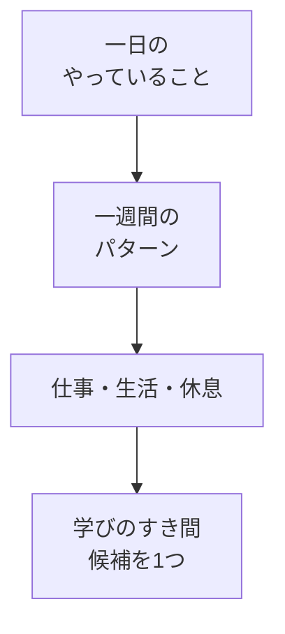

# 一日・一週間の過ごし方を洗い出して整理する

## たとえ話

> 同じ広さの部屋でも、物が床に散らばっていると「もう置く場所がない」と感じる。けれど一度すべてを棚に並べ直すと、実は空いている隙間がいくつもあったと気づくことがある。狭かったのは部屋ではなく、何がどこにあるか見えていなかっただけなのだ。
>
> 一日の時間も、これによく似ている。「時間がない」と感じる人の多くは、本当に一分も空いていないのではなく、自分の一日がどう流れているかを一度も書き出していないだけのことがある。だから今日は、新しい時間をひねり出す前に、まず手持ちの時間を棚に並べてみる。見えるようになって初めて、どこに学びのすき間があるかを選べるようになる。

## 今日のゴール

「時間がない」の正体を見える化し、ざっくりと**一日・一週間の過ごし方**を書き出す。  
そのうえで、**学びに使えそうな時間を1つ**見つける。

## 前提確認

- すでにできる前提：[01 目標を整理する](01-目標を整理する.md) で3行の目標メモを書いた（まだの場合は先にそちらへ）
- まだ知らなくてよいこと：Googleスプレッドシートでの時間管理（第5章で扱います）

## このテーマで伸ばす力

**整理力** — やっていることを書き出し、次に取る時間の候補を見つける力です。

## 学びの段階

今日の完了条件は **「できる」** です。完璧なスケジュール表は作りません。書き出して、学びの時間候補を1つ見つけたところでOKです。

## なぜ大事か

「時間がない」は感覚であることが多いです。書き出すと、**削れる時間**や**短くできる時間**が見つかることがあります。

第1章のテーマ1で「なぜ学ぶか」を書きました。今日は、その学びを**いつ入れるか**の材料を集めます。第5章では、ここで見つけた候補をスプレッドシートで運用していきます。今日は紙・メモで十分です。

## 読んで学ぶ

時間の見える化は、分単位の精密な記録ではありません。  
**ブロック**で書きます。例：

- 朝：準備・移動
- 昼：仕事の中心の時間
- 夕方：事務・片づけ
- 夜：休息

働く日と休みの日でパターンが違うことは多いです。平日と土日で予定の入り方が違う人もいます。「いつもと違う日」は無理に一般化しなくて大丈夫です。**いちばん多いパターン**を書けばOKです。

**個人情報の注意**：お客さまの名前・具体的な予定の詳細は書かないでください。

### 図解



## 手順

用意するもの：紙とペン、またはメモアプリ

### ステップ1：昨日の一日を3つ書く（5分）

昨日1日を思い出し、やったことを箇条書きで**3つだけ**書きます。細かくなくて大丈夫です。

例：

- お客さま対応を数件
- 予約や問い合わせの確認と返信
- 帰宅後にサービス一覧のことを考えた
- 事務作業や書類のコピー
- 夜に予約や問い合わせの案内を思い出した

**わからないまま進まないチェック**：「全然時間がない」と感じるが書けない → まず**いちばん忙しかった曜日**を1つだけ書いてください（例：「土曜は対応が続く」）。それで今日は先に進めます。

### ステップ2：一日のブロックを書く（10分）

典型的な1日を、4〜6個のブロックに分けて書きます。時刻はざっくりでよいです。

```text
【一日の過ごし方（たたき台）】
・朝（　時ごろ〜　時ごろ）： 
・昼（　時ごろ〜　時ごろ）： 
・夕方（　時ごろ〜　時ごろ）： 
・夜（　時ごろ〜　時ごろ）： 
```

空欄は「だいたい」で埋めてください。わからないブロックは「バラバラ」と書いてもOKです。

### ステップ3：一週間のパターンを書く（10分）

曜日ごとに、ステップ2と同じくらいのざっくりさで書きます。全部埋めなくて大丈夫です。**違いが大きい曜日だけ**でもOKです。

```text
【一週間の過ごし方（たたき台）】
月：
火：
水：
木：
金：
土：
日：
```

休みの日・仕事が少ない日があれば、その日をメモに書いておきます。

### ステップ4：学びの時間候補を1つ見つける（5分）

メモを見返し、次の質問に答えます。

```text
学びに使えそうな「5分」は、
```

候補の例：

- 仕事を始める前の5分、メモを開く
- 電車の移動中、1行だけ書く
- 寝る前5分、今日やったことを1行書く
- 仕事の合間、5分だけ教材を開く

「毎日は無理」でも大丈夫です。**週に何回なら取れそうか**を横に書いておくと、次のテーマにつながります。

### ステップ5（30分版）：削れる・短くできる時間を1つ（任意）

余力があれば、メモから次のどちらかを1つ書きます。

- **削れる時間**：少し減らしても困らなさそうなこと（例：同じ動画を何度も見る）
- **短くできる時間**：5分に縮小できそうなこと（例：「お客さまの記録の整理」を「1件だけメモする」）

## できたらOK

- 一日・一週間の過ごし方のたたき台が書けている
- 学びの時間候補を**1つ**見つけている
- お客さまの名前などの個人情報を書いていない

## つまずいたら

**躓いたら戻る先**：[01 目標を整理する](01-目標を整理する.md)（なぜ学ぶかが曖昧なとき）

| つまずき | 対処 |
|---|---|
| 生活を晒す感じがして書きにくい | 仕事のブロックだけ書く。詳細は書かない |
| 毎日バラバラで一般化できない | いちばん多い2日分だけ書く |
| 学びの候補が見つからない | 「寝る前5分」か「起きてすぐ5分」を仮で1つ書く |

Discordで質問するときは、次のテンプレを使ってください。

```text
【今やっている教材】
第1章 02 一日・一週間の過ごし方を洗い出す

【詰まったところ】
（例：一週間のパターンが書けない）

【試したこと】
（例：昨日の3つだけ書いた）

【スクショやエラー文】
（メモの写真でもOK。なくても大丈夫）

【どうなればOKか】
（例：自分の仕事に合った書き方の例がほしい）
```

## 今日の成果物

- **時間の見える化メモ**（一日・一週間のたたき台 ＋ 学びの時間候補1つ）

任意：Discordに「学びの時間候補」を1行だけ書いてみてください。

## 問い

学びに使えそうな「5分」は、あなたの1週間のどこにありそうでしょうか。  
「時間がない」と感じていた時間帯を書き出してみて、見え方は少し変わったでしょうか。
