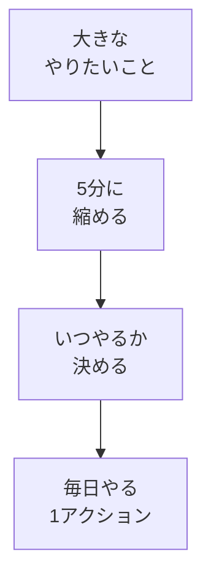

# 学びの時間を確保し、習慣で必ずやることを1つ決める

## たとえ話

> 毎日コップ一杯の水をやれば育つ植物がある。手間としてはほんの数十秒で、特別な道具もいらない。それでも枯らしてしまう人は少なくない。やる気がないからではなく、「いつ水をやるか」が決まっていないからだ。朝なのか夜なのか、決めていないと、気づいたときには何日も過ぎている。
>
> 学びを続けることも、この水やりとよく似ている。大きな決意よりも、**小さくて毎日できる行動**を**いつやるか**まで決めておくことのほうが、ずっと長持ちする。今日学ぶのは、根性で頑張る方法ではない。気合いに頼らなくても自然に続く、自分なりの「水やりの時間」を一つ決めることだ。

## 今日のゴール

毎日必ずやる **「1アクション」** を1つだけ決め、**いつやるか**を宣言する。

## 前提確認

- すでにできる前提：[01 目標を整理する](01-目標を整理する.md) の3行メモ、[02 時間の見える化](02-一日・一週間の過ごし方を洗い出す.md) の学びの時間候補
- まだ知らなくてよいこと：スプレッドシートでの習慣トラッキング（第5章）

## このテーマで伸ばす力

**習慣力・整理力** — 大きな目標を、今日から実行できる1アクションに落とす力です。

## 学びの段階

今日の完了条件は **「できる」** です。宣言文を書き、**今日から実行できる大きさか**を自分で確認したところまで進めます。

## なぜ大事か

「1日1時間学ぶ」と決めて続かない人は多いです。ここで止まる人は多いですが、悪いことではありません。最初から大きすぎただけのことがほとんどです。

Rebuild AI Guild の第1章では、**5分でできること**を軸にします。5分なら、仕事を始める前・仕事の合間・寝る前など、すき間に入れやすくなります。

AIに相談するときも、「毎日何を5分やるか」が決まっていると、質問の質が上がります（第7章以降で深めます）。

## 読んで学ぶ

「毎日やる1アクション」とは、次の条件を満たす**1つだけ**の行動です。

- **5分以内**で終わる（または「開くだけ」「1行書くだけ」でもよい）
- **場所や道具が決まっている**（例：スマホのメモ、紙のノート）
- **やったかどうかがはっきりわかる**（例：「メモを開いた」「1行書いた」）

例：

- 「仕事を始める前の5分、メモに『今日の学び』と1行書く」
- 「帰宅後、お客さまの記録の整理のためのメモを1件だけ書く」
- 「仕事のあとの5分、予約や問い合わせの案内について1行メモする」
- 「寝る前、明日の5分でやることを1行書く」

### 図解



## 手順

### ステップ1：5分でできる学びの行動を3つ書く（5分）

メモに、次の見出しを書き、候補を3つ出します。

```text
【5分でできる学びの行動（候補）】
1.
2.
3.
```

候補のヒント：

- 教材を開く
- 1行メモを書く
- 末尾の問いに1行答える
- 昨日の仕事の困りごとを1行書く

完璧な学習内容は不要です。**続けられるか**を優先してください。

### ステップ2：1つだけ選ぶ（5分）

3つのうち、**いちばん続けられそうなもの**を1つに丸をつけます。

迷ったら、次の基準で選びます。

- 道具を用意しなくてよい
- 移動中でもできそう
- 失敗しても困らない

**わからないまま進まないチェック**：「毎日は無理」と感じる → 週3回でもよいです。ただし **いつやるか** は必ず1つ決めてください（例：「月・水・金の寝る前5分」）。

### ステップ3：宣言文を1文で書く（5分）

次の型に当てはめて、**1文**書きます。

```text
【毎日やる1アクションの宣言】
（いつ）に（何を5分やる）。
```

例：

- 「毎晩、寝る前5分に、Rebuildの教材を開いて1行メモする。」
- 「働く日の朝、コーヒーを飲みながら5分、昨日の困りごとを1行書く。」
- 「火・木・土の仕事のあと5分、予約や問い合わせの案内について1行書く。」

### ステップ4：大きすぎないか確認する（5分）

宣言文を読み、次をチェックします。

- [ ] 5分（またはそれ以下）で終わる言い方になっている
- [ ] 「いつ」が具体的（「いつか」ではない）
- [ ] 今日から始められる

1つでも×なら、**半分の大きさ**に直します。

- 「1時間教材を読む」→「教材を開いて見出しだけ読む」
- 「お客さまの記録を全部整理する」→「記録について1行メモする」

### ステップ5（30分版）：崩れたときの代替案を1つ（任意）

余力があれば、次を書きます。

```text
【崩れたときの代替案】
本番の時間が無理な日は、（いつ）に（もっと小さい行動）をする。
```

例：「寝る前5分が無理な日は、トイレで30秒だけメモを開く。」

## できたらOK

- 毎日やる1アクションの**宣言文が1文**書けている
- 5分以内・いつやるかが書けている
- 今日から実行できる大きさだと自分で確認した

## つまずいたら

**躓いたら戻る先**：[02 一日・一週間の過ごし方を洗い出す](02-一日・一週間の過ごし方を洗い出す.md)（時間の候補が見つからないとき）

| つまずき | 対処 |
|---|---|
| 1時間学習を宣言してしまった | ステップ4で5分に縮小する |
| 毎日無理 | 週3回＋曜日を宣言に書く |
| 何をすればいいかわからない | 「教材を開く」だけで宣言する |

Discordで質問するときは、次のテンプレを使ってください。

```text
【今やっている教材】
第1章 03 毎日やる1アクションを決める

【詰まったところ】
（例：宣言文が大きすぎる気がする）

【試したこと】
（例：候補を3つ書いた）

【スクショやエラー文】
（宣言文の写真でもOK。なくても大丈夫）

【どうなればOKか】
（例：自分の仕事に合った宣言文の例がほしい）
```

## 今日の成果物

- **毎日やる1アクションの宣言**（1文。任意で代替案つき）

任意：Discordに宣言文を1行で投稿してみてください。

## 問い

毎日5分なら、あなたの仕事のなかで何なら続けられそうでしょうか。  
今日決めた1アクションは、テーマ1の「3行の目標」のどれにつながっているでしょうか。
