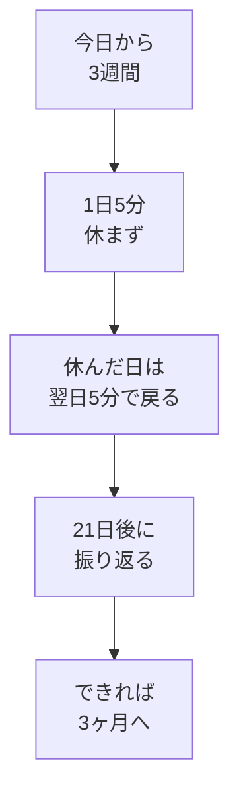

# スタート3週間ルール——1日5分・休まず／できれば3ヶ月

## たとえ話

> 焚き火をおこすとき、いちばん難しいのは火がつくまでの最初の数分だという。小さな炎は風や湿り気にすぐ消されてしまうので、ここでは大きな薪をくべるより、細い枝を絶やさず足しつづけることのほうが大切になる。いったん安定して燃えはじめれば、少しくらい目を離しても火は保たれる。
>
> 新しい習慣を始めるときの最初の数週間も、この消えやすい小さな炎によく似ている。だから最初の**3週間（21日間）**は、大きな成果をねらうより、小さくても火を絶やさないことを優先する。今日学ぶのは、根性で燃やしつづける方法ではなく、消えかけても翌日また小さく火を足せる、自分なりのルールを決めることだ。

## 今日のゴール

**3週間ルール**と（できれば）**3ヶ月の目標**を書き、「1日5分・休まず」のスタートラインを決める。  
あわせて、ルールの意味を4択チェックで確認する。

## 前提確認

- すでにできる前提：[03 毎日やる1アクション](03-学びの時間を確保し毎日やる1アクションを決める.md) の宣言文
- まだ知らなくてよいこと：週報・月報の運用（第5章）

## このテーマで伸ばす力

**習慣力** — 最初の21日間を短く区切り、休んでも戻れるルールを自分で決める力です。

## 学びの段階

今日は **理解（知った・わかった）** と **実践（できる）** の両方です。

- 4択チェックでルールの意味を確認する（知った・わかった）
- 3週間・3ヶ月の自分ルールを書き、今日からカウントを始められる（できる）

## なぜ大事か

新しいことを始めると、体や頭が「いつもと違う」と感じて、拒否反応が出ることがあります。これは自然な反応です。悪いことではありません。

スタート3週間ルールは、次の2つをセットにします。

1. **1日5分** — テーマ3で決めた1アクションと同じくらいの大きさ
2. **休まず** — 完璧な成果ではなく、「やった日」をつなぐ

3ヶ月は「できれば」の先の地図です。3週間だけに絞っても、今日の教材は完了です。

**休んだら終わりではありません。** 休んだ翌日に5分だけ戻る、とルールに書いておきます。

### 図解



## 読んで学ぶ

### スタート3週間ルールとは

最初の**21日間**は、次を自分との約束にします。

- 毎日（または決めた曜日）**5分だけ**やる
- **成果の大小は問わない**（開いた・1行書いた・読んだだけでもOK）
- **1日休んでも終わりにしない**。翌日5分で戻る

例：「3週間、仕事を始める前5分だけメモを開く。休んだ日は翌朝5分で戻る。」  
例：「3週間、仕事のあと5分だけ予約や問い合わせの案内のメモを1行。休んだ日は翌日の合間5分で戻る。」

### 3ヶ月は「できれば」

3ヶ月の目標は、3週間が終わったあと見直してもよいです。今日は「こうなっていたらうれしい」くらいで書きます。

例：

- お客さまの記録の整理のやり方が1パターン決まっている
- 予約や問い合わせの案内の下書きが1つある

**わからないまま進まないチェック**：「3ヶ月は不安」→ 今日は**3週間ルールだけ**書いて完了にしてください。3ヶ月の欄は空欄でもOKです。

## 手順

### ステップ1：3週間ルールを1行で書き始める（5分）

メモに、次の見出しと1行目を書きます。

```text
【スタート3週間ルール（今日から　月　日〜　月　日）】
21日間、（いつ）に（5分の行動）を休まずやる。休んだ日は翌日5分で戻る。
```

日付は今日から数えて21日後までをメモに書いておくと、終わりが見えます（カレンダーアプリで確認してもよいです）。

テーマ3の「毎日やる1アクションの宣言」と**同じ行動**で構いません。

### ステップ2：3ヶ月の目標を書く（5分・任意）

余力があれば、次を1行書きます。

```text
【できれば3ヶ月の目標】
3ヶ月後には、
```

不安なら「3週間が終わってから書き直す」とメモに書いて、空欄のまま進んでもOKです。

### ステップ3：21日目に自分へ送る一言（5分・30分版）

任意です。21日目に読み返すためのメモを1行書きます。

```text
【21日目に自分へ】
21日続いたら、自分にこう言う：
```

例：「5分でも続いた。次は10分に広げるか、今のまま維持するか決めよう。」

### ステップ4：今日からカウント開始（5分）

今日の5分を、ルールどおり実行してください。  
実行できたら、メモに「Day 1」と書きます。できなくても、明日5分で戻ればOKです。

## 4択チェック

先に自分で答えてから、答え合わせページを開いてください。

**問1.** スタート3週間ルールで、いちばん大事なのはどれですか？

- A. 1日1時間は必ず学ぶ
- B. 最初の21日間は、短くても休まず続ける
- C. 休んだらルールをやり直さなければならない
- D. 3週間で完璧な成果を出す

答え合わせはこちら：  
[答えを見る](../../答え/第01章-目標と習慣/04-スタート3週間ルール-答え.md)

## できたらOK

- 3週間ルールが1行以上書けている（開始日・終了日の目安つき）
- 4択チェックに自分で答えた
- 今日を Day 1 としてカウントを開始できた（または明日5分で戻ると決めた）

## つまずいたら

**躓いたら戻る先**：[03 毎日やる1アクションを決める](03-学びの時間を確保し毎日やる1アクションを決める.md)（5分の行動が大きすぎるとき）

| つまずき | 対処 |
|---|---|
| 休んだら終わりだと思う | ルールに「翌日5分で戻る」を必ず書く |
| 体が拒否する・やりたくない | 自然な反応。5分を「開くだけ」に縮小 |
| 3ヶ月が重い | 3週間だけに絞る。3ヶ月は空欄OK |

Discordで質問するときは、次のテンプレを使ってください。

```text
【今やっている教材】
第1章 04 スタート3週間ルール

【詰まったところ】
（例：1日休んでしまい、もう終わりだと思った）

【試したこと】
（例：3週間ルールは書いた）

【スクショやエラー文】
（ルールのメモの写真でもOK。なくても大丈夫）

【どうなればOKか】
（例：休んだあとの戻り方を確認したい）
```

## 今日の成果物

- **3週間ルール・（任意で）3ヶ月ルールのメモ**
- **Day 1** の記録（「今日5分やった」または「明日戻る」のメモ）

任意：Discordに3週間ルールを1行で宣言してみてください。

## 問い

3週間、休まず5分だけ続けたら、あなたの仕事や学びで何が変わりそうでしょうか。  
休んでしまった日に、自分にどんな言葉をかければ戻りやすくなりそうでしょうか。
