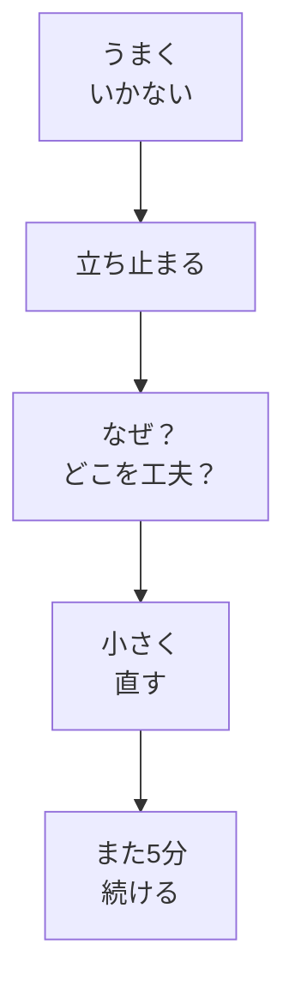

# 落ち着いて続ける・うまくいかないとき考える

## たとえ話

> 同じ道で何度もつまずく人と、一度で気づいて避けられるようになる人がいる。その差は、注意力の強さよりも、つまずいた瞬間に「今、何に足を取られたのか」を一度だけ振り返るかどうかにあることが多い。ただ転んで立ち上がるだけなら、次も同じ場所で転ぶ。けれど石の位置を一言メモしておけば、次は自然とよけられる。
>
> 学びや仕事も、これとよく似ている。うまくいかなかったときに「自分には向いていない」と決めつけて終わるか、「何が違ったか」を一行だけ書き留めるか。その小さな差が、数か月後の進み方を大きく変えていく。今日学ぶのは、失敗をなくす方法ではなく、つまずいたときに自分を責めずに立ち止まって考える、その入り口を作ることだ。

## 今日のゴール

うまくいかないときに**自分に問う言葉**を1つ決め、振り返りメモを1つ書く。  
推奨：Discordの「今日の振り返り」に**1行**投稿する。

## 前提確認

- すでにできる前提：第1章テーマ1〜4の成果物（目標3行・時間の見える化・毎日やる1アクション・3週間ルール）
- まだ知らなくてよいこと：学びの4段階の詳細（第2章で深めます）

## このテーマで伸ばす力

**メタ認知（振り返り・工夫する力の入門）** — 「なぜうまくいかないか」「どこを工夫するか」を、自分に問う力です。

## 学びの段階

今日の完了条件は **「できる」** です。振り返りメモを書き、うまくいかないときに使う**問いかけの言葉を1つ**決めたところまで進めます。

## なぜ大事か

続かない理由は、意志の弱さだけではありません。よくある原因は次のようなものです。

- 最初の行動が大きすぎた
- いつやるかが曖昧だった
- うまくいかないと自分を責めて、次が怖くなった
- 新しいことの不快感を「向いていない」と解釈した

ここで大切なのは、**自分を責めずに原因を探す**ことです。責めないからといって妥協するのではなく、「次に変えられることは何か」を小さく見つけます。

第1章の締めくくりとして、これまでの成果物を軽く振り返り、第2章「学びの土台を整える」へつなぎます。

### 図解



## 読んで学ぶ

### メタ認知の入門とは

難しい言葉に見えますが、やることはシンプルです。

- **自分の学び方や行動を、少し外から見る**
- **うまくいかなかったとき、なぜか・どこを変えられそうかを書く**

Rebuild AI Guild では、学び方を支えるものを **考え方の土台** や **学び方の原則** と呼びます。第2章でさらに深めます。

### 自分に問う言葉の例

次から1つ選ぶか、自分の言葉に直してください。

- 「今日は何が邪魔になった？」
- 「5分を、もっと小さくできる？」
- 「いつやるか、もう少し具体的にできる？」
- 「休んだあと、戻る言葉は何にする？」

例：仕事を始める前の5分が取れない日 → 「合間の30秒でメモを開く」に変えられるか問う。  
例：仕事のあとがバタバタする日 → 「寝る前1行」に変えられるか問う。

**わからないまま進まないチェック**：「何も思い浮かばない」→ **続かなかったこと**を1つだけ書けばOKです。理由は後からで大丈夫です。

## 手順

### ステップ1：続かなかったことを1つ書く（5分）

メモに、過去の仕事や学びで「続かなかったこと」を1つ書きます。学習以外でも構いません。

```text
【続かなかったこと】
```

例：

- お客さまの記録をデジタル化しようとしてやめた
- 予約や問い合わせの案内を直そうとして手が付かなくなった
- 動画教材を買ったが3日で見なくなった

### ステップ2：「なぜ」と「どこを工夫するか」を書く（10分）

ステップ1について、次の2つに答えます。わからない部分は「わからない」と書いてよいです。

```text
【なぜうまくいかなかったか（思いつく範囲で）】

【どこを工夫できそうか（小さく1つ）】
```

自分を責める言葉（「意志が弱い」だけで終わる）は、一度書いたら横に「次に変えられること」を必ず1つ足してください。

### ステップ3：自分に問う言葉を1つ決める（5分）

今後、うまくいかないときに使う言葉を**1つ**決め、メモの見出しに書きます。

```text
【うまくいかないとき、自分に問う言葉】
```

### ステップ4：第1章の成果物を軽く振り返る（5分）

次のチェックリストで、第1章で作ったものを確認します。なくても責めなくて大丈夫。あとから戻って作れます。

- [ ] 目標3行のメモ（テーマ1）
- [ ] 時間の見える化メモ（テーマ2）
- [ ] 毎日やる1アクションの宣言（テーマ3）
- [ ] 3週間ルール（テーマ4）
- [ ] 今日の振り返りメモ（テーマ5・今書いているもの）

足りないものがあれば、Discordで「あとから作る」と1行書くだけでもOKです。

### ステップ5：Discordに1行投稿する（5分・推奨）

Rebuild AI Guild の Discord で、「今日の振り返り」用のチャンネル（運営が案内した場所）に、次のテンプレをコピーして**1行でも埋めて**投稿してください。

```text
【今日やったこと】
第1章の振り返りメモを書いた

【できたこと】
（例：うまくいかないときの問いかけを1つ決めた）

【詰まったこと】
（例：特になし / 3週間ルールの日付がまだ）

【明日5分だけやるなら】
（テーマ3の1アクションをそのまま書いてOK）
```

完璧な日報は目指しません。**小さくても進んだこと**が見える化できればOKです。

Discordがまだ使えない場合は、同じ内容をメモに書いて完了にしてください。

## できたらOK

- 「なぜうまくいかなかったか／どこを工夫するか」の**振り返りメモが1つ**ある
- うまくいかないときに使う**問いかけの言葉が1つ**決まっている
- Discordに1行以上投稿した、またはメモに同内容を書いた

## つまずいたら

**躓いたら戻る先**：[04 スタート3週間ルール](04-スタート3週間ルール.md)（3週間の区切りがまだのとき）

| つまずき | 対処 |
|---|---|
| 自分を責めてしまう | 「次に変えられること」を必ず1行書く |
| 何も思い浮かばない | ステップ1の「続かなかったこと」1つだけ |
| Discordがわからない | メモに同じテンプレを書いて完了 |
| 第1章の成果物が揃っていない | チェックリストで足りない番号だけ、後日やるとメモ |

Discordで質問するときは、次のテンプレを使ってください。

```text
【今やっている教材】
第1章 05 落ち着いて続ける・振り返り

【詰まったところ】
（例：振り返りの書き方がわからない）

【試したこと】
（例：続かなかったことを1つ書いた）

【スクショやエラー文】
（メモの写真でもOK。なくても大丈夫）

【どうなればOKか】
（例：振り返りメモの例がほしい）
```

## 今日の成果物

- **振り返りメモ1つ**（続かなかったこと ＋ なぜ／工夫 ＋ 問いかけの言葉）
- **Discord投稿1行以上**（またはメモへの同等の記録）

## 第1章の完了条件（全体）

次がそろっていれば、第1章は一区切りです。

- 目標3行
- 毎日やる1アクション
- 3週間ルール
- 振り返りメモ1つ
- Discordの今日の振り返りに1行（推奨）

## 次章への導線

**第2章「学びの土台を整える」**へ進みます。  
早さへの欲、思考の癖、学びの4段階など、**考え方の土台**を深めていきます。第1章で始めた行動を、第2章で支える考え方を足していきます。

## 問い

あなたの仕事で、1年続けていればできていたのに、やめてしまったことは何でしょうか。  
うまくいかなかったとき、**なぜそうなったか・どこを工夫できそうか**を、少しだけ考えてみてください。  
今日決めた「自分に問う言葉」は、明日から使えそうでしょうか。
