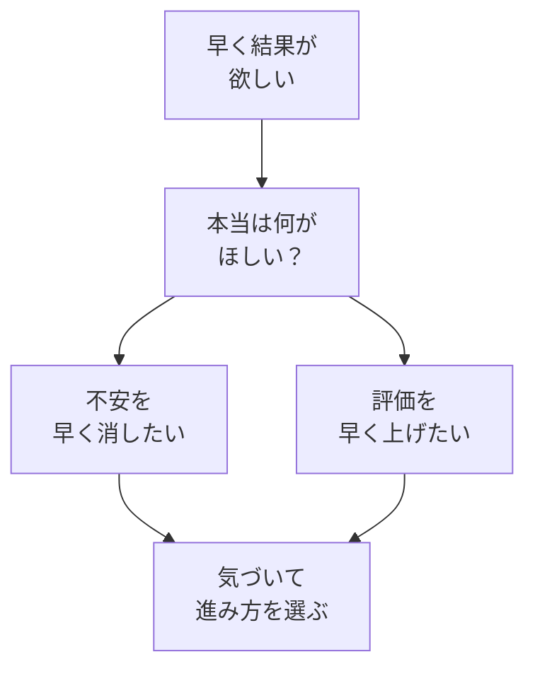

# 早く結果が欲しい——その欲に気づく

## たとえ話

> 電子レンジの「あたため」ボタンを連打しても、料理は早く仕上がらない。むしろ表面だけ熱くなって中は冷たいまま、ということが起きる。早く食べたいという気持ちが強いほど、人は工程を飛ばしたくなる。けれど火の通り方には、急いでも縮められない時間がある。
>
> 学びでも、似たことが起きる。「早く結果が欲しい」と思うと、わからない言葉を飛ばし、動画を流し見し、とりあえず先へ進めたくなる。だが急いでいるのは多くの場合、目の前の作業そのものではなく、その奥にある不安を早く消したい気持ちのほうだ。だから今日はまず、その急ぎの正体に気づくことから始める。気づけば、急ぐか、ゆっくり進むかを、自分で選べるようになる。

## 今日のゴール

自分が「早く結果が欲しい」と感じる場面を1つ見つけ、なぜ急いでいるのかを言葉にする。

## この教材で伸ばす力

**進める力** — 焦りに気づき、止まるタイミングを自分で決められるようになる

## 前提確認

- すでにできる前提：第1章で「なぜ学ぶか」を少し書いた、または心の中にある
- まだ知らなくてよいこと：PC操作、AI、Cursor

## 学びの段階

今日の完了は **「気づいた」** です。  
自分の「急ぎ」を1つ言葉にできればOKです。正解は1つではありません。

## なぜ大事か

Rebuild AI Guild では、ツールやテクニックの前に**考え方の土台**を整えます。

「早く結果が欲しい」気持ちは、悪いことではありません。  
仕事を変えたい、お客さまに喜んでもらいたい——その気持ちがあるから学び始めます。

ただ、**その欲に気づかないまま進む**と、次のようなことが起きやすいです。

- 動画や記事を流し見して「知った」で終わる
- わからない用語を飛ばして、後で同じところで止まる
- AIの答えをコピーして、自分の言葉で説明できない

気づくだけで、進み方を選べるようになります。

### 図解：急ぎの正体



## 読んで学ぶ

### 急ぎの正体の例

| 場面 | 急ぎの正体（例） |
|---|---|
| サービス一覧を早く作りたい | お客さまに新しい内容を伝えたい気持ちが強い |
| 情報発信を今日から始めたい | 集客の不安を早く減らしたい |
| 予約や問い合わせの案内を急いで出したい | 問い合わせが来るか不安 |
| お客さま向けの資料を一気に作りたい | 信頼してもらいたい気持ちが先に走る |

急いでいるときは、一度立ち止まって聞いてみてください。

> 「今、何を早くしたいですか？」  
> 「それは、本当は何の不安や願いですか？」

### 急ぎに気づいたらやること

1. **止まる** — 5分で十分です
2. **書く** — 「今、急いでいること」を1行書く
3. **ひとつ深く** — 「それは、本当は何がほしいから？」を1行足す
4. **選ぶ** — 今日は「ゆっくり1つだけ」か「急ぎのまま進む」かを決める

Rebuild AI Guild では、基本は**ゆっくり1つだけ**を勧めます。  
第2章04で、わからないまま進まない姿勢をさらに深めます。

## 手を動かす（インプット＋アウトプット）

紙・メモ帳・スマホのメモに、次の2行を書いてください。

```text
【急いでいること】
（例：ホームページを今週中に作りたい）

【本当は何がほしい？】
（例：お客さまに予約しやすくしてほしい）
```

書けなくても大丈夫です。「わからない」と書くだけでもOKです。

## わからないまま進まないチェック

次のどれかに当てはまったら、**今日はここで止まってOK**です。

- 「急いでいること」が書けない → 第1章の目標メモに戻る
- 「本当は何がほしい？」がわからない → 1行だけ「今の気持ち」を書く
- 書いた内容が長すぎて混乱する → 1行に短くする

## できたらOK

- 「急いでいること」を1つ書けた
- 4択チェック3問に答えた
- 答えページで確認した

今日はここまでで十分です。

## 4択チェック

1. 「早く結果が欲しい」気持ちについて、Rebuild AI Guild が伝えたいことはどれですか？
   - A. その気持ちは悪いので、消すべきだ
   - B. 気づかないまま進むと、浅い理解のまま止まりやすい
   - C. 急いで進めば、早く成果が出る
   - D. 気づきは不要で、テクニックだけ覚えればよい

2. 「サービス一覧を早く作りたい」と感じたとき、急ぎの正体として考えにくいのはどれですか？
   - A. お客さまに新しい内容を伝えたい気持ち
   - B. 集客の不安を早く減らしたい気持ち
   - C. 競合より先にサイトを出したいだけで、内容は後回し
   - D. お客さまに喜んでもらいたい気持ち

3. 急ぎに気づいたあと、Rebuild AI Guild が基本として勧める進め方はどれですか？
   - A. わからない用語は飛ばして先に進む
   - B. 動画を倍速で全部見終える
   - C. ゆっくり1つだけ進める
   - D. AIの答えをそのまま使って完了とする

答え合わせはこちら：  
[答えを見る](../../答え/第02章-学びの土台/01-早く結果が欲しい-その欲に気づく-答え.md)

## つまずいたら

Discordで次のように聞いてください。

```text
【今やっている教材】第2章 01 早く結果が欲しい

【詰まったところ】

【試したこと】

【どうなればOKか】
```

**躓いたら戻る先**

- 第1章：目標と習慣の整理・管理（なぜ学ぶかがまだぼんやりなとき）

## 今日の成果物

- 「急いでいること」と「本当は何がほしい？」の2行メモ

## 問い

あなたの仕事で、最近「早く結果が欲しい」と感じた場面は、どこだったでしょうか。  
その裏にある気持ちは、何だったのでしょうか。
