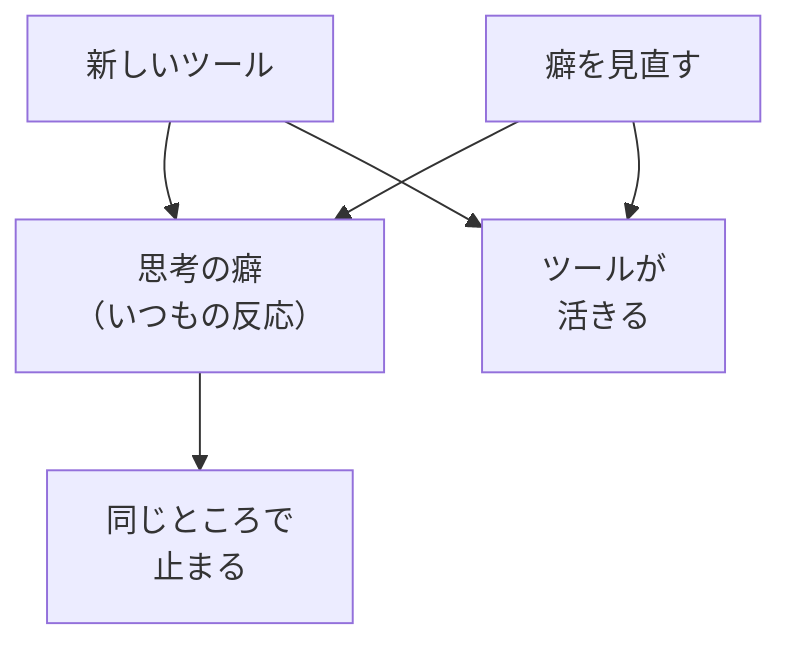

# 本質的に変えるのは思考の癖

## たとえ話

> 包丁が古くて切れないとき、新しい高級な包丁を買えば一時はよく切れる。けれど同じ研ぎ方・同じ力の入れ方を続けていれば、その包丁もまたすぐに切れなくなる。本当に変わるのは道具ではなく、刃を当てる角度や手の動かし方という、いつもの「やり方」のほうだ。
>
> 学びや仕事の道具も、これとよく似ている。新しいアプリやAIをそろえても、いつもの考え方や反応のしかたが変わらなければ、しばらくして同じところで止まってしまう。だから今日は、便利な道具を増やす前に、自分が無意識に繰り返している「思考の癖」に目を向けてみる。癖は悪いものではないが、気づかなければ選び直すこともできないからだ。

## 今日のゴール

「思考の癖」とは何かを理解し、自分のいつもの反応を1つ書き出す。

## この教材で伸ばす力

**判断する力** — いつもの反応に気づき、別の進め方を選べるようになる

## 前提確認

- すでにできる前提：第2章01で「急ぎの欲」に気づいた経験がある
- まだ知らなくてよいこと：AIの使い方、ファイル整理、Cursor

## 学びの段階

今日の完了は **「わかった」** です。  
「思考の癖」を自分の言葉で1文説明できればOKです。

## なぜ大事か

新しいツールやテクニックを覚えても、**いつもの考え方が変わらなければ**、同じところで止まります。

- 「とりあえずAIに聞く」→ 答えは出るが、自分で説明できない
- 「完璧にできてから出す」→ いつまでも公開できない
- 「自分には向いていない」→ 試す前に止まる

Rebuild AI Guild が本質的に変えたいのは、こうした**思考の癖**です。  
ツールは、その癖を変えるための道具のひとつにすぎません。

### 図解：ツールと思考の癖



## 読んで学ぶ

### 思考の癖とは

**考え方の土台**のうち、無意識に繰り返している反応のことです。

| よくある癖 | 例 | 別の例 |
|---|---|---|
| 完璧主義 | 写真が揃うまで公開しない | 資料が完成するまで案内を出さない |
| 丸投げ | AIに文章を全部書かせる | AIにサービスの説明を任せきり |
| 飛ばし | わからない用語を無視して進む | システム用語を理解せず設定する |
| 自分を責める | 「PCが苦手だから無理」と決める | 「年齢的に遅い」と止まる |

癖は悪いわけではありません。  
ただ、**気づかないと選べない**ままです。

### 癖に気づく3つの問い

1. 同じ種類の作業で、いつも同じところで止まりませんか？
2. うまくいかないとき、最初に出る言葉は何ですか？（「無理」「もういいや」など）
3. 誰かに相談するとき、いつも同じ言い方をしていませんか？

## 手を動かす（インプット＋アウトプット）

メモに次を書いてください。

```text
【私のいつもの反応（思考の癖）】
（例：わからなくなると「後でいいや」と閉じる）

【それが起きやすい場面】
（例：PCの設定を触るとき）
```

1つで十分です。書けない場合は「まだわからない」と書いてOKです。

## わからないまま進まないチェック

- 「思考の癖」がピンとこない → 上の表から「これっぽい」と感じた行を1つ丸ごと書く
- 自分の癖が思い浮かばない → 最近止まった場面を1つ書き、「そのとき最初に思ったこと」を書く
- 全部当てはまりそう → いちばんよく起きる1つだけ選ぶ

## できたらOK

- 「思考の癖」を自分の言葉で1文説明できた
- 自分のいつもの反応を1つ書いた
- 4択チェック3問に答え、答えページで確認した

## 4択チェック

1. Rebuild AI Guild が「本質的に変えたい」と言っているのはどれですか？
   - A. 最新AIツールの操作方法だけ
   - B. 思考の癖（いつもの反応のパターン）
   - C. パソコンの処理速度
   - D. 競合より早くサイトを公開すること

2. 次のうち、「思考の癖」の例としてふさわしいのはどれですか？
   - A. Command + C でコピーする操作
   - B. わからない用語を飛ばして先に進む習慣
   - C. Finderでフォルダを開く手順
   - D. スプレッドシートのセル番号

3. 思考の癖に気づいたあと、Rebuild AI Guild が勧める次の一歩はどれですか？
   - A. 癖を隠して、とにかく速く進む
   - B. 気づいた癖を1つ書き、場面とセットで覚える
   - C. ツールをもう1つ増やして解決する
   - D. 気づきは忘れて、テクニックだけ覚える

答え合わせはこちら：  
[答えを見る](../../答え/第02章-学びの土台/02-本質的に変えるのは思考の癖-答え.md)

## つまずいたら

```text
【今やっている教材】第2章 02 思考の癖

【詰まったところ】

【試したこと】

【どうなればOKか】
```

**躓いたら戻る先**

- [01 早く結果が欲しい](./01-早く結果が欲しい-その欲に気づく.md) — 急ぎの欲が癖を強くしているとき

## 今日の成果物

- 自分の「いつもの反応」と「起きやすい場面」のメモ

## 問い

あなたの仕事で、繰り返し起きている「いつもの反応」は、何でしょうか。  
それは、誰かに相談するときの言い方にも、表れているかもしれません。
