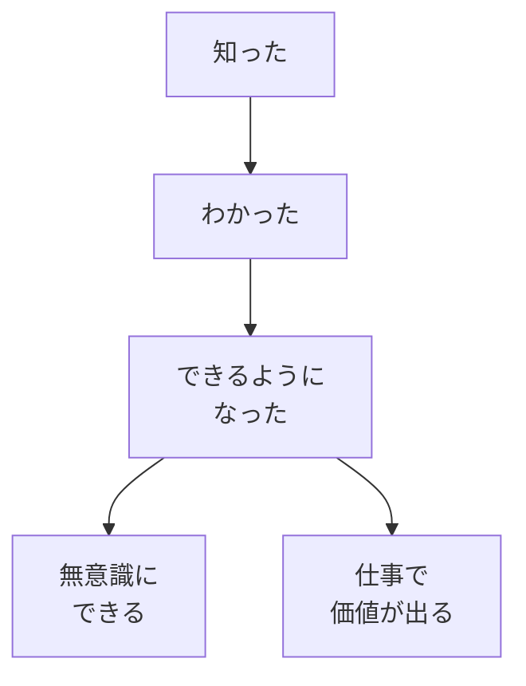

# 学びの4段階——知ったで満足しない

## たとえ話

> 自転車の乗り方を本で読めば、ペダルの踏み方もハンドルの切り方も頭では理解できる。だが本を読み終えた人がそのまま自転車にまたがると、たいてい数メートルで転ぶ。「わかる」ことと「できる」ことのあいだには、何度も転びながら体で覚えるという、本だけでは越えられない段差があるからだ。
>
> 学びでも同じことが起きる。便利な技や考え方を「知った」「わかった」だけで、もう身についた気になってしまう。けれど実際にやってみると、思うように手が動かない。それは才能の問題ではなく、まだ段階を一つ越えていないだけのことが多い。だから今日は、自分の学びが今どの段階にいるのかを見分け、「知った」で満足せず次の一段へ進むための物差しを手に入れる。

## 今日のゴール

学びの4段階を理解し、最近学んだことを自分でどの段階か評価する。

## この教材で伸ばす力

**続ける力** — 「知ったで終わらない」基準を持ち、次の一歩を選べるようになる

## 前提確認

- すでにできる前提：第2章01・02を読んだ
- まだ知らなくてよいこと：具体的なMac操作（第3章で学ぶ）

## 学びの段階

今日の完了は **「わかった」** です。  
4段階を順番に言え、自分の例を1つ当てはめられればOKです。

## なぜ大事か

Rebuild AI Guild では、学びを次の4段階で見ます。

1. **知った** — 名前や存在を聞いた
2. **わかった** — 自分の言葉で説明できる
3. **できるようになった** — 実際にやってみてできた
4. **無意識にできる** — 考えなくても自然にできる

多くの人が **「知った」で満足** して止まります。  
教材を読み終えた、動画を見終えた——その時点では、まだ「わかった」にも届いていないことがあります。

仕事で価値が出るのは、だいたい **「できるようになった」以降** です。

### 図解：学びの4段階



## 読んで学ぶ

### 各段階の見分け方

| 段階 | 例（予約や問い合わせの導線） | 別の例（サービスの案内） |
|---|---|---|
| 知った | 「ホームページツールがある」と聞いた | 「AIで文章が書ける」と聞いた |
| わかった | なぜ予約や問い合わせの導線が必要か、自分の言葉で説明できる | お客さまに何を伝えるべきか説明できる |
| できる | 実際に予約ボタンを置いて試した | 実際に案内文を出して反応を見た |
| 無意識 | 内容を足すたびに自然に更新できる | 季節ごとに案内を直すのが当たり前 |

### 「知ったで満足しない」とは

- 読み終えた ≠ できる
- 動画を見た ≠ わかった
- AIの答えをもらった ≠ 自分で説明できる

次の一歩は、段階を1つ上げることです。

- 知った → **自分の言葉で1文説明する**（わかったへ）
- わかった → **小さく1回やってみる**（できるへ）
- できる → **もう1回、別の場面でやる**（無意識へ）

## 手を動かす（インプット＋アウトプット）

最近学んだこと（Rebuild AI Guild でも、仕事でもOK）を1つ選び、メモに書いてください。

```text
【最近学んだこと】
（例：フォルダを作るとファイルが探しやすい）

【今の段階】知った / わかった / できる / 無意識 のどれ？

【次の一歩（段階を1つ上げる）】
（例：自分のMacでフォルダを1つ作ってみる）
```

## わからないまま進まないチェック

- 4段階の違いがわからない → 「知った＝聞いただけ」「できる＝実際にやった」と覚える
- 自分の段階がわからない → 「昨日やったか？」で判断。やっていなければ「知った」か「わかった」
- 全部「知った」ばかり → それでOK。今日は気づくだけで十分

## できたらOK

- 4段階を順番に言えた
- 自分の例を1つ書き、段階を当てはめた
- 4択チェック3問に答え、答えページで確認した

## 4択チェック

1. 学びの4段階の正しい順番はどれですか？
   - A. 知った → できる → わかった → 無意識
   - B. わかった → 知った → 無意識 → できる
   - C. 知った → わかった → できるようになった → 無意識にできる
   - D. 無意識 → 知った → わかった → できる

2. YouTubeで「ショートカットキーが便利」と見て、翌日マウスだけで作業した場合、その人の段階はどれに近いですか？
   - A. 無意識にできる
   - B. できるようになった
   - C. 知った（またはわかった手前）
   - D. 仕事で価値が出ている

3. 「知ったで満足しない」とは、どういう意味に近いですか？
   - A. 知識を増やさないほうがよい
   - B. 読み終えた・見終えた時点で止まらず、次の段階へ進む
   - C. 動画は見ないほうがよい
   - D. 説明できなくても、とりあえず先の章へ進む

答え合わせはこちら：  
[答えを見る](../../答え/第02章-学びの土台/03-学びの4段階-知ったで満足しない-答え.md)

## つまずいたら

```text
【今やっている教材】第2章 03 学びの4段階

【詰まったところ】

【試したこと】

【どうなればOKか】
```

**躓いたら戻る先**

- [02 思考の癖](./02-本質的に変えるのは思考の癖.md) — 「読んだのにできない」が癖と関係しているとき
- [01 早く結果が欲しい](./01-早く結果が欲しい-その欲に気づく.md) — 知ったで満足して急いで次へ進もうとしているとき

## 今日の成果物

- 最近学んだこと＋今の段階＋次の一歩のメモ

## 問い

あなたが「もうわかった」と感じたことで、実際にはまだ「知った」止まりだったものは、あるでしょうか。  
その次の一歩は、何にできそうでしょうか。
