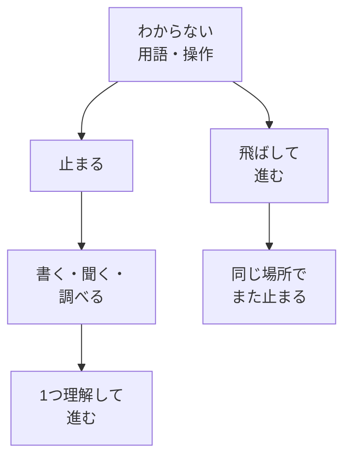

# ゆっくり学ぶ——わからないまま進まない

## たとえ話

> 編み物で目を一つ落としたまま編み進めると、その場では気づかず先へ進める。けれど何段も編んだあとで、布の途中にぽっかり穴が空いているのに気づく。直すには、せっかく編んだところをほどいて、落とした一目まで戻らなければならない。先を急いだぶん、あとで戻る距離が長くなる。
>
> 学びでも、わからない言葉や操作を「後でいいや」と飛ばすと、これと同じことが起きる。その場は進んだように見えても、理解の布には小さな穴が残り、同じ場所でまた手が止まる。だから今日は、わからないと感じたその瞬間に立ち止まる練習をする。止まることは遅れではなく、穴を残さず確実に前へ進むための、いちばん近道なのだ。

## 今日のゴール

「わからないまま進まない」ための止まるチェックを理解し、自分の止まる合図を1つ決める。

## この教材で伸ばす力

**進める力** — わからないときに先へ進まず、戻る・聞く・書くを選べるようになる

## 前提確認

- すでにできる前提：学びの4段階（第2章03）を知っている
- まだ知らなくてよいこと：Webhookなどの専門用語の意味（今は止まることが大事）

## 学びの段階

今日の完了は **「できる」** です。  
自分の「止まる合図」を1つ決め、次にわからなくなったとき使える状態にします。

## なぜ大事か

早く進もうとすると、**わからないまま先へ進みやすい**です。

- 用語を飛ばす
- エラーを無視する
- 「なんとなく」でクリックを続ける

一時的には進んだように見えます。  
でも後で、同じところでまた止まります。これが**浅い理解のまま躓く**パターンです。

Rebuild AI Guild では、**ゆっくり学ぶ**ことを大切にします。

- わからないまま先に進まない
- インプット（読む・聞く）とアウトプット（書く・やる）をセットで行う
- 急いで進もうとすればするほど、後で穴が残る

### 図解：ゆっくり学ぶと浅い理解



## 読んで学ぶ

### わからないまま進まないチェック

次のどれかに当てはまったら、**そこで止まってOK**です。

| チェック | 例 | 別の例 |
|---|---|---|
| 用語が説明できない | 「予約や問い合わせの導線」とは何か、一言で言えない | 「申し込みの導線」とは何か、言えない |
| 手順の「なぜ」がわからない | なぜこのボタンを押すのかわからない | なぜこの項目を入力するのかわからない |
| 人に説明できない | 一緒に働く人に手順を教えられない | 事務の人に設定を頼めない |
| 不安だけが残る | 壊しそうで怖いのに進んでいる | 間違った案内を出しそうで怖い |

止まることは、失敗ではありません。**学びの4段階を上げるための正しい一歩**です。

### 止まったあとにやること（小さく3つ）

1. **書く** — 「わからないこと」を1行でメモする
2. **聞く** — Discordで質問する（テンプレは下の「つまずいたら」）
3. **1つだけ** — 今日はその1点だけ調べる・聞く。全部は後でOK

### 螺旋的に学ぶ

同じところを何度も最初からやり直すのではなく、**一旦先に進み、躓いたら戻る**学び方です。

- 第3章でMac操作を学ぶ
- わからなくなったら第2章に戻る（急いでいないか確認）
- 穴を1つ埋めてから、また先へ

## 手を動かす（インプット＋アウトプット）

メモに次を書いてください。

```text
【私の止まる合図】
（例：用語を3回見ても意味がわからない）

【止まったときにやること】
（例：メモに1行書いてDiscordで聞く）
```

## わからないまま進まないチェック（この教材用）

- 止まる合図が決められない → 上の表の4つから、いちばん心当たりがあるものを選ぶ
- 「止まるのが怖い」 → 5分だけ止まる練習でOK。Rebuild AI Guild は止まることを推奨します
- 全部わからない → 「いちばん不安な1つ」だけ書く

## できたらOK

- 自分の「止まる合図」を1つ決めた
- 止まったときにやることを1つ書いた
- 4択チェック3問に答え、答えページで確認した

## 4択チェック

1. 「ゆっくり学ぶ」とRebuild AI Guild が言いたいことに近いのはどれですか？
   - A. 1日の学習時間を増やして、徹夜で進む
   - B. わからないまま先へ進まず、穴を残さない
   - C. 教材は読まず、動画だけ倍速で見る
   - D. エラーが出たら無視して次へ進む

2. 次のうち、「わからないまま進まないチェック」に当てはまるのはどれですか？
   - A. 用語の意味を一言で説明できないのに、次の画面へ進んだ
   - B. 用語を調べて、自分の言葉でメモに書いた
   - C. Discordで質問して、回答をメモした
   - D. 小さく1回やってみて、できた

3. 「螺旋的に学ぶ」とは、どの進め方に近いですか？
   - A. 同じ章を最初から何度も丸ごと繰り返すだけ
   - B. 一旦先に進み、躓いたら戻って穴を深める
   - C. わからない章は永遠にスキップする
   - D. 最後の章まで一気に読み切ってから戻る

答え合わせはこちら：  
[答えを見る](../../答え/第02章-学びの土台/04-ゆっくり学ぶ-わからないまま進まない-答え.md)

## つまずいたら

```text
【今やっている教材】第2章 04 ゆっくり学ぶ

【詰まったところ】

【わからないこと（1行）】

【試したこと】

【どうなればOKか】
```

**躓いたら戻る先**

- [03 学びの4段階](./03-学びの4段階-知ったで満足しない.md) — 今の段階が「知った」止まりか確認
- [01 早く結果が欲しい](./01-早く結果が欲しい-その欲に気づく.md) — 急いで飛ばそうとしていないか確認

## 今日の成果物

- 「止まる合図」と「止まったときにやること」のメモ

## 問い

最近、わからないまま進んでしまった場面は、あったでしょうか。  
次に同じ場面が来たら、どんな合図で止まれそうでしょうか。
