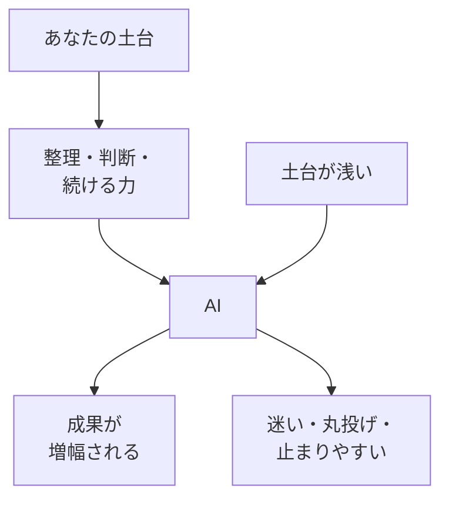

# AIは増幅装置——1年後の視点と進め方

## たとえ話

> 同じ拡声器を手にしても、聞こえてくる声はずいぶん違う。伝えたいことが定まっている人が使えば、その思いは遠くまでくっきり届く。けれど話す中身が決まっていない人が使うと、大きくなるのは中身ではなく、ためらいや迷いの声のほうだ。拡声器は声を大きくするだけで、中身までは作ってくれない。
>
> AIも、この拡声器によく似ている。自分の考えや、お店の強みが言葉になっている人が使えば、その土台が何倍にも増幅される。けれど土台があいまいなままだと、増幅されるのは迷いのほうになりがちだ。だから今日は、AIにすべてを任せる前に、なぜ「今は土台に時間をかける」のかを考える。土台さえあれば、AIが進むほど、その力はますます活きてくる。

## 今日のゴール

「AIは増幅装置」という考え方を理解し、1年後にできていたいことを1つ書く。

## この教材で伸ばす力

**判断する力** — AIに任せきりにせず、土台を整えたうえで使う判断ができるようになる

## 前提確認

- すでにできる前提：第2章01〜04の学び方の原則
- まだ知らなくてよいこと：Cursorの使い方（第12章）、具体的なAIプロンプト（第11章）

## 学びの段階

今日の完了は **「わかった」** です。  
「AIは増幅装置」を自分の言葉で説明し、1年後の視点を1つ書ければOKです。

## なぜ大事か

Rebuild AI Guild の北極星は、**今は土台に時間をかける**ことです。

AIは魔法ではありません。  
**その人の能力を増幅する装置**にすぎません。

| 土台がある人 | 土台が浅い人 |
|---|---|
| AIの答えを自分の言葉で直せる | AIの答えをそのまま使い、説明できない |
| 何を聞くか決められる | とりあえず聞いて、迷子になる |
| 試して、直して、続けられる | 一度失敗して止まる |

半年〜1年後、AIはさらに進化します。  
そのとき活きるのは、**考え方の土台・整理・試行錯誤の習慣**です。

### 図解：AIは増幅装置



## 読んで学ぶ

### Rebuild AI Guild の地図（全体像）

第2章で整えた**考え方の土台**のあと、次の順で進みます。

| 章 | 内容 | 土台との関係 |
|---|---|---|
| 第3〜5章 | Mac・IT・習慣と時間 | 手を動かす土台 |
| 第6〜7章 | ファイル整理・AIに渡す情報 | 整理する土台 |
| 第8〜10章 | エディタ・ターミナル・GitHub | 作る・進める土台 |
| 第11〜14章（Guild本編） | AI活用・Cursor・AIチーム・LP公開 | 土台の上で増幅 |

今は第2章です。**急いで第11章へ飛ばない**ことが、1年後の自分への投資になります。

### AI活用に大事な2つ（第11章以降の予告）

1. **情報整理** — 何を、どの順で、AIに渡すか
2. **試行錯誤** — 一度で正解を出さず、試して直す

どちらも、第2章までの原則とつながっています。

### 1年後の例

| 1年後にできていたいこと | 今の土台作り |
|---|---|
| 予約しやすい導線とサービスの説明 | ファイル整理・自分の言葉での説明 |
| お客さまに合った提案の記録 | 習慣・メモの残し方 |
| 問い合わせから申し込みまでの案内 | ITリテラシー・わからないとき止まる |
| お客さまに伝わるLP | 段階的に「できる」まで積む |

## 手を動かす（インプット＋アウトプット）

メモに次を書いてください。

```text
【1年後にできていたいこと（1つ）】
（例：お客さまが自分で予約できる導線がある）

【そのために今、土台としてやること（1つ）】
（例：第3章からMacとファイルの基礎をゆっくり進める）
```

## わからないまま進まないチェック

- 1年後のことが想像できない → 第1章の目標メモから1行借りる
- 「AIですぐできるのでは？」と思う → 増幅装置の図に戻る。土台が浅いと迷いやすい
- Guild本編（第11章〜）を今すぐやりたい → 第2章を終えてから。順番には理由がある

## できたらOK

- 「AIは増幅装置」を自分の言葉で1文説明できた
- 1年後にできていたいことを1つ書いた
- 4択チェック3問に答え、答えページで確認した

## 4択チェック

1. 「AIは増幅装置」とは、どの意味に近いですか？
   - A. AIがあれば、土台がなくても何でもできる
   - B. その人の土台次第で、AIの成果も変わる
   - C. AIは使わないほうがよい
   - D. AIは1年後には不要になる

2. Rebuild AI Guild が「今は土台に時間をかける」と言う理由に近いのはどれですか？
   - A. 最新ツールの情報はすぐ古くなるから
   - B. 1年後も活きる整理・判断・続ける力を先に育てるから
   - C. AIは難しいから触らないほうがよいから
   - D. 第11章以降は存在しないから

3. 第2章のあと、無料本編のおおまかな進み方として正しいのはどれですか？
   - A. 第11章（AI活用）にすぐ飛ぶ
   - B. 第3章（Macとファイル）から順に、手を動かす土台を積む
   - C. 第2章をスキップして第6章へ
   - D. 読むだけで第10章まで一気に進む

答え合わせはこちら：  
[答えを見る](../../答え/第02章-学びの土台/05-AIは増幅装置-1年後の視点と進め方-答え.md)

## つまずいたら

```text
【今やっている教材】第2章 05 AIは増幅装置

【詰まったところ】

【試したこと】

【どうなればOKか】
```

**躓いたら戻る先**

- [04 ゆっくり学ぶ](./04-ゆっくり学ぶ-わからないまま進まない.md) — 急いで第11章へ行こうとしているとき
- [01 早く結果が欲しい](./01-早く結果が欲しい-その欲に気づく.md) — 成果を早く出したい気持ちが強いとき
- 第1章 — 1年後のことがまだぼんやりなとき

## 今日の成果物

- 1年後にできていたいこと＋今の土台作り1つのメモ

## 問い

1年後のあなたが「土台を整えてよかった」と思う状態は、どんな姿でしょうか。  
今週、そこに向けて小さくできる一歩は、何にできそうでしょうか。
