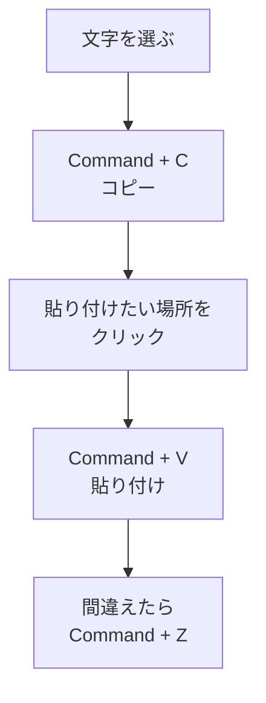

# ショートカットとは何か（Cmd+C / V / Z など）

## たとえ話

> 毎日通る部屋に、遠回りの道と近道の二つがあるとする。近道の存在を知らない人は、何年も遠回りを続けてしまう。一回ごとの差はほんの数歩でも、毎日繰り返すうちに、その差は驚くほど大きな時間になっていく。
>
> パソコンの操作にも、同じような近道がある。同じことをするのに、毎回マウスでメニューをたどる遠回りと、キーをひと押しで済ませる近道がある。ショートカットは特別な才能でも魔法でもなく、よく使う操作を短く呼び出すための、この近道のことだ。今日それを学ぶのは、覚えた時間が、これから毎日少しずつ返ってくるからだ。

## 今日のゴール

- Macで **コピー・貼り付け・元に戻す** の3つを、キーボードだけで1回ずつ試す。

## この教材で伸ばす力

**進める力** — 同じ操作を短く繰り返せるようになる

## 学びの段階

完了条件は **「できる」** — メモ帳で文字をコピーして貼り付け、元に戻せること

## 前提確認

- すでにできる前提：Macの電源が入っていて、キーボードが使える
- まだ知らなくてよいこと：すべてのショートカットを覚える必要はない

## なぜ大事か

仕事のメモ、お客さまの記録の下書き、やりとりの記録——コピーと貼り付けは毎日の作業です。
マウスだけで進めると、操作に意識が取られ、内容を考える力が残りにくくなります。
まず3つだけ覚えれば、今日から作業が少し軽くなります。

## 読んで学ぶ

### ショートカットとは

**ショートカット**とは、メニューをたどらずに操作を実行するキーの組み合わせです。
Macでは、多くのショートカットで **Command（⌘）** キーを使います。
キーボード左下あたりに「⌘」と書かれたキーがあります。

よく使う3つだけ、今日覚えます。

| 操作 | キー | 覚え方のヒント |
|---|---|---|
| コピー | `Command + C` | **C**opy（コピー） |
| 貼り付け | `Command + V` | クリップボードから **V**iew（貼る）と覚える人もいます |
| 元に戻す | `Command + Z` | 最後の操作を取り消す（**Z**ap のイメージ） |

### 図解



## 手順

### 1. メモ帳（テキストエディット）を開く

1. 画面下の **Dock**（アイコンが並ぶバー）を見る。
2. **テキストエディット** のアイコンを探す。見つからなければ、画面右上の **Spotlight**（虫眼鏡マーク）をクリックする。
3. 「テキストエディット」と入力し、表示された **テキストエディット** を押す（または Enter）。

### 2. 練習用の文字を書く

1. 白い画面をクリックして、カーソル（縦棒）が点滅するのを確認する。
2. 次の1行を入力する（例）：
   ```
   お客さまA：前回の内容、次回はこの提案
   ```
3. 自分の仕事に合わせて、次のように置き換えてもよい：
   ```
   お客さまB：得意なこと、次に提案したいこと
   ```

### 3. コピーする（Command + C）

1. 書いた文字の **先頭** をクリックする。
2. マウスを **最後までドラッグ** して、文字全体が青く反転（選択）されるのを確認する。
3. キーボードで **`Command` を押しながら `C`** を押す。
4. 画面に変化がなくても大丈夫です。コピーは成功しています。

### 4. 貼り付ける（Command + V）

1. 選択した文字の **右側** をクリックして、カーソルを移動する。
2. **Enter** を1回押して、次の行に移動する。
3. **`Command` を押しながら `V`** を押す。
4. 同じ文字が2行目に現れれば成功です。

### 5. 元に戻す（Command + Z）

1. 2行目に何か文字を追加してみる（例：`テスト`）。
2. **`Command` を押しながら `Z`** を押す。
3. 追加した文字が消えれば、元に戻せています。

> **スクショ案内**：テキストエディットで文字が選択（青く反転）されている画面を撮っておくと、Discordで質問するときに役立ちます。撮り方は `Shift + Command + 4` で範囲を選べます。

## わからないまま進まないチェック

次のどれかに当てはまったら、**ここで止まって** Discordで聞いてください。

- 「Command キーがどれかわからない」
- 「文字を選択できない（青くならない）」
- 「貼り付けても何も出てこない」

## できたらOK

- [ ] メモ帳で文字を書いた
- [ ] `Command + C` でコピーした
- [ ] `Command + V` で貼り付けた
- [ ] `Command + Z` で元に戻した

今日はこの4つができれば十分です。他のショートカットは、必要になったときに覚えれば大丈夫です。

## つまずいたら

### よくあるつまずき

| 症状 | 試すこと |
|---|---|
| 貼り付けられない | 先にコピー（Command + C）をしたか確認。貼り付け先をクリックしてから Command + V |
| 日本語入力のまま効かない | 一旦英数入力に切り替えてから試す |
| 全部消えてしまった | Command + Z を数回押す（元に戻せることが多い） |

### 躓いたら戻る先

操作に焦っているかもしれません。一度立ち止まって、第2章「学びの土台を整える」の **ゆっくり学ぶ** の考え方を見直してください。

- [第2章：学びの土台を整える](../../第02章-学びの土台/)

Discordで次のように聞いてください。

```text
【今やっている教材】第3章 01-shortcuts

【詰まったところ】（例：貼り付けができない）

【試したこと】（例：Command + V を押した）

【スクショやエラー文】

【どうなればOKか】貼り付けができればOK
```

## 今日の成果物

- テキストエディットに、コピー＆貼り付けを試した練習メモ（保存しなくてもOK）

## 問い

あなたの仕事で、**毎日コピー＆貼り付けしている作業**は、何でしょうか。
（例：予約メモ、対応の記録、やりとりの記録の下書き）
