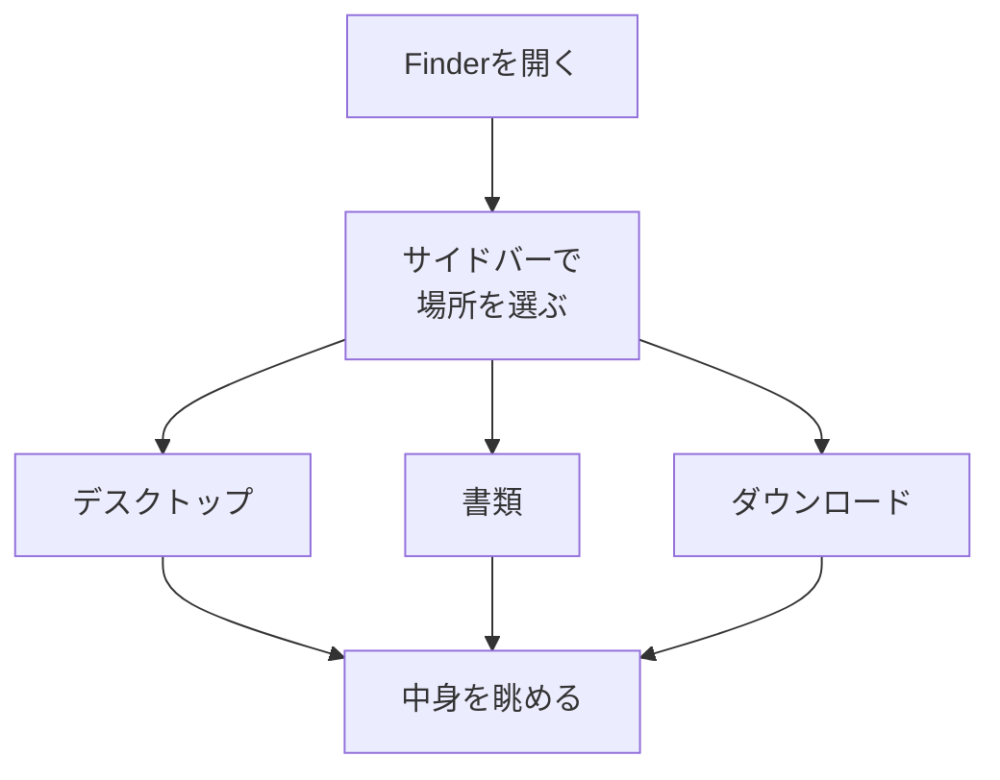

# Finderとは何か

## たとえ話

> 大きな建物に初めて入ったとき、受付の案内図がどこにあるかわからないと、目的の部屋にたどり着けず廊下をさまよってしまう。けれど一度「総合受付はここ」とわかれば、そこから先はずいぶん楽になる。どの部屋も、まず受付を起点に探せばよいからだ。
>
> パソコンの中も、これと似ている。書類も写真も、ダウンロードしたものも、見えないどこかに散らばっている。それを探して開くための「総合受付」にあたるのが Finder だ。今日それを学ぶのは、ファイルを上手に作る前に、まず「どこを見れば自分のものが置いてあるのか」という起点を知っておくと、これから先ずっと迷いにくくなるからだ。

## 今日のゴール

- Finderを開き、**デスクトップ・書類・ダウンロード** の3つの場所を見て回る。

## この教材で伸ばす力

**整理力** — Macの中の「置き場所」を把握し始める

## 学びの段階

完了条件は **「できる」** — Finderで3つのフォルダを開き、中身を眺められること

## 前提確認

- すでにできる前提：第3章「ショートカット」の教材を読んだ、またはMacを触ったことがある
- まだ知らなくてよいこと：フォルダの作り方や移動（次の教材で学びます）

## なぜ大事か

仕事の写真、サービス一覧の下書き、予約アプリのスクショ、お客さまの記録、案内文。
これらはすべてMacのどこかに保存されています。
Finderに慣れると、「探す時間」を減らし、**考える時間**を残せます。

## 読んで学ぶ

### Finderとは

**Finder**（ファインダー）は、Macのファイルやフォルダを見るためのアプリです。
Windowsの「エクスプローラー」に近い役割です。

Dock（画面下のアイコン列）の **左端** に、青と白の **笑顔の顔** のアイコンがあります。これがFinderです。

### よく使う3つの場所

| 場所 | 何が入りやすいか | 例 | 別の例 |
|---|---|---|---|
| デスクトップ | 一時的に置いたもの | 今日の予約メモ | 明日使う資料 |
| 書類 | 仕事用の資料 | サービス一覧の下書き | 提供内容の案 |
| ダウンロード | ネットから取ったもの | 仕入れサイトのPDF | 受け取った資料のPDF |

### 図解



## 手順

### 1. Finderを開く

1. 画面下の **Dock** を見る。
2. **左端** の青白い **笑顔のアイコン**（Finder）をクリックする。
3. 新しいウィンドウが開けば成功です。

> **スクショ案内**：Finderのウィンドウ全体（サイドバーが見える状態）を撮っておくと、質問時に便利です。

### 2. サイドバーを確認する

1. Finderウィンドウの **左側** に、フォルダ名が縦に並んでいるエリアがあります。これが **サイドバー** です。
2. サイドバーが見えない場合は、画面上部メニューの **表示** をクリック → **サイドバーを表示** を選ぶ。

### 3. デスクトップを見る

1. サイドバーの **デスクトップ**（または「Desktop」）をクリックする。
2. 右側に、デスクトップ上のファイルやフォルダが表示されます。
3. 何があるか、30秒だけ眺めてください。覚える必要はありません。

### 4. 書類を見る

1. サイドバーの **書類**（Documents）をクリックする。
2. 中身を30秒眺める。

### 5. ダウンロードを見る

1. サイドバーの **ダウンロード**（Downloads）をクリックする。
2. 中身を30秒眺める。

### 6. 表示形式を変えてみる（任意）

1. Finderウィンドウ上部の **アイコン表示・リスト表示** のボタンをクリックして、見え方を変えてみる。
2. どちらが見やすいか、感覚だけ覚えておく。

## わからないまま進まないチェック

- 「Finderのアイコンが見つからない」→ 上の手順1で止まる
- 「サイドバーにデスクトップ・書類・ダウンロードがない」→ Discordで聞く（設定で非表示のことがあります）
- 「右側が真っ白で何もない」→ そのフォルダが空の可能性。別の場所をクリックしてみる

## できたらOK

- [ ] Finderを開いた
- [ ] デスクトップ・書類・ダウンロードの3つをクリックして中身を見た
- [ ] 「自分のMacの中に、こんなものがある」と感じられた

今日は **見るだけ** でOKです。整理は第6章で深掘りします。

## つまずいたら

### 躓いたら戻る先

Finderがわからなくなるときは、焦って進もうとしているサインかもしれません。

- [第2章：学びの土台を整える](../../第02章-学びの土台/)

前の教材：

- [01-shortcuts：ショートカットとは何か](./01-ショートカットとは何か.md)

Discordテンプレート：

```text
【今やっている教材】第3章 02-finder-basics

【詰まったところ】

【試したこと】

【スクショやエラー文】

【どうなればOKか】Finderで3つの場所を見られればOK
```

## 今日の成果物

- Finderで3つの場所を見た、という経験（メモ不要）

## 問い

デスクトップ・書類・ダウンロードのうち、**いちばん散らかっている（または不安になる）場所**は、どこでしょうか。
