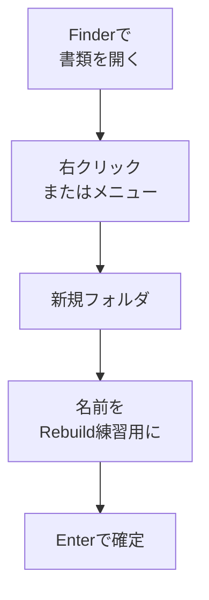

# フォルダを作る

## たとえ話

> 引き出しの中にすべての文房具を放り込んでいると、ペン一本を取り出すたびに中をかき回すことになる。けれど仕切り板を一枚入れて「ここはペン、ここはクリップ」と決めるだけで、探す時間はぐっと減る。仕切りは中身を増やすわけではないが、同じ中身を見つけやすくしてくれる。
>
> パソコンのフォルダも、この引き出しの仕切りと同じ役目を持つ。写真も書類も、一か所に混ざったまま増えていくと、必要なものを探すのにだんだん時間がかかるようになる。今日それを学ぶのは、ファイルが少ない今のうちに「置き場所を決める」という小さな仕切りを作っておくと、これから増えても散らからずに済むからだ。

## 今日のゴール

- **書類** の中に `Rebuild練習用` という名前のフォルダを1つ作る。

## この教材で伸ばす力

**整理力** — 情報の「置き場所」を自分で決め始める

## 学びの段階

完了条件は **「できる」** — 指定した名前のフォルダが書類フォルダ内に存在すること

## 前提確認

- すでにできる前提：Finderを開ける（第3章 02-finder-basics）
- まだ知らなくてよいこと：完璧なフォルダ設計（第6章で学びます）

## なぜ大事か

お客さまの記録、サービス一覧の案、仕事の資料——ファイルが増えると、デスクトップやダウンロードだけでは足りなくなります。
フォルダを作れると、「あとで探す」ではなく **「最初から置く場所を決める」** ができます。

## 読んで学ぶ

### フォルダとは

**フォルダ**は、ファイルをまとめて入れる入れ物です。
紙のファイルに区切りを入れるのと同じイメージです。

今日作るフォルダ名は **`Rebuild練習用`** です。
Guildの教材で手を動かす練習用として使います。

### 図解



## 手順

### 1. Finderで書類を開く

1. Dockの **Finder**（笑顔アイコン）をクリックする。
2. サイドバーの **書類** をクリックする。

### 2. 新規フォルダを作る（方法A：右クリック）

1. 右側の空白部分で **右クリック**（または Control を押しながらクリック）する。
2. メニューから **新規フォルダ** を選ぶ。
3. 青いフォルダが現れ、名前の部分が選択された状態になります。

### 3. 新規フォルダを作る（方法B：メニューから）

右クリックが難しい場合：

1. 画面上部メニューの **ファイル** をクリックする。
2. **新規フォルダ** を選ぶ。

### 4. フォルダに名前をつける

1. 選択された状態のまま、次の名前を入力する：
   ```
   Rebuild練習用
   ```
2. **Enter** を押して確定する。
3. 書類フォルダの中に `Rebuild練習用` と表示されれば成功です。

> **スクショ案内**：`Rebuild練習用` フォルダが書類の中に見えている画面を撮っておくと、達成の記録になります。

### 5. フォルダを開いてみる（確認）

1. `Rebuild練習用` フォルダを **ダブルクリック** する。
2. 中身は空で大丈夫です。
3. ウィンドウ左上の **＜ 書類** をクリックすると、一つ上の階層に戻れます。

## わからないまま進まないチェック

- 「新規フォルダが出てこない」→ 書類フォルダを開いているか確認。空白部分で右クリックしたか確認
- 「名前を変えられない」→ フォルダを一度クリックして選択し、Enter を押すか、ゆっくりクリックして名前を編集
- 「どこに作られたかわからない」→ サイドバーの書類をもう一度クリックし、`Rebuild練習用` を探す

## できたらOK

- [ ] 書類フォルダの中に `Rebuild練習用` がある
- [ ] フォルダをダブルクリックして開けた
- [ ] 書類に戻れた

## つまずいたら

| 症状 | 試すこと |
|---|---|
| フォルダ名が `新規フォルダ` のまま | フォルダを選択 → Enter → 名前を入力 |
| 間違った場所に作った | フォルダをドラッグして書類に移動（次の教材でも扱います） |

### 躓いたら戻る先

- [第2章：学びの土台を整える](../../第02章-学びの土台/)
- [02-finder-basics：Finderとは何か](./02-Finderとは何か.md)

Discordで質問するときは、次の形で書いてください。

```text
【今やっている教材】第3章 03 フォルダを作る

【詰まったところ】
（例：書類の場所が見つからない / 新規フォルダが出ない）

【試したこと】

【どうなればOKか】Rebuild練習用フォルダが作れればOK
```

## 今日の成果物

- `書類/Rebuild練習用` フォルダ（Macの中に残ります）

## 問い

もし仕事用にフォルダを1つだけ増やすとしたら、**何のためのフォルダ**にするでしょうか。
（例：`お客さま写真`、`仕事の資料2025`）
