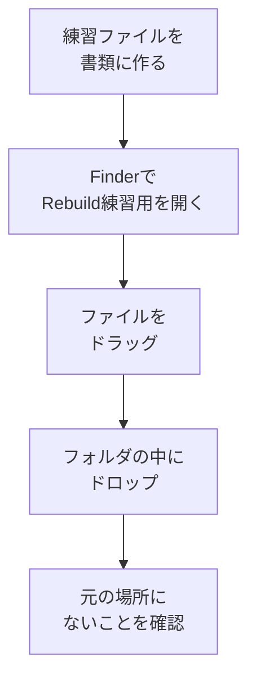

# ファイルを移動する

## たとえ話

> 新しい家に引っ越すとき、荷物をただ運び出すだけでは片づかない。「この箱は寝室、これは台所」と運ぶ先を決めて初めて、新しい暮らしが整っていく。同じ荷物でも、どこへ運ぶかを決めるかどうかで、その後の暮らしやすさは大きく変わる。
>
> パソコンのファイルも、これと同じだ。ダウンロードやデスクトップに置きっぱなしの書類は、玄関に積まれたままの段ボールのようなもの。今日学ぶ「移動」は、そのファイルを正しい部屋へ引っ越しさせる作業だ。一つずつ運ぶ先を決める習慣がつくと、あとから探しまわる手間が、少しずつ消えていく。

## 今日のゴール

- 練習用のテキストファイルを作り、`Rebuild練習用` フォルダへ **移動** する。

## この教材で伸ばす力

**進める力** — ファイルを意図した場所に置ける

## 学びの段階

完了条件は **「できる」** — 練習ファイルが `書類/Rebuild練習用` の中だけに存在すること

## 前提確認

- すでにできる前提：`Rebuild練習用` フォルダがある（03-create-folder）
- まだ知らなくてよいこと：ドラッグの細かい操作全部

## なぜ大事か

ダウンロードに溜まったままのPDF、デスクトップに置きっぱなしのメモ——探すたびに疲れます。
「いつか整理しよう」ではなく、**1ファイルずつ正しい場所へ移す** 習慣が、整理の第一歩です。

## 読んで学ぶ

### 移動とコピーの違い

| 操作 | 結果 |
|---|---|
| **移動** | 元の場所から消え、新しい場所にだけある |
| **コピー** | 元と先の両方に同じファイルがある |

今日は **移動** を練習します。

### 図解



## 手順

### 1. 練習用ファイルを作る

1. **テキストエディット** を開く（Spotlightで「テキストエディット」と検索しても可）。
2. 次の1行を入力する：
   ```
   移動の練習：2025年6月
   ```
3. 画面上部メニューの **ファイル** → **保存** をクリックする。
4. 保存ダイアログで：
   - **場所** を **書類** にする（サイドバーで書類を選ぶ）。
   - **名前** を `移動練習メモ.txt` にする。
5. **保存** をクリックする。
6. テキストエディットは閉じてよい。

### 2. Finderで書類を開く

1. **Finder** を開く。
2. サイドバーの **書類** をクリックする。
3. `移動練習メモ.txt` があることを確認する。

### 3. ドラッグで移動する

1. `移動練習メモ.txt` を **クリックしたまま** マウスを動かす（ドラッグ）。
2. サイドバーの **`Rebuild練習用`** フォルダの上まで持っていく。
3. フォルダがハイライトされたら、**マウスボタンを離す**（ドロップ）。
4. 書類フォルダの一覧から `移動練習メモ.txt` が消えていれば、移動成功の可能性が高いです。

### 4. 移動先を確認する

1. サイドバーの **`Rebuild練習用`** をクリックする。
2. 中に `移動練習メモ.txt` があれば完了です。

> **スクショ案内**：`Rebuild練習用` の中に `移動練習メモ.txt` が見えている画面を撮る。

### 5. 別の方法：切り取り＆貼り付け（任意）

ドラッグが難しい場合：

1. `移動練習メモ.txt` をクリックして選択する。
2. **`Command + C`** でコピーするのではなく、メニュー **編集** → **コピー** のあと、**Option** キーを押しながら **編集** メニューを開くと **〇〇を移動** が出る場合があります。
3. または：ファイルを選択 → **`Command + C`** → `Rebuild練習用` を開く → **`Command + Option + V`**（移動して貼り付け）を試す。

ここで止まったら、ドラッグだけできれば今日はOKです。

## わからないまま進まないチェック

- 「ドラッグしてもコピーになって、元にも残る」→ そのままでも学習には問題ない。後で整理すればよい
- 「ファイルが見つからない」→ 書類と `Rebuild練習用` の両方を確認。Spotlight（Command + スペース）で「移動練習」と検索

## できたらOK

- [ ] `移動練習メモ.txt` が `Rebuild練習用` の中にある
- [ ] 書類の直下には（移動できていれば）ない

## つまずいたら

### 躓いたら戻る先

- [第2章：学びの土台を整える](../../第02章-学びの土台/)
- [03-create-folder：フォルダを作る](./03-フォルダを作る.md)

```text
【今やっている教材】第3章 04-move-files

【詰まったところ】

【試したこと】

【スクショやエラー文】

【どうなればOKか】練習ファイルがRebuild練習用の中にあればOK
```

## 今日の成果物

- `書類/Rebuild練習用/移動練習メモ.txt`

## 問い

ダウンロードやデスクトップに、**「そろそろ引っ越しさせたい」ファイル**は1つあるでしょうか。名前だけメモしておいてください。
