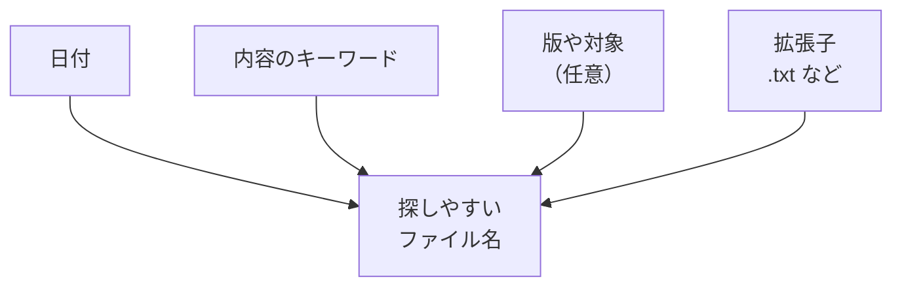

# 命名ルールの入口

## たとえ話

> 食品の保存容器に何も書かずに冷蔵庫へしまうと、数日後には「これは何だっけ」と中身を開けて確かめることになる。けれど「煮物・6月10日」と一言貼っておくだけで、開けなくても中身と古さがわかる。ラベルは、未来の自分に向けた小さな伝言なのだ。
>
> パソコンのファイル名も、この保存容器のラベルとよく似ている。`最新.docx` `最新のコピー.docx` と並ぶと、どれが本当に新しいのか、つけた本人でさえわからなくなる。今日それを学ぶのは、名前のつけ方を少し整えるだけで、後から探す自分が迷わずに済むからだ。名前は、未来の自分へのメモなのだ。

## 今日のゴール

- 命名ルール3つを理解し、`Rebuild練習用` に **ルールに沿った名前** の練習ファイルを1つ作る。

## この教材で伸ばす力

**整理力** — あとから探せる名前をつけられる

## 学びの段階

完了条件は **「できる」** — ルールに沿ったファイル名の練習ファイルが1つあること

## 前提確認

- すでにできる前提：フォルダの作成・ファイルの移動（第3章 03〜04）
- まだ知らなくてよいこと：完璧な命名体系（第6章で深掘り）

## なぜ大事か

`対応の記録`、`お客さま写真`、`やりとりの記録`、`仕事の資料`。
名前がバラバラだと、検索しても出てきません。
AIに資料を渡すときも、**ファイル名がわかっていると指示しやすい** です。

## 読んで学ぶ

### 今日覚える命名ルール3つ

1. **日付を入れる** — `2025-06-16` のように、先頭か途中に入れる（古い順に並びやすい）
2. **内容がわかる語を入れる** — `最新` だけにしない。`サービス案` `やりとりの記録` のように
3. **バージョンは数字** — `v2` `v3` のように。`最新のコピー` は避ける

### 良い例・悪い例

| 悪い例 | 良い例 | 理由 |
|---|---|---|
| `メモ.docx` | `2025-06-16_サービス案_v1.txt` | いつの何かがわかる |
| `最新.docx` | `2025-06-16_やりとりの記録_お客さまA.txt` | 「最新」はすぐ古くなる |
| `写真 (3).jpg` | `2025-06-16_対応前_お客さまA.jpg` | 内容と日付がわかる |

※ お客さまの実名は、練習では `お客さまA` `お客さまB` のようにぼかしてください。

### 図解



## 手順

### 1. 今日の日付を確認する

1. 画面右上の **日付と時刻** をクリックするか、カレンダーアプリで今日の日付を確認する。
2. 形式は **`YYYY-MM-DD`**（例：`2025-06-16`）で書きます。

### 2. 練習ファイル名を決める

自分の仕事に近い例を1つ選び、名前を決めます。

**例：**
```
2025-06-16_サービス案_v1.txt
```

**別の例：**
```
2025-06-16_案内案_v1.txt
```

### 3. テキストエディットでファイルを作る

1. **テキストエディット** を開く。
2. 中に1行だけ書く（例：`サービス一覧の下書き`）。
3. **ファイル** → **保存** をクリックする。
4. **場所** を `書類` → `Rebuild練習用` にする。
5. **名前** に、さきほど決めたルール通りの名前を入力する。
6. **保存** をクリックする。

### 4. Finderで確認する

1. **Finder** で `書類` → `Rebuild練習用` を開く。
2. ファイル名に **日付・内容・版** が入っているか確認する。

> **スクショ案内**：命名ルール通りのファイル名が一覧に見えている画面。

## わからないまま進まないチェック

- 「日付の形式がわからない」→ `2025-06-16` のように、年-月-日でOK
- 「何を書けばいいかわからない」→ `2025-06-16_練習_v1.txt` だけでもOK
- 「.txt とは」→ テキストファイルの種類名。そのままで大丈夫

## できたらOK

- [ ] 日付がファイル名に入っている
- [ ] `最新` だけの名前ではない
- [ ] `Rebuild練習用` フォルダに保存した

第3章のまとめ：ショートカット、Finder、フォルダ、移動、命名——ここまでできれば、第6章のファイル整理に進む土台ができています。

## つまずいたら

### 躓いたら戻る先

- [第2章：学びの土台を整える](../../第02章-学びの土台/)
- [04-move-files：ファイルを移動する](./04-ファイルを移動する.md)

Discordで質問するときは、次の形で書いてください。

```text
【今やっている教材】第3章 05 命名ルールの入口

【詰まったところ】
（例：どんな名前にすればよいかわからない）

【試したこと】

【どうなればOKか】練習ファイルに日付と内容の名前を付けられればOK
```

## 今日の成果物

- 命名ルールに沿った練習ファイル1つ（`Rebuild練習用` 内）

## 問い

あなたのMacの中で、**名前を変えたら楽になるファイル**は1つあるでしょうか。今の名前と、つけたい名前をメモしてみてください。
