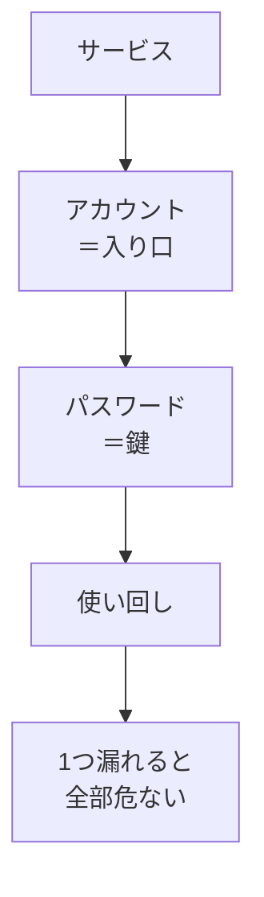

# アカウントとパスワードの基本

## たとえ話

> 家のドアも、車も、物置も、すべて同じ一本の鍵で開くようにしておくと、便利な反面、その一本を落としただけで全部が他人に開かれてしまう。鍵を分けておくのは面倒だが、どれか一つを失くしても被害がそこで止まる、という安心と引き換えなのだ。
>
> インターネットのサービスも、これと同じだ。予約も、仕入れも、メールも、同じパスワードで開くようにしていると、どこか一つが漏れたとたん、すべてが危うくなる。今日それを学ぶのは、パスワードという「鍵」の扱い方を少し見直すだけで、自分の仕事の大切な情報を守れるようになるからだ。鍵の話は地味だが、土台の安全につながっている。

## 今日のゴール

- アカウントとパスワードの役割を理解し、4択チェック3問に答える。

## この教材で伸ばす力

**正しく考える力** — デジタル上の「鍵」の大切さを判断できる

## 学びの段階

完了条件は **「知った」** — 4択チェックに答え、答えページで確認できたこと

## 前提確認

- すでにできる前提：メールや予約アプリなど、何か1つはアカウントを持っている
- まだ知らなくてよいこと：パスワード管理アプリの使い方（発展編で扱う）

## なぜ大事か

お客さまの情報、売上データ、予約履歴——小規模事業でもデジタル上に大切な情報があります。
パスワードが弱い・使い回しだと、**自分の仕事のデータ**が他人に見られるリスクがあります。

## 読んで学ぶ

### アカウントとは

**アカウント**（アカウント）とは、サービスにログインするための「あなた専用の入り口」です。
メールアドレスやユーザー名と、パスワードの組み合わせで識別されます。

### パスワードの基本ルール

1. **推測されにくい** — 誕生日・店名だけは避ける
2. **使い回さない** — 1つ漏れたら全部危ない
3. **人に教えない** — 運営が「パスワードを聞く」ことは基本的にない
4. **メモは暗号化や専用アプリ** — 紙に平文で貼らない（今日は「覚える・管理する意識」だけ）

### アカウントで守っているものの例

| サービス | アカウントで守っているもの |
|---|---|
| 予約アプリ | お客さまの予約情報 |
| 仕入れサイト | 注文履歴・支払い情報 |
| Googleアカウント | メール、ドライブの資料 |
| 公式LINE | お客さまとのやりとり |

### 図解



## わからないまま進まないチェック

- 「アカウントとメールアドレスの違いがわからない」→ アカウントは「ログインのセット全体」。メールはその一部になりやすい
- 「今のパスワードが危ないかわからない」→ 今日はルールを知るだけでOK。変更は一つずつでよい

## 4択チェック

1. パスワードの使い回しについて、正しい説明はどれですか？
   - A. 覚えやすいので、仕事用もプライベートも同じにした方がよい
   - B. 1つのサービスで漏れたら、同じパスワードの他サービスも危なくなる
   - C. 使い回しは問題ない。長ければ大丈夫
   - D. パスワードは店名だけで十分

2. 「サポートです。パスワードを教えてください」とメールが来た。どうしますか？
   - A. 信頼できそうなら教える
   - B. 教えない。公式でもパスワードを聞くことはほぼない
   - C. 半分だけ教える
   - D. 別のパスワードを教える

3. 強いパスワードの考え方として、いちばん近いのはどれですか？
   - A. 誕生日と店名の組み合わせ
   - B. 推測されにくく、サービスごとに違うもの
   - C. メモ帳に貼っておく
   - D. 短くて覚えやすい4文字

答え合わせはこちら：  
[答えを見る](../../答え/第04章-ITリテラシー/01-アカウントとパスワードの基本-答え.md)

## できたらOK

- [ ] 3問に自分の答えを選んだ
- [ ] 答えページで確認した
- [ ] 「使い回しは危ない」と言える

## つまずいたら

### 躓いたら戻る先

- [第3章：Macとファイルの基礎](../../第03章-Macとファイル/)

```text
【今やっている教材】第4章 01-accounts-passwords

【詰まったところ】

【試したこと】

【どうなればOKか】4択に答えて答えページを見られればOK
```

## 今日の成果物

- 4択チェックの回答（頭の中またはメモでOK）

## 問い

あなたが使っているサービスのうち、**いちばん守りたいアカウント**は、どれでしょうか。理由も1行で書いてみてください。
