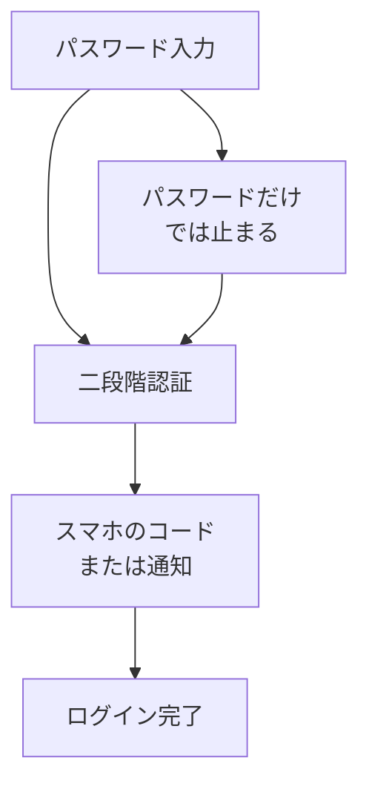

# 二段階認証

## たとえ話

> 大切なものを預ける金庫に、鍵が一つしかなければ、その鍵を拾った人は誰でも開けられる。だから多くの金庫は、鍵を回したうえで暗証番号も求める。鍵を持っていても、番号を知らなければ開かない。確認が一つ増えるぶん面倒だが、その一手間が中身を守ってくれる。
>
> インターネットのログインも、これと同じ考え方で守れる。パスワードという「鍵」だけだと、それが漏れた瞬間に入られてしまう。今日学ぶ二段階認証は、そこに「スマホに届くもう一つの確認」を足す仕組みだ。設定は今日でなくてよい。まずは、なぜこの一手間が自分の仕事の情報を守るのかを知ることから始める。

## 今日のゴール

- 二段階認証（2要素認証）が何かを理解し、4択チェック3問に答える。

## この教材で伸ばす力

**正しく考える力** — ログインの安全を一段強くする選択ができる

## 学びの段階

完了条件は **「知った」** — 4択チェックに答え、答えページで確認できたこと

## 前提確認

- すでにできる前提：アカウントとパスワードの基本（第4章 01）
- まだ知らなくてよいこと：今日中にすべてのサービスで設定を終えること

## なぜ大事か

メールやGoogleアカウントが乗っ取られると、パスワードリセットメールも見られ、**他のサービスまで連鎖**することがあります。
二段階認証は、パスワードが漏れても、犯人がログインしにくくする防御です。

## 読んで学ぶ

### 二段階認証とは

**二段階認証**（2要素認証、2FA）とは、ログインするときに

1. **知っているもの**（パスワード）
2. **持っているもの**（スマホに届くコードなど）

の **2つ** を求める仕組みです。

### よくある確認方法

| 方法 | イメージ |
|---|---|
| SMSの数字コード | スマホに6桁の番号が届く |
| 認証アプリ | Google認証システムなどのアプリに表示されるコード |
| スマホの通知 | 「ログインしますか？」とスマホに聞かれる |

### 優先したいアカウント

1. **メール**（Gmailなど）
2. **Googleアカウント**（ドライブ・スプレッドシート）
3. **予約・決済系**
4. **公開アカウント**

今日は **理解** だけ。設定は時間があるときに1つずつでOKです。

### 図解

## わからないまま進まないチェック

- 「二段階認証と二要素認証の違い」→ ほぼ同じ意味で使われます。今日は同じと考えてOK
- 「設定が難しそう」→ 今日の完了条件はチェックに答えること。設定は別の日でよい

## 4択チェック

1. 二段階認証の説明として正しいのはどれですか？
   - A. パスワードを2回入力する
   - B. パスワードに加えて、スマホなど別の確認を求める
   - C. パスワードを短くできる機能
   - D. 誰でもログインできるようにする機能

2. いちばん先に二段階認証を付けたいアカウントはどれが近いですか？
   - A. 一度も使わないゲームアカウント
   - B. メールやGoogleアカウントなど、他とつながる中心のアカウント
   - C. ゲスト用の仮アカウント
   - D. パスワードを覚えていないアカウント

3. SMSでコードが届く方式について、正しいのはどれですか？
   - A. 二段階認証の方法のひとつ
   - B. パスワードの代わりにSMSだけで十分
   - C. 二段階認証とは無関係
   - D. スマホがなくても必ず使える

答え合わせはこちら：  
[答えを見る](../../答え/第04章-ITリテラシー/02-二段階認証-答え.md)

## できたらOK

- [ ] 3問に答えた
- [ ] 答えページで確認した
- [ ] 「パスワード＋もう1つ」が二段階認証だと言える

## つまずいたら

### 躓いたら戻る先

- [01-accounts-passwords：アカウントとパスワードの基本](./01-アカウントとパスワードの基本.md)
- [第3章：Macとファイルの基礎](../../第03章-Macとファイル/)

## 今日の成果物

- 4択チェックの回答

## 問い

二段階認証を **最初の1つ** 付けるとしたら、どのサービスにするでしょうか。
