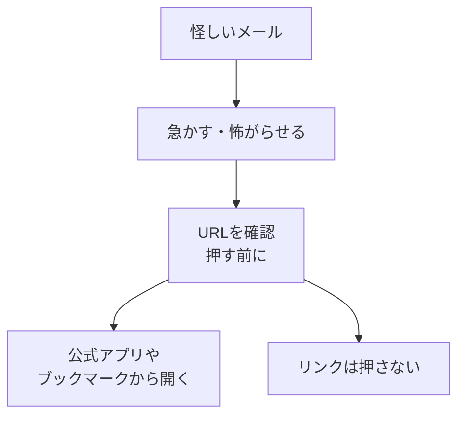

# フィッシング・怪しいメール・URL

## たとえ話

> 玄関に「水道局です、点検にうかがいました」と人が訪ねてくる。制服らしきものを着て、口調も丁寧だと、つい開けてしまいそうになる。けれど本物の点検なら、たいてい事前に知らせがあるし、慌てて開けなくても、後から正規の窓口に電話して確かめられる。急かされたときほど、一度立ち止まる人ほど被害に遭いにくい。
>
> インターネットの世界にも、この「制服を着た訪問者」がやってくる。本物そっくりのメールやサイトで、急いでパスワードを入れさせようとする。今日学ぶのは、見た目だけで信じず、送り主とURLを一度確かめる習慣だ。あなたの仕事の大切な情報を守るのは、難しい知識ではなく、この「いったん止まる」一拍なのだ。

## 今日のゴール

- フィッシングメールと怪しいURLの見分け方を理解し、4択チェック3問に答える。

## この教材で伸ばす力

**正しく考える力** — 急がせるメールやリンクを一度止めて確認できる

## 学びの段階

完了条件は **「知った」** — 4択チェックに答え、答えページで確認できたこと

## 前提確認

- すでにできる前提：メールを受け取ったことがある
- まだ知らなくてよいこと：高度なセキュリティ用語

## なぜ大事か

「パスワードの有効期限が切れました」「不正ログインを検知」——不安をあおるメールは、仕事の忙しいときほど引っかかりやすいです。
1回クリックするだけで、アカウントやお客さまの情報が危なくなることがあります。

## 読んで学ぶ

### フィッシングとは

**フィッシング**（phishing）は、本物のサービスを装って、パスワードや個人情報を盗もうとする手口です。
「釣り（fishing）」のように、えさで釣るイメージです。

### 怪しいサイン5つ

1. **急かす** — 「24時間以内に」「今すぐ」
2. **送り主が不自然** — 公式と違うアドレス（`amazon-security.xyz` など）
3. **リンクのURLが本物と違う** — リンクにマウスを乗せて確認（押す前に！）
4. **日本語がおかしい** — 変な敬語、機械翻訳っぽい文
5. **知らない添付ファイル** — 開かない

### URLの見方（基本）

- 本物のAmazonなら、だいたい `amazon.co.jp` など公式ドメイン
- `amazon-login.secure-web123.com` のように、途中に変な語が入るのは疑う
- **短縮URL**（bit.ly など）は、誰が作ったかわからないので慎重に

### よくある偽装の例

| よくある偽装 | 本当に確認すること |
|---|---|
| 予約アプリからのお知らせ | アプリを直接開いて通知を見る（メールのリンクは押さない） |
| 仕入れ先の請求書 | 電話や普段の連絡先で確認 |
| お客さまからの返信？ | 表示名は偽装できる。本文とアドレスを確認 |

### 図解

## わからないまま進まないチェック

- 「URLの見方がわからない」→ リンクの上にマウスを乗せると、画面のどこかに本当のURLが出ます。それを見る練習は別の日でもOK
- 「本物か偽物か自信がない」→ **押さない** が正解。公式サイトを自分で開く

## 4択チェック

1. フィッシングメールの特徴として、いちばん当てはまるのはどれですか？
   - A. いつも丁寧で、急かさない
   - B. 不安をあおって、すぐリンクを押させようとする
   - C. パスワードを聞かない
   - D. 送り主が必ず公式ドメイン

2. 怪しいリンクを受け取ったとき、まず良い行動はどれですか？
   - A. すぐクリックして中を見る
   - B. リンクは押さず、普段使う公式アプリやブックマークから自分で開く
   - C. 友達に転送して試してもらう
   - D. パスワードを入力して本物か確認する

3. メールの表示名が「Apple公式」でも、安心できない理由は？
   - A. 表示名は偽装できるから
   - B. Appleはメールを送らないから
   - C. 表示名は必ず本物だから
   - D. 日本語だから安全

答え合わせはこちら：  
[答えを見る](../../答え/第04章-ITリテラシー/03-フィッシング・怪しいメール・URL-答え.md)

## できたらOK

- [ ] 3問に答えた
- [ ] 答えページで確認した
- [ ] 「急かす・URL確認・押さない」のどれか1つを自分の言葉で言える

## つまずいたら

### 躓いたら戻る先

- [01-accounts-passwords：アカウントとパスワードの基本](./01-アカウントとパスワードの基本.md)
- [第3章：Macとファイルの基礎](../../第03章-Macとファイル/)

## 今日の成果物

- 4択チェックの回答

## 問い

最近もらったメールのうち、**少しでも不安になったもの**は、あったでしょうか。どのサイン（急かす、URL、送り主）が引っかかったでしょうか。
