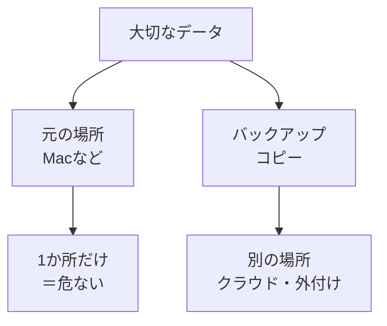

# バックアップとデータの守り方

## たとえ話

> 大切な書類を一冊のノートだけにまとめている人がいる。便利でまとまっているぶん、そのノートを電車に置き忘れたら、半年分の記録が一度に消えてしまう。だから昔の人は、大事な帳簿を写しておき、別の場所に分けて保管した。手間はかかるが、片方を失ってももう片方が残る。
>
> パソコンのデータも、これと同じだ。写真も記録も、機械の中の一か所だけに置いていると、壊れた日・失くした日に、まとめて消えてしまう。今日学ぶバックアップは、その「写しを別の場所に置いておく」という、昔ながらの知恵をデジタルでやることだ。地味で目立たないが、なくしたときに、事業を止めずに済む保険になる。

## 今日のゴール

- バックアップの意味と、小規模事業者に現実的な守り方を理解し、4択チェック3問に答える。

## この教材で伸ばす力

**習慣力** — 大切なデータを失わない考え方を持つ

## 学びの段階

完了条件は **「知った」** — 4択チェックに答え、答えページで確認できたこと

## 前提確認

- すでにできる前提：Macやスマホでファイル・写真を持っている
- まだ知らなくてよいこと：今日中に完璧なバックアップ体制を作ること

## なぜ大事か

お客さまの記録、仕事の写真、業務の資料、やりとりの記録——PCが壊れる、紛失する、誤って消す、は誰にでも起こりえます。
バックアップは、**事業を止めないための最低限の習慣**です。

## 読んで学ぶ

### バックアップとは

**バックアップ**とは、大切なデータの **コピーを別の場所に置いておく** ことです。
1か所だけに置いていると、その1か所がダメになったときに全部失います。

### 3-2-1の考え方（理想）

プロの世界では **3-2-1** と言われます。

- **3**つ：データのコピーを3か所
- **2**種類：違う種類の媒体（例：PC＋クラウド）
- **1**つ：遠くに（火災・盗難に備え、別の場所に1つ）

完全にできなくても大丈夫です。まずは **「2か所にある」** を目指します。

### 小規模事業者向けの現実的な選択

| 方法 | 内容 | 例 |
|---|---|---|
| クラウド | Googleドライブ、iCloudなど | サービス案、資料のPDF |
| 外付けSSD/HDD | Macに繋いでコピー | 写真のまとまったバックアップ |
| Time Machine | Mac標準の自動バックアップ | 定期的に外付けディスクへ |

今日は **どれを選ぶか決める必要はない**。「2か所に置く」意識だけ持ちます。

### 図解

## わからないまま進まないチェック

- 「何をバックアップすればいいかわからない」→ 失ったら困るものから。お客さまの情報、写真、売上メモ、資料
- 「クラウドは怖い」→ 第4章のパスワード・二段階認証とセットで守る、と覚えてOK

## 4択チェック

1. バックアップの説明として正しいのはどれですか？
   - A. 元のファイルを削除して整理すること
   - B. 大切なデータのコピーを別の場所に置くこと
   - C. ウイルス対策ソフトのこと
   - D. パスワードを変えること

2. データが1か所（Macの中だけ）にあるリスクは？
   - A. 特にない
   - B. PC故障・紛失・誤削除で、まとめて失う可能性がある
   - C. 自動的にクラウドに行くから大丈夫
   - D. バックアップは不要

3. 現実的な第一歩として、いちばん近いのはどれですか？
   - A. 今日から毎日外付けSSDを買う
   - B. 失ったら困るデータを1つ決め、クラウドか別媒体にコピーする意識を持つ
   - C. すべて紙に印刷する
   - D. バックアップは大企業だけがやること

答え合わせはこちら：  
[答えを見る](../../答え/第04章-ITリテラシー/04-バックアップとデータの守り方-答え.md)

## できたらOK

- [ ] 3問に答えた
- [ ] 答えページで確認した
- [ ] バックアップ＝別の場所にコピー、と言える

## つまずいたら

### 躓いたら戻る先

- [01-accounts-passwords：アカウントとパスワードの基本](./01-アカウントとパスワードの基本.md)
- [第3章：Macとファイルの基礎](../../第03章-Macとファイル/)

## 今日の成果物

- 4択チェックの回答
- （任意）失ったら困るデータを1つ、メモに書いた

## 問い

いま **バックアップがない** とわかっているデータは、何でしょうか。1つだけ書いてみてください。
