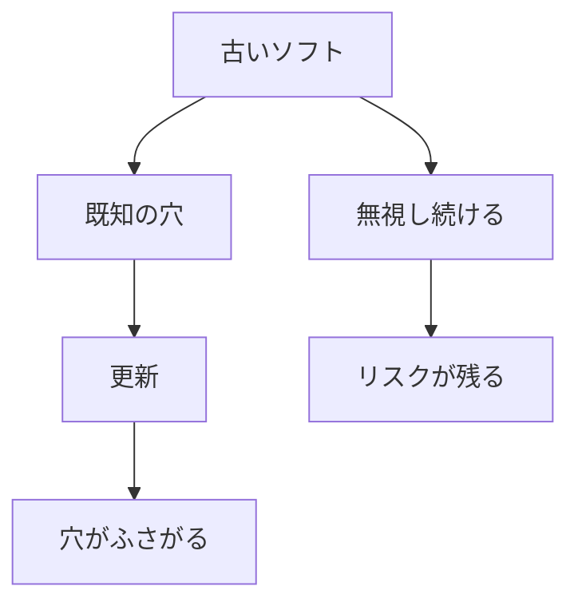

# ソフト更新とメンテナンス

## たとえ話

> 家の壁に小さなひび割れを見つけても、急ぎでなければ「また今度」と後回しにしがちだ。けれどひびは雨や風で少しずつ広がり、放っておくほど直すのが大変になる。気づいたうちに小さく塞いでおけば、大きな修理にはならずに済む。
>
> パソコンやアプリの「更新してください」という通知も、この壁のひびに似ている。更新の中には、悪意ある人に狙われる「穴」を塞ぐ修正が含まれていることが多い。後回しにするほど、その穴は知られた弱点として残りつづける。今日学ぶのは、更新が面倒な邪魔者ではなく、土台を守るための小さな手入れなのだ、という見方だ。設定は今日でなくてよい。まずは意味を知ることから始める。

## 今日のゴール

- なぜソフト更新が必要かを理解し、4択チェック3問に答える。

## この教材で伸ばす力

**習慣力** — デバイスを使い続けるための基本メンテナンスを理解する

## 学びの段階

完了条件は **「知った」** — 4択チェックに答え、答えページで確認できたこと

## 前提確認

- すでにできる前提：Macやスマホで「アップデート」の通知を見たことがある
- まだ知らなくてよいこと：今日中にすべての機器を最新にすること

## なぜ大事か

OS（macOS、iOS）やアプリの更新には、**セキュリティの穴を直す** 修正が含まれることが多いです。
古いまま使うと、知られている弱点を狙われやすくなります。

## 読んで学ぶ

### 更新の種類

| 種類 | 例 | ざっくりした役割 |
|---|---|---|
| OS更新 | macOS、iOS | 土台の安全と機能 |
| アプリ更新 | 予約アプリ、ブラウザ | そのアプリの穴や不具合修正 |
| セキュリティ更新 | 緊急の小さな修正 | 特に急ぎの穴埋め |

### 更新のタイミングのコツ

1. **仕事の合間** — いちばん忙しい日の直前は避ける
2. **バックアップ後** — 大きなOS更新の前は、データのコピーがあると安心（前の教材）
3. **電源とWi-Fi** — ノートPCは電源接続、通信が安定しているとき
4. **再起動** — 更新後は再起動を求められることが多い

### Macで更新を確認する場所（知識として）

1. 画面左上の **リンゴマーク** をクリック
2. **システム設定**（またはシステム環境設定）
3. **一般** → **ソフトウェアアップデート**

今日は **場所を知る** だけでOK。すぐ押さなくても大丈夫です。

### 図解

## わからないまま進まないチェック

- 「更新で壊れるのが怖い」→ 大きな更新は時間に余裕がある日に。不安ならDiscordで聞いてからでOK
- 「何を更新すればいいかわからない」→ まずOSと、毎日使うアプリ（ブラウザ、予約アプリ）

## 4択チェック

1. ソフトウェア更新の主な理由として、いちばん近いのはどれですか？
   - A. 画面をきれいにするためだけ
   - B. 不具合修正やセキュリティの穴を直すため
   - C. パソコンを遅くするため
   - D. データを消すため

2. OS更新をする前に、意識しておくとよいことは？
   - A. 必ず予約の多い日にする
   - B. 時間に余裕があり、可能ならバックアップがある状態
   - C. バックアップは不要
   - D. 更新は永遠にしない

3. Macでソフトウェアアップデートを確認する入口は？
   - A. リンゴマーク → システム設定 → 一般 → ソフトウェアアップデート
   - B. ゴミ箱を開く
   - C. Finderのサイドバーだけ
   - D. テキストエディットのメニュー

答え合わせはこちら：  
[答えを見る](../../答え/第04章-ITリテラシー/05-ソフト更新とメンテナンス-答え.md)

## できたらOK

- [ ] 3問に答えた
- [ ] 答えページで確認した
- [ ] 更新は「穴をふさぐ」ことだと言える

## つまずいたら

### 躓いたら戻る先

- [04-backup：バックアップとデータの守り方](./04-バックアップとデータの守り方.md)
- [第3章：Macとファイルの基礎](../../第03章-Macとファイル/)

## 今日の成果物

- 4択チェックの回答

## 問い

いま **更新を溜めている** デバイスやアプリは、あるでしょうか。いつやるか、カレンダーに「5分だけ確認」と書いてもよいです。
