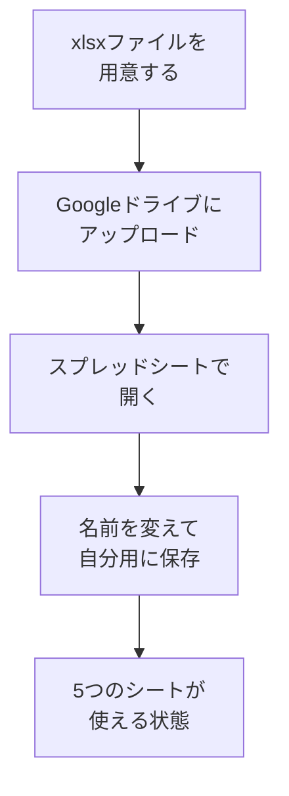

# スプレッドシートテンプレをコピーする

## たとえ話

> 何もない更地に「家を建てて」と言われると、どこから手をつければいいか途方に暮れる。けれど間取り図と土台があれば、「ここが台所、ここが寝室」と中身を入れていくだけでよくなる。枠があるだけで、ゼロから考える負担はぐっと軽くなる。
>
> 記録をつける習慣も、これと似ている。「学んだことを書こう」と決めても、まっさらな表を前にすると、何を書けばいいかわからず手が止まりやすい。今日学ぶのは、最初から枠が決まったテンプレートを自分専用に用意することだ。書く中身を考える前に、まず書く場所を整えておく。この一手間が、続ける土台になる。

## 今日のゴール

- Googleドライブに **Rebuild AI Guild 学習管理** スプレッドシートを用意し、自分のドライブに保存する。

## この教材で伸ばす力

**習慣力** — 学びを続けるための「置き場所」を作る

## 学びの段階

完了条件は **「できる」** — 自分のGoogleドライブに学習管理スプレッドシートが1つあること

## 前提確認

- すでにできる前提：Googleアカウント（Gmail）を持っている
- まだ知らなくてよいこと：シートの中身を全部埋めること（次の教材から少しずつ）

## なぜ大事か

第1章で決めた「なぜ学ぶか」「いつ学ぶか」を、紙や頭の中だけに置くと忘れます。
スプレッドシートに置くと、**見返せる・直せる・続けられる** 土台になります。

## 読んで学ぶ

### テンプレートに入っているシート

| シート名 | 目的 |
|---|---|
| 目標 | なぜ学ぶか、作りたいもの、不安 |
| 週間スケジュール | 学習できそうな時間と別案 |
| 日々の記録 | 今日やったこと、詰まったこと |
| 週報 | 1週間の振り返り |
| 月報 | 1か月の変化 |

正本ファイルはリポジトリの `templates/spreadsheet/rebuild-ai-guild-learning-template.xlsx` です。

### 図解



## 手順

### 準備：xlsxファイルをMacに置く

1. 教材リポジトリから `templates/spreadsheet/rebuild-ai-guild-learning-template.xlsx` をダウンロードする。
2. ダウンロードフォルダにファイルがあることを確認する（Finder → ダウンロード）。

> **スクショ案内**：ダウンロードフォルダに `rebuild-ai-guild-learning-template.xlsx` が見えている画面。

### 1. Googleドライブを開く

1. ブラウザ（SafariやChrome）を開く。
2. アドレスバーに `https://drive.google.com` と入力し、Enter。
3. Googleアカウントでログインする（未ログインの場合）。

### 2. ファイルをアップロードする

1. Googleドライブ画面の **左上** の **＋新規**（または **新規**）ボタンをクリックする。
2. メニューから **ファイルのアップロード** を選ぶ。
3. ファイル選択画面で、**ダウンロード** フォルダを開く。
4. `rebuild-ai-guild-learning-template.xlsx` を選び、**開く**（または **選択**）をクリックする。
5. 画面右下にアップロードの進行が出ます。完了するまで待つ。

### 3. スプレッドシートとして開く

1. アップロードが終わると、ドライブのファイル一覧に `rebuild-ai-guild-learning-template.xlsx` が現れます。
2. そのファイルを **ダブルクリック** する。
3. プレビュー画面が開いたら、画面上部の **Googleスプレッドシートで開く** をクリックする。
   - 英語表示の場合は **Open with Google Sheets** です。
4. 新しいタブでスプレッドシートが開けば成功です。

> **スクショ案内**：「Googleスプレッドシートで開く」ボタンが見えている画面。

### 4. 名前を変えて自分用にする

1. スプレッドシート左上のタイトル（ファイル名）をクリックする。
2. 次の名前に変える：
   ```
   Rebuild AI Guild 学習管理（自分の名前）
   ```
   例：`Rebuild AI Guild 学習管理（山田）`
3. Enter で確定する。

### 5. シートを確認する

1. 画面 **左下** に、シート名のタブが並んでいます。
2. 次の5つがあるか確認する（名前は近い表記でもOK）：
   - 目標
   - 週間スケジュール
   - 日々の記録
   - 週報
   - 月報
3. タブをクリックして、切り替えられることを確認する。

### 6. 保存の確認

Googleスプレッドシートは **自動保存** です。「保存」ボタンを押す必要はありません。
ドライブに戻ると、同じ名前のファイルが残っていればOKです。

## わからないまま進まないチェック

- 「Googleアカウントがない」→ 先にGmail作成が必要。Discordで相談してOK
- 「Googleスプレッドシートで開くが出ない」→ ファイルを右クリック → **アプリで開く** → **Googleスプレッドシート**
- 「シートが1つしかない」→ xlsxが正しくアップロードされたか確認。CSVから作る方法は `templates/spreadsheet/README.md` 参照

## できたらOK

- [ ] 自分のGoogleドライブに学習管理スプレッドシートがある
- [ ] 5つのシートタブが見える
- [ ] タイトルを自分用の名前に変えた

今日は **中身を書かなくてOK** です。次の教材から書き始めます。

## つまずいたら

### 躓いたら戻る先

- [第1章：目標と習慣の整理・管理](../../第01章-目標と習慣/)
- [第3章：Macとファイルの基礎](../../第03章-Macとファイル/)（Finder・ダウンロードの操作）

```text
【今やっている教材】第5章 01-copy-template

【詰まったところ】

【試したこと】

【スクショやエラー文】

【どうなればOKか】ドライブに学習管理シートがあればOK
```

## 今日の成果物

- Googleドライブ上の `Rebuild AI Guild 学習管理` スプレッドシート（URLはブックマークしておくと便利）

## 問い

このスプレッドシートを、**いつ開く習慣**にするでしょうか。（例：朝コーヒーの前、週末の5分）
