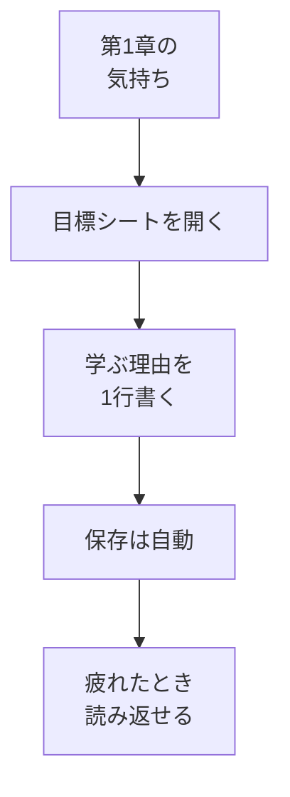

# なぜ学ぶのかを書く

## たとえ話

> 長い山道を登っていると、足元ばかり見ているうちに「自分はなぜここを登っているんだろう」とわからなくなる瞬間がある。そんなとき、出発前に書いた「あの景色が見たい」という一言のメモがあれば、もう一度顔を上げて歩き出せる。目的地そのものより、その一言が足を前に進めてくれる。
>
> 学びを続けることも、これと似ている。忙しい日が続くと、なぜ始めたのかが薄れて手が止まりやすい。今日学ぶのは、第1章で芽生えた「なぜ学ぶか」という気持ちを、いつでも読み返せる場所に書き留めることだ。理由が見えていれば、疲れた日にも、もう一歩だけ進める。立派な文章はいらない。自分に届く一言で十分だ。

## 今日のゴール

- 学習管理スプレッドシートの **目標** シートに、「なぜ学ぶか」を **最低1行** 書く。

## この教材で伸ばす力

**メタ認知** — 自分が何のために動いているかを言葉にする

## 学びの段階

完了条件は **「できる」** — 目標シートに自分の言葉が1行以上入っていること

## 前提確認

- すでにできる前提：学習管理スプレッドシートがある（第5章 01-copy-template）
- まだ知らなくてよいこと：きれいな文章、正解の目標

## なぜ大事か

「サービス一覧を自分で直したい」「予約や問い合わせの案内を整えたい」。
理由が見えると、15分の学習も **仕事の一部** に感じられます。

## 読んで学ぶ

### 目標シートに書く項目（今日は1つだけ）

テンプレートの「目標」シートには、例えば次の列があります。

- 学ぶ理由
- 3か月後にできるようになりたいこと
- 作りたいもの
- 今いちばん不安なこと

**今日は「学ぶ理由」だけ** 書けばOKです。

### 書き方のヒント

- 完璧な文章にしない
- 「〜したい」「〜が不安」でよい
- 下の例をそのまま使っても、自分の言葉に変えてもよい

**例：**
```
予約メモやサービス案を、自分のPCで整理できるようになりたい
```

**別の例：**
```
予約や問い合わせの案内文を、自分で直せるようになりたい
```

### 図解



## 手順

### 1. スプレッドシートを開く

1. ブラウザで [Googleドライブ](https://drive.google.com) を開く。
2. `Rebuild AI Guild 学習管理` のファイルをダブルクリックして開く。

### 2. 目標シートを選ぶ

1. 画面 **左下** のタブから **目標** をクリックする。
2. 1行目付近に列名（見出し）があることを確認する。

### 3. 「学ぶ理由」のセルに書く

1. **学ぶ理由** の列がわかる行を探す（テンプレートの2行目あたりが入力用のことが多い）。
2. そのセルを **クリック** する。
3. キーボードで、なぜ学ぶかを1行書く。
4. **Enter** を押すか、別のセルをクリックすると入力が確定する（自動保存）。

> **スクショ案内**：「学ぶ理由」に1行書き込んだ状態（個人情報は写さないか、ぼかす）。

### 4. 読み返す

1. 書いたセルをもう一度クリックし、声に出すか、目で読み返す。
2. 「自分の言葉」に感じられたら今日は完了です。

## わからないまま進まないチェック

- 「何を書けばいいかわからない」→ 「Rebuildに来たのは、〇〇がしたいから」で1行
- 「第1章のメモがない」→ 今の気持ちをそのまま書く
- 「セルが小さくて見えない」→ 列の境界線をドラッグして広げる

## できたらOK

- [ ] 目標シートを開いた
- [ ] 「学ぶ理由」に1行以上書いた
- [ ] 読み返した

## つまずいたら

### 躓いたら戻る先

- [第1章：目標と習慣の整理・管理](../../第01章-目標と習慣/README.md)（01-目標を整理する など）
- [01-copy-template：テンプレをコピーする](./01-スプレッドシートテンプレをコピーする.md)

Discordで質問するときは、次の形で書いてください。

```text
【今やっている教材】第5章 02 なぜ学ぶのかを書く

【詰まったところ】
（例：学ぶ理由がうまく書けない）

【試したこと】

【どうなればOKか】学ぶ理由を1行書ければOK
```

## 今日の成果物

- 目標シートの「学ぶ理由」1行

## 問い

1週間後、同じ行を読み返したとき、**まだしっくり来るでしょうか。** 違う気持ちになっていたら、直して大丈夫です。
