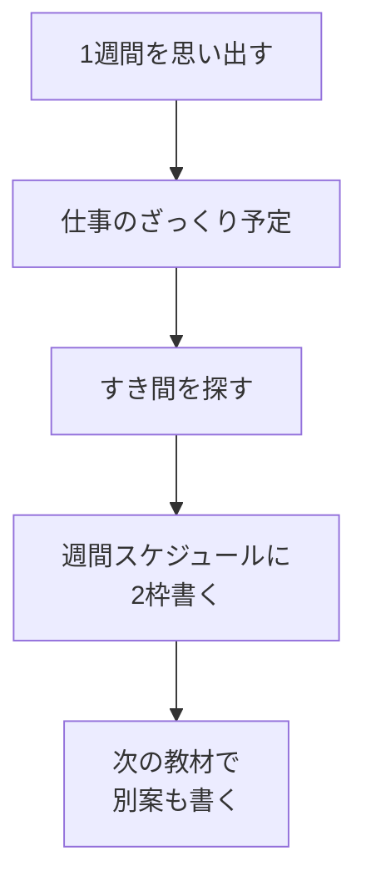

# 1週間の時間を見える化する

## たとえ話

> 財布の中身を「だいたいこれくらい」と思い込んでいると、いつの間にか足りなくなる。けれど一度ぜんぶ広げて数えてみると、思ったより使っていたところや、削れる出費がはっきり見えてくる。お金が足りないのではなく、流れが見えていなかっただけ、ということは少なくない。
>
> 一週間の時間も、これとよく似ている。「学ぶ時間がない」と感じていても、実際に一週間を書き出してみると、思いがけないすき間が見つかることがある。今日学ぶのは、自分を責めるためではなく、時間の流れを一度広げて眺め、学びに使えそうな「空きの形」を見つけることだ。見えてはじめて、どこを使うかを選べるようになる。

## 今日のゴール

- **週間スケジュール** シートに、今週（または典型的な1週間）の **学習できそうな時間帯を2つ以上** 書く。

## この教材で伸ばす力

**習慣力** — 時間の使い方を自分の目で確認する

## 学びの段階

完了条件は **「できる」** — 週間スケジュールに学習時間候補が2つ以上書いてあること

## 前提確認

- すでにできる前提：学習管理スプレッドシートがある
- まだ知らなくてよいこと：完璧な時間割

## なぜ大事か

仕事の合間、予定のない午前、休みの日の朝——小さなすき間は誰にでもあります。
カレンダーにしないと「いつかやろう」のまま終わります。

## 読んで学ぶ

### 見える化とは

**見える化**とは、頭の中の「たぶん忙しい」を、表や文字にして **見える形にする** ことです。
正確でなくてよい。だいたいでOKです。

### 書くときのコツ

- **曜日＋時間帯** で書く（例：`火 21:00-21:30`）
- **短くてよい** — 15分単位から
- **仕事の予定も書く** — 休みの日、忙しい日など。学習可能時間がわかりやすくなる

### 書き出しの例

| 曜日 | 仕事の目安 | 学習候補 |
|---|---|---|
| 火 | 18時まで仕事 | 21:00〜21:30 サービス案の学習 |
| 日 | 休み | 10:00〜10:30 PC練習 |

### 図解



## 手順

### 1. 週間スケジュールシートを開く

1. 学習管理スプレッドシートを開く。
2. 左下タブの **週間スケジュール** をクリックする。

### 2. 列の意味を確認する

テンプレートには、例えば次のような列があります（名称は近ければOK）。

- 曜日
- 時間帯
- 予定・メモ
- 学習に使えるか

1行目は見出し、2行目以降に書きます。

### 3. 学習候補を2つ書く

**例1：**

| 曜日 | 時間帯 | 予定・メモ | 学習に使えるか |
|---|---|---|---|
| 水 | 21:00-21:30 | 仕事後、帰宅後 | はい |
| 日 | 10:00-10:30 | 休みの朝 | はい |

**例2：**

| 曜日 | 時間帯 | 予定・メモ | 学習に使えるか |
|---|---|---|---|
| 火 | 20:00-20:30 | 予定の少ない日 | はい |
| 土 | 7:00-7:30 | 朝の準備前 | はい |

1. 空いている行の **曜日** セルをクリックして入力する。
2. **時間帯**、**予定・メモ** も続けて入力する。
3. 最低 **2行** 書く。

> **スクショ案内**：週間スケジュールに2行以上書いた状態（個人の予定が写る場合は共有前に確認）。

### 4. 現実チェック

1. 書いた時間は、**本当に起きていそうか** を考える。
2. 無理そうなら、15分に短くするか、別の曜日に変える。

## わからないまま進まないチェック

- 「毎日バラバラで書けない」→ 「だいたいこうなことが多い」週でOK
- 「2つも空きがない」→ 週1回・15分でもOK。1つ見つけたらDiscordで相談して2つ目を一緒に考えてもよい

## できたらOK

- [ ] 週間スケジュールに学習候補が2行以上ある
- [ ] 曜日と時間帯が書いてある

## つまずいたら

### 躓いたら戻る先

- [第1章：目標と習慣の整理・管理](../../第01章-目標と習慣/)（時間の地図）
- [02-why-learn：なぜ学ぶのかを書く](./02-なぜ学ぶのかを書く.md)

Discordで質問するときは、次の形で書いてください。

```text
【今やっている教材】第5章 03 1週間の時間を見える化する

【詰まったところ】
（例：学習できそうな時間が見つからない）

【試したこと】

【どうなればOKか】週間スケジュールに候補を2行書ければOK
```

## 今日の成果物

- 週間スケジュールの学習候補2行以上

## 問い

書いた2つのうち、**いちばん現実的にできそうなのはどちら**でしょうか。印をつけるか、セルに色を付けてもよい（任意）。
