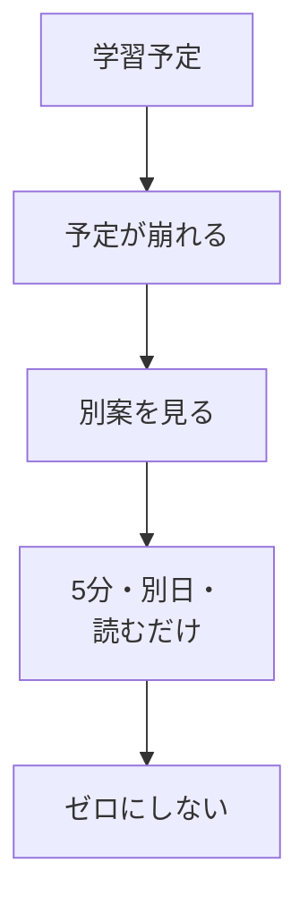

# 学習時間と崩れたときの別案

## たとえ話

> 雨の日のために傘を一本かばんに入れておく人は、急な雨でもあわてない。傘があるから雨が降らなくなるわけではないが、降ったときにずぶ濡れにならずに済む。備えとは、悪いことを防ぐためではなく、起きても立て直せるようにしておくことだ。
>
> 学びの計画も、これと同じだ。予定していた時間に急な用事が入るのは、誰にでも起きる日常で、失敗ではない。今日学ぶのは、計画が崩れたときのための「別案」を、あらかじめ一行だけ用意しておくことだ。傘のように小さな備えがあれば、崩れた日もゼロにせず、習慣の糸をつなぎ続けられる。

## 今日のゴール

- 週間スケジュールに書いた学習枠それぞれについて、**崩れたときの別案を1行ずつ** 書く。

## この教材で伸ばす力

**続ける力** — 予定が狂っても、ゼロにしない選択ができる

## 学びの段階

完了条件は **「できる」** — 学習候補ごとに別案が1行以上あること

## 前提確認

- すでにできる前提：週間スケジュールに学習候補を2つ以上書いた（03-weekly-time）
- まだ知らなくてよいこと：別案を必ず実行すること

## なぜ大事か

「今日はダメだった」で終わると、習慣は途切れます。
**5分だけ・別の日・スマホでメモだけ** など、縮小版を決めておくと、続きやすくなります。

## 読んで学ぶ

### 別案の例

| 元の計画 | 崩れた理由（例） | 別案 |
|---|---|---|
| 火 21:00-21:30 学習 | 残業・仕事が長引いた | 寝る前5分、目標シートを読むだけ |
| 日 10:00-10:30 | 家族の用事 | 月曜朝15分にずらす |
| 20:00-20:30 | 対応が長引いた | 翌日ランチ後10分、教材を開くだけ |

### 別案のルール

1. **ゼロにしない** — 何か1つは残す
2. **短くてよい** — 5分、1行メモ、読むだけでもOK
3. **責めない** — 別案を実行した自分を責めない

### 図解



## 手順

### 1. 週間スケジュールを開く

1. 学習管理スプレッドシートを開く。
2. **週間スケジュール** タブをクリックする。
3. 前の教材で書いた **学習候補の行** を確認する。

### 2. 別案用の列を使う

テンプレートに **崩れたときの別案**（または近い名前）の列がある場合：

1. その列の、学習候補と同じ行のセルをクリックする。
2. 別案を1行で書く。

列がない場合：

1. 右側の空いている列の見出しを **別案** に変える（見出しセルをクリックして入力）。
2. 学習候補の行に別案を書く。

### 3. 具体例で書く

**例（水 21:00-21:30 の行）：**
```
別案：23:00に5分だけ、今日の目標シートを読む
```

**別の例（火 20:00-20:30 の行）：**
```
別案：水曜昼休み10分、教材を開いて見出しだけ読む
```

3. 書いた学習候補 **すべての行** に、別案を1行ずつ書く。

### 4. 声に出して確認（任意）

1. 別案を読み上げる。
2. 「これならできそう」と感じるか確認。無理なら、もっと短くする。

## わからないまま進まないチェック

- 「別案が思いつかない」→ 「5分だけ目標シートを開く」で固定してOK
- 「別案も実行できなかった」→ 次の日に週報で触れる。責めない

## できたらOK

- [ ] 各学習候補に別案が1行ある
- [ ] 別案は「ゼロ」ではなく、短い行動になっている

## つまずいたら

### 躓いたら戻る先

- [第2章：学びの土台を整える](../../第02章-学びの土台/)（ゆっくり学ぶ・完璧を目指さない）
- [03-weekly-time：1週間の時間を見える化](./03-1週間の時間を見える化する.md)

## 今日の成果物

- 週間スケジュールの「別案」列（または同等のメモ）

## 問い

過去1週間で計画が崩れたとき、**実際はどうしていたでしょうか。** その経験を、別案に活かせそうでしょうか。
