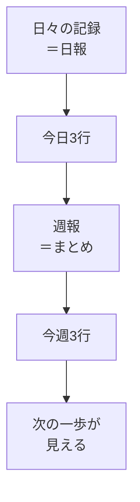

# 日報・週報で振り返る

## たとえ話

> 旅先で毎日少しずつ写真を撮っておく人は、家に帰ってから「こんなところに行った、こんなことを感じた」と旅を振り返れる。何も残さなかった人は、楽しかったはずの日々が、ぼんやりした記憶のかたまりになってしまう。一枚の写真が、過ぎた時間を形にして残してくれる。
>
> 学びの日々も、これと似ている。進めたつもりでも、記録がないと「結局、何をしたんだっけ」と思い出せなくなりやすい。今日学ぶ日報と週報は、その日の小さな一枚の写真のようなものだ。長く書く必要はない。三行で、自分への手紙くらいの軽さで十分だ。残しておくと、次の一歩が自然と見えてくる。

## 今日のゴール

- **日々の記録** シートに今日の日報を **3行以内** で書く。
- **週報** シートに、今週の振り返りを **3行以内** で書く。

## この教材で伸ばす力

**メタ認知** — 自分の学びの段階を振り返り、次を小さく決める

## 学びの段階

完了条件は **「できる」** — 日報1件と週報1件がスプレッドシートに残っていること

このテーマの完了は **「できる」** です。書いたことが残ればOKです。

## 前提確認

- すでにできる前提：学習管理スプレッドシート、目標・週間スケジュールを触った
- まだ知らなくてよいこと：毎日完璧に書くこと

## なぜ大事か

「知った」「できた」「まだわからない」——学びの段階を言葉にすると、次に何をすればいいかが見えます。
Discordに共有するときの材料にもなります。

## 読んで学ぶ

### 学びの段階（おさらい）

| 段階 | 意味 | 例 |
|---|---|---|
| 知った | 概念を理解した | 二段階認証とは何かわかった |
| できた | 手を動かして確認した | Finderでフォルダを作った |
| まだ | 止まっている | スプレッドシートの共有がわからない |

日報・週報では、正直に **まだ** を書いてOKです。

### 日報に書く3行（テンプレ）

1. **今日やったこと**（教材名でもOK）
2. **詰まったこと**（なければ「なし」）
3. **明日5分だけやること**

### 週報に書く3行（テンプレ）

1. **今週進んだこと**
2. **いちばんの詰まり**
3. **来週やること（小さく）**

### 図解



## 手順

### 1. 日々の記録シートを開く

1. 学習管理スプレッドシートを開く。
2. 左下タブの **日々の記録** をクリックする。

### 2. 今日の日報を書く

1. 空いている行（または今日の日付の行）を選ぶ。
2. 次の内容を、列に分けて書くか、1セルに3行まとめて書く：

**例：**
```
今日やったこと：第5章 日報・週報の教材、日報を1件書いた
詰まったこと：特になし
明日5分：目標シートを読み返す
```

**別の例：**
```
今日やったこと：週間スケジュールを見直した
詰まったこと：別案を実行できなかった
明日5分：教材01を5分だけ開く
```

3. 日付列がある場合は、今日の日付を入れる（例：`2025-06-16`）。

> **スクショ案内**：日々の記録に1行書いた状態。

### 3. 週報シートを開く

1. 左下タブの **週報** をクリックする。

### 4. 今週の週報を書く

1. 空いている行を選ぶ。
2. 3行テンプレで書く：

**例：**
```
今週進んだこと：第3〜5章の教材に取り組み始めた
いちばんの詰まり：Googleドライブのアップロードに時間がかかった
来週やること：週2回・15分の学習を守る
```

3. 週の期間列がある場合は、だいたいの範囲を書く（例：`6/10-6/16`）。

### 5. Discordに共有する（任意）

週報の1行だけ、Discordに貼ってもよいです。

```text
今週の学習：第5章まで進めた。来週は週2回15分を目指す。
```

## わからないまま進まないチェック

- 「何も進んでいない週報が書けない」→ 「今週は忙しく、スプレッドシートを作っただけ」でOK
- 「詰まったことが恥ずかしい」→ Guildは詰まりを共有する場所です。ぼかして書いてもよい

## できたらOK

- [ ] 日々の記録に今日の日報がある
- [ ] 週報に今週の振り返りがある
- [ ] それぞれ3行以内（長くても5行までならOK）

第5章のまとめ：テンプレコピー → なぜ学ぶか → 週間時間 → 別案 → 日報週報。ここまでで、第1章のルールを運用する土台ができました。

## つまずいたら

### 躓いたら戻る先

- [第1章：目標と習慣の整理・管理](../../第01章-目標と習慣/)
- [04-backup-plan：崩れたときの別案](./04-学習時間と崩れたときの別案.md)

```text
【今やっている教材】第5章 05-daily-weekly-report

【詰まったところ】

【試したこと】

【どうなればOKか】日報と週報が1件ずつあればOK
```

## 今日の成果物

- 日々の記録シートの日報1件
- 週報シートの週報1件

## 問い

日報の「明日5分だけやること」は、**本当に明日やれそう**でしょうか。大きすぎたら、今すぐ1行短くしてください。
