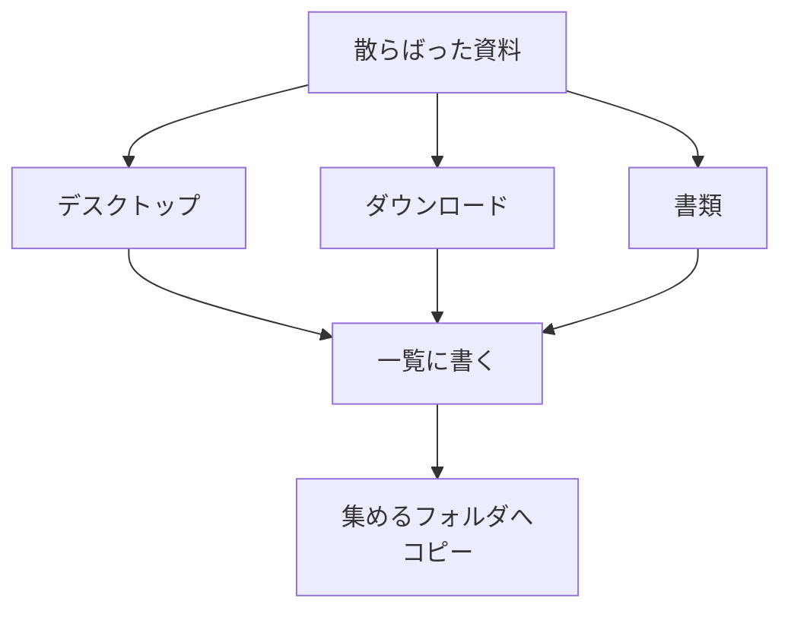

# 自分の仕事資料を集める

## たとえ話

> 料理を始める前に、冷蔵庫や棚から材料を一度まな板の前に出してみると、「卵がもう一つあった」「同じ調味料を二本も買っていた」と気づくことがある。使う前に並べてみるだけで、何があって何が足りないかが見えてくる。

> パソコンの中の資料も、これと同じだ。あちこちに散らばったままでは、全体が見えない。今日は、片づける前にまず一度「集めて見える化」する。なぜ集めることから始めるのかというと、何があるかがわかって初めて、どれを残しどう分けるかを落ち着いて決められるからだ。

## 今日のゴール

デスクトップ・ダウンロード・書類から、自分の仕事に関係するファイルを一覧にし、1か所に「集める用フォルダ」を作る。

## 前提確認

- すでにできる前提：テーマ1でホーム・デスクトップ・ダウンロード・書類の場所を知った。第3章でコピー・貼り付けができる
- まだ知らなくてよいこと：フォルダ設計の完成形、重複ファイルの自動削除

## このテーマで伸ばす力

**整理力・分解** — 散らばった資料を一度見える化し、次のステップに渡す力です。

## 学びの段階

今日の完了条件は **「できる」** です。集めるフォルダを作り、仕事関連ファイルを15分版は3個まで、30分版は5個までコピーして一覧を書いたところまで進めます。

## なぜ大事か

資料が散らばっていると、探すたびに脳の切り替えが起きます。一度「集める」フォルダにコピーすると、**何があるか**が一覧で見えます。

例：サービス一覧・料金表・店内POPの素材、お客さまへの案内など。「どこにあるか」がわかると、次の「分ける」作業が進めやすくなります。

今日は **移動も削除もしません**。コピーだけなので、元の場所はそのまま残ります。

## わからないまま進まないチェック

- **これが仕事用かわからない** → 保留リストに書いて、今日は触らない。消さない
- **コピーと移動の違いがわからない** → 今日はコピー（`Command + C` → `Command + V`）のみ。元の場所はそのまま

## 躓いたら戻る先

**第3章 Macとファイルの基礎**（コピー・貼り付け、フォルダ作成）  
[01-Macの中の住所を知る.md](01-Macの中の住所を知る.md)（どこを探せばいいかわからないとき）

## 読んで学ぶ

「棚卸し」とは、店の在庫を一度数えることです。PCの中でも同じで、**散らばった資料を一度リストアップする**作業を今日はします。

コピーと移動の違い：

| 操作 | 結果 |
|---|---|
| コピー（Command+C → Command+V） | 元の場所にも残る。新しい場所にも増える |
| 移動（ドラッグで別フォルダへ） | 元の場所からなくなる |

今日は **コピーのみ** です。間違えて消す心配が減ります。

**個人情報・機密情報の注意**：お客さまの記録など実名入りのファイルはコピーしない。匿名化した見本や自分用メモのみ対象にしてください。

### 図解



## 手順

### ステップ1：集めるフォルダを作る（5分）

1. Finderを開く
2. 左サイドバーから **書類** をクリック
3. 右側の空白を **右クリック** → **新規フォルダ**
4. フォルダ名を `仕事資料_集める` と入力して Enter

**スクショを撮るなら**：作ったフォルダが書類の中に見えている画面

### ステップ2：デスクトップから探す（7分）

1. サイドバーから **デスクトップ** を開く
2. 仕事に関係しそうなファイルを探す（サービス一覧、料金表、案内文など）
3. メモに次の形式で書きます（15分版は合計3個まで、30分版は合計5個まで）

```text
ファイル名：
元の場所：デスクトップ
用途（ざっくり）：
```

4. ファイルを1つ選ぶ → `Command + C`
5. `仕事資料_集める` フォルダを開く → `Command + V`

わからないファイルは **保留リスト** に書いて、コピーしません。

### ステップ3：ダウンロードから探す（7分）

ステップ2と同じ手順で、**ダウンロード** から仕事関連を探してコピーします。15分版は合計3個、30分版は合計5個に達したら、ここで止まってOKです。

### ステップ4：一覧を完成させる（6分）

コピーしたファイルについて、メモの一覧を完成させます。

```text
【今日コピーしたファイル数】：　個
【いちばん多かった種類】：（例：サービス一覧、料金表、案内文）
【保留にしたもの】：
```

## できたらOK

- `仕事資料_集める` フォルダが書類の中にある
- 仕事関連ファイルをコピーした（15分版は3個まで、30分版は5個まで）
- 一覧メモにファイル名・元の場所・用途が書いてある
- 実名入りの機密ファイルをコピーしていない

## つまずいたら

**躓いたら戻る先**：第3章 Macとファイルの基礎

| つまずき | 対処 |
|---|---|
| コピーできない | ファイルを1回クリックで選択してから Command+C |
| 貼り付け先がわからない | 先に `仕事資料_集める` フォルダを開いてから Command+V |
| 全部集めようとして時間がかかる | 15分版は3個、30分版は5個で止める。残りは次回 |
| 仕事用かわからない | 保留リストへ。触らない |

Discordで質問するときは、次のテンプレをコピーして使ってください。

```text
【今やっている教材】
第6章 02 自分の仕事資料を集める

【詰まったところ】
（例：コピーしたのに集めるフォルダに出てこない）

【試したこと】
（例：フォルダを開いてから貼り付けた）

【スクショやエラー文】
（Finderの画面。ファイル名は隠してOK）

【どうなればOKか】
（例：コピーと貼り付けの手順を確認したい）
```

## 今日の成果物

- **`仕事資料_集める` フォルダ**（コピーされたファイルは15分版3個まで、30分版5個まで）
- **仕事資料一覧メモ**

## 問い

集めてみて、いちばん多かった種類の資料は何だったでしょうか。  
「保留」にしたファイルは、なぜ迷ったのでしょうか。
