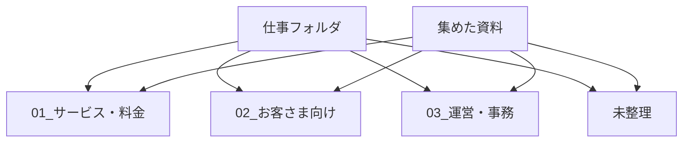

# 仕事用フォルダに分ける

## たとえ話

> よく使う台所では、菜箸とお玉とハサミがひとつの引き出しにごちゃ混ぜになっていない。「調理に使う道具」「食べるときに使う道具」とゆるく分かれているから、手が迷わずに動く。完璧に整然と並んでいなくても、種類でまとまっているだけで十分に役に立つ。

> フォルダも、この引き出しの仕切りと同じだ。きれいに並べる箱ではなく、未来の自分が迷わないための棚である。なぜ種類で分けるのかというと、「これはここ」と置き場所が決まっていれば、探す時間も迷う時間も減るからだ。今日は完璧を目指さず、3つ＋未整理で始めてみる。

## 今日のゴール

集めた資料を、仕事の種類ごとに3〜4個のフォルダに分けて入れる。

## 前提確認

- すでにできる前提：テーマ2で `仕事資料_集める` に資料をコピーした。第3章でフォルダ作成・ドラッグ移動ができる
- まだ知らなくてよいこと：完璧なフォルダ設計、クラウド同期の設定

## このテーマで伸ばす力

**整理力・構造化・分解** — 資料の種類に合わせて「棚」を作り、迷いを減らす力です。

## 学びの段階

今日の完了条件は **「できる」** です。3つ以上のサブフォルダを作り、集めた資料を15分版は3個まで、30分版は5個まで振り分けたところまで進めます。迷ったものは `未整理` でOKです。

## なぜ大事か

1つのフォルダに全部入っていると、開くたびに探す作業が発生します。種類ごとに分けると、「サービス一覧ならここ」と決められるようになります。

例：`01_サービス・料金` にサービス一覧と料金表、`02_お客さま向け` に店内POPや案内文を入れる、という具合です。

分け方は後から直せます。今日は **動かすこと** が目的です。

## わからないまま進まないチェック

- **どのフォルダに入れるか決められない** → `未整理` に入れて先に進む
- **フォルダ名を間違えた** → フォルダ名をクリックして少し待つと編集できる（第3章復習）

## 躓いたら戻る先

**第3章 Macとファイルの基礎**（フォルダ作成・ドラッグ移動）  
[02-自分の仕事資料を集める.md](02-自分の仕事資料を集める.md)（集めるフォルダがまだないとき）

## 読んで学ぶ

**親フォルダ** は大きい棚、**サブフォルダ** はその中の小さい棚、とイメージしてください。

今日作る構造の例：

```text
書類/
  仕事/
    01_サービス・料金/
    02_お客さま向け/
    03_運営・事務/
    未整理/
    仕事資料_集める/  ← ここから振り分ける
```

フォルダ名の数字（`01_` など）は、並び順を固定するための目印です。なくても大丈夫です。

**個人情報・機密情報の注意**：お客さまの実名入りファイルは `未整理` のまま触らず、後で匿名化または別管理にしてください。

### 図解



## 手順

### ステップ1：仕事フォルダを作る（5分）

1. Finderで **書類** を開く
2. 右クリック → **新規フォルダ** → 名前を `仕事` にする
3. `仕事` フォルダをダブルクリックして中に入る

`仕事資料_集める` がまだ書類の直下にある場合は、あとで `仕事` の中に移動してもOKです。

### ステップ2：サブフォルダを3つ＋未整理を作る（5分）

`仕事` フォルダの中で、次のフォルダを作ります。

- `01_サービス・料金`
- `02_お客さま向け`
- `03_運営・事務`
- `未整理`

**スクショを撮るなら**：サブフォルダが並んだツリー構造

### ステップ3：ファイルを振り分ける（10分）

1. `仕事資料_集める`（または集めたファイルがある場所）を開く
2. ファイルを **ドラッグ** して、適切なサブフォルダに **移動** する
3. 迷ったら `未整理` へ
4. ファイル数の目安：15分版は3個まで、30分版は5個まで（それ以上は未整理に残してOK）

振り分けの目安：

| ファイルの種類 | 入れるフォルダ |
|---|---|
| サービス一覧・料金表 | 01_サービス・料金 |
| 案内文・POP・お客さま向け資料 | 02_お客さま向け |
| 予約表・運営メモ・事務書類 | 03_運営・事務 |

### ステップ4：振り分けメモを書く（5分）

```text
01_〇〇：　個（例：サービス一覧、料金表）
02_〇〇：　個
03_〇〇：　個
未整理：　個
```

## できたらOK

- `仕事` フォルダ配下に3つ以上のサブフォルダがある
- 集めた資料を振り分けた（15分版は3個まで、30分版は5個まで）
- 迷ったものは `未整理` に入っている
- 振り分けメモを書いた

## つまずいたら

**躓いたら戻る先**：第3章 Macとファイルの基礎

| つまずき | 対処 |
|---|---|
| 完璧な分類ができない | 未整理フォルダを使う。今日は動かすことが目的 |
| フォルダを作りすぎた | 3つ＋未整理に戻す。余ったフォルダは削除してOK |
| ドラッグで移動できない | ファイルをクリックしたまま、フォルダの上まで持っていく |
| 仕事資料_集めるが見つからない | 02の教材に戻るか、書類フォルダ全体を検索 |
| 量が多くて終わらない | 15分版は3個、30分版は5個で止める。残りは次回 |

Discordで質問するときは、次のテンプレをコピーして使ってください。

```text
【今やっている教材】
第6章 03 仕事用フォルダに分ける

【詰まったところ】
（例：ドラッグしてもフォルダに入らない）

【試したこと】
（例：フォルダを開いてから中にドロップした）

【スクショやエラー文】
（フォルダ構造のスクショ。ファイル名は隠してOK）

【どうなればOKか】
（例：振り分けの例がほしい）
```

## 今日の成果物

- **`仕事` フォルダ配下の3〜4サブフォルダ**（中にファイルが入っている）
- **振り分けメモ**

## 問い

フォルダを分けたあと、「これはどこだろう」と迷いそうな資料はまだ残っているでしょうか。  
作ったフォルダ名のうち、いちばんしっくりきたのはどれだったでしょうか。
