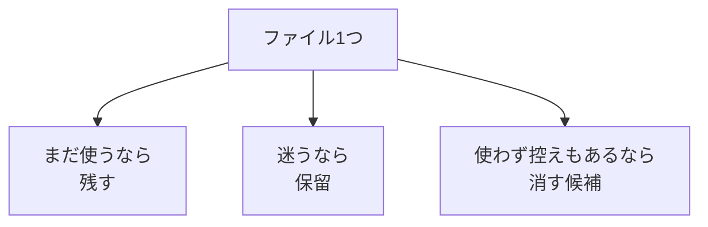

# 残す・消す・保留を判断する

## たとえ話

> 季節の変わり目にクローゼットを開けると、今年も着る服、もう着ない服、迷う服の三つが必ず混ざっている。全部取っておけば引き出しは閉まらず、勢いで全部捨てれば後で「あれが無い」と困る。だから多くの人は「今年着る」「処分する」「一年だけ保留」と、ゆるく三つに分けていく。

> パソコンのファイルの片づけも、これと同じ判断だ。「全部残す」でも「全部消す」でもなく、残す・消す・保留の三つで考える。なぜ三つ目の「保留」が大事かというと、迷ったものを無理に決めずに済むからだ。迷いを保留に逃がせるからこそ、安心して手が動く。

## 今日のゴール

仕事のファイルを「残す・消す・保留」の3つに分ける判断基準を持ち、未整理フォルダから15分版は3個まで、30分版は5個まで判断する。

## 前提確認

- すでにできる前提：テーマ3で `未整理` フォルダを作り、資料を振り分けた
- まだ知らなくてよいこと：自動アーカイブツール、高度なバックアップ設定

## このテーマで伸ばす力

**整理力・正しく考える力** — 削除の前に止まり、自分の基準で判断する力です。

## 学びの段階

今日の完了条件は **「わかった」以上** です。4択に答え、未整理フォルダのファイルに判断ラベルを付け、理由を1行ずつ書ければOKです。15分版は3個まで、30分版は5個までで止めます。

## なぜ大事か

「とりあえず全部残す」と、どれが最新かわからなくなります。「怖くて全部消せない」と、探す時間が増え続けます。

判断基準があると、**迷ったときは保留**と決められるので、安心して進めます。今日は **消さなくてよい** です。ラベルを付けるだけで完了です。

例：古いサービス一覧は、新版があれば消す候補です。お客さまの名前が入ったやりとりの記録は、匿名化または別管理にします。

## わからないまま進まないチェック

- **消していいかわからない** → 全部「保留」でOK。今日は消さない
- **古い版と新しい版の見分けがつかない** → 保留。更新日が新しい方を仮の最新とする

## 躓いたら戻る先

**第3章 Macとファイルの基礎**（ゴミ箱の使い方）  
**第4章 ITリテラシー基礎**（バックアップの考え方）  
[03-仕事用フォルダに分ける.md](03-仕事用フォルダに分ける.md)（未整理フォルダがないとき）

## 読んで学ぶ

### 判断基準のテンプレ

| 分類 | 意味 | 例 |
|---|---|---|
| 残す | まだ使う。仕事フォルダに置く | 今年のサービス一覧、現行の料金表 |
| 消す | 不要。新版がある。バックアップ済み | 3年前のサービス一覧（新版あり） |
| 保留 | わからない。あとで見直す | 名前がわからないファイル、実名入りメモ |

「消す」は **ゴミ箱へ移動** のことです。Macのゴミ箱からは一定期間復元できます。ただし今日の実践では、消すは **任意・最大1個まで** にしてください。

**個人情報・機密情報の注意**：お客さまの実名入りファイルは「消す」ではなく「匿名化または別管理」が基本です。AIに丸ごと渡すのもダメです（第7章で詳しく学びます）。

自分用に、次の3行を書き換えてください。

```text
残す：まだ使うもの、最新版、仕事で参照するもの
消す：新版があり、バックアップがある古い版だけ（今日は実行しなくてOK）
保留：わからないもの、実名入り、判断に迷うもの
```

### 図解



## 手順

### ステップ1：判断基準を書く（5分）

上のテンプレを自分の言葉で3行書きます。完璧でなくて大丈夫です。

### ステップ2：未整理フォルダを開く（2分）

1. Finderで `書類` → `仕事` → `未整理` を開く
2. 中のファイルが3個未満でもOK。ある分だけ判断する

未整理フォルダが空の場合は、デスクトップかダウンロードから「判断に迷いそうなファイル」を15分版は3個まで、30分版は5個まで選んでもOKです。

### ステップ3：ファイルにラベルを付ける（10分）

各ファイルについて、メモに次の形式で書きます。

```text
ファイル名：
判断：残す / 消す / 保留
理由（キーワード1つでOK）：
```

ラベルの付け方（どれか1つでOK）：

- メモ帳に一覧を書く
- ファイル名の先頭に `[残]` `[消]` `[保留]` を付ける（リネームする場合。拡張子は消さない）

### ステップ4：4択チェックに答える（5分）

**1.** サービス一覧の古い版（新版がある）をどうしますか？（バックアップがある前提）

- A. 残す
- B. 消す
- C. 保留
- D. どれでもよい

**2.** お客さまの名前入りの、やりとりの記録PDFをどうしますか？

- A. そのまま残してAIに丸ごと渡す
- B. 匿名化して残す（または別管理）
- C. 確認せずゴミ箱へ
- D. 判断せず放置

**3.** ダウンロードの「名前がわからないファイル」をどうしますか？

- A. すぐ消す
- B. 開いて中身を確認してから判断
- C. 永久保留
- D. デスクトップに移すだけ

答え合わせはこちら：  
[答えを見る](../../答え/第06章-ファイル整理/04-残す・消す・保留を判断する-答え.md)

### ステップ5：（任意）消す候補を1個だけゴミ箱へ

判断がはっきりしていて、バックアップがある場合のみ、最大1個をゴミ箱へ移動してもOKです。不安なら今日はスキップしてください。

## できたらOK

- 自分用の判断基準3行を書いた
- ファイルに残す・消す・保留のラベルと理由を付けた（15分版は3個まで、30分版は5個まで）
- 4択チェックに答えた
- 不安なものは保留にできた

## つまずいたら

**躓いたら戻る先**：第3章 Macとファイルの基礎、第4章 ITリテラシー基礎

| つまずき | 対処 |
|---|---|
| 全部保留になった | それでOK。今日は消さなくてよい |
| 消したあと不安 | ゴミ箱を開き「戻す」で復元できる |
| 未整理フォルダがない | 03の教材で作るか、迷いそうなファイルを3個だけ選ぶ |
| 実名入りファイルがある | 保留のまま。匿名化は別の日でOK |
| 量が多くて終わらない | 15分版は3個、30分版は5個で止める |

Discordで質問するときは、次のテンプレをコピーして使ってください。

```text
【今やっている教材】
第6章 04 残す・消す・保留を判断する

【詰まったところ】
（例：古い版と新しい版の見分けがつかない）

【試したこと】
（例：更新日を見たがわからない）

【スクショやエラー文】
（なくても大丈夫）

【どうなればOKか】
（例：保留で進んでいいか確認したい）
```

## 今日の成果物

- **判断メモ**（15分版3個まで、30分版5個まで。残す／消す／保留＋理由1行）
- **自分用の判断基準3行**

## 問い

あなたが「保留」に入れたファイルは、いつまた見直すと決められそうでしょうか。  
今日決めた「残す・消す・保留」の自分ルールを、一言で言うとどうなるでしょうか。
