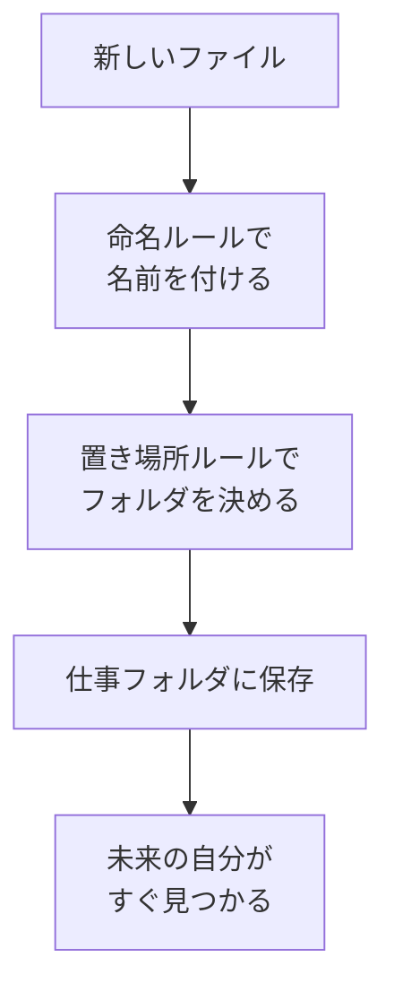

# 命名ルールと置き場所ルールを作る

## たとえ話

> 作り置きのおかずを保存容器に入れるとき、ふたに「肉じゃが 6/14」と書いておくと、一週間後の自分が中身を開けずに判断できる。逆に何も書かなければ、似た容器が並んだ冷蔵庫の前で、ひとつずつ開けて確かめる羽目になる。名前とは、後の自分にあてた短い手紙のようなものだ。

> ファイルの名前も、これと同じ役割を持つ。「final」「最新」「本当に最新」が並ぶと、どれが本物かわからなくなる。今日決めるのは、完璧なルールではなく、続けられるルールだ。なぜ続けやすさを優先するのかというと、守れないルールは無いのと同じで、ゆるくても続くルールだけが未来の自分を助けるからだ。

## 今日のゴール

自分の仕事用に、ファイル名と置き場所のルールを決め、1ファイルをルール通りにリネームする。15分版はルール合計3個まで、30分版はルール合計5個までに絞ります。

## 前提確認

- すでにできる前提：テーマ1〜4で住所・集める・分ける・判断まで完了。第3章でリネームができる
- まだ知らなくてよいこと：高度な自動化、クラウドの同期ルール

## このテーマで伸ばす力

**整理力・習慣力** — 未来の自分が迷わない名前と置き場所を決める力です。

## 学びの段階

今日の完了条件は **「できる」** です。ルールを書き、1ファイルをリネームして正しいフォルダに置いたところまで進めます。15分版はルール合計3個まで、30分版はルール合計5個までで完了です。

## なぜ大事か

ファイル名と置き場所がバラバラだと、探すたびに「あれどれだっけ」が起きます。ルールがあると、**新しいファイルが来たときの判断**が速くなります。

例：`2026-06_サービス一覧_v2.pdf` を `01_サービス・料金` フォルダに置く、という具合です。

ルールを破ってもダメではありません。続く方を選んでください。

## わからないまま進まないチェック

- **ルールが多すぎて覚えられない** → 15分版は合計3個、30分版は合計5個までに減らす
- **リネームで拡張子（.pdfなど）を消してしまった** → 元に戻す。拡張子は残す（第3章復習）

## 躓いたら戻る先

**第3章 Macとファイルの基礎**（リネーム、拡張子）  
[03-仕事用フォルダに分ける.md](03-仕事用フォルダに分ける.md)（仕事フォルダがないとき）

## 読んで学ぶ

### 命名ルールのテンプレ（3つ選ぶ）

- 日付を先頭に：`YYYY-MM_内容`（例：`2026-06_サービス一覧`）
- 版（バージョン）を末尾に：`_v1` `_v2`
- お客さまの名前は入れない（代わりに `見本` `テンプレ`）
- 半角英数字とアンダースコア `_` を基本に
- 意味がわかる短い日本語を入れる

### 置き場所ルールのテンプレ（3つ選ぶ）

- 新しいPDFはまずダウンロード → 週1で仕事フォルダへ
- サービス一覧・料金表は `01_サービス・料金` のみ
- 未整理は週1で5個まで処理
- デスクトップに置くのは「今週使う1個だけ」
- 写真・画像は `画像` または `02_お客さま向け` へ

**個人情報・機密情報の注意**：命名ルールに「実名を入れない」を必ず含めてください。

### 図解



## 手順

### ステップ1：ルールを選んでメモする（5分）

メモ帳またはテキストファイルに書きます。

```text
【命名ルール】
1.
2.
3.

【置き場所ルール】
1.
2.
3.
```

テンプレから選ぶだけでOKです。自分の言葉に直しても大丈夫です。15分版は命名・置き場所を合わせて3個まで、30分版は合わせて5個までにします。

### ステップ2：リネームするファイルを1つ選ぶ（3分）

`仕事` フォルダの中から、サービス一覧・料金表・案内文などを1つ選びます。

### ステップ3：ルール通りにリネームする（7分）

1. Finderでファイルを **1回クリック** して選択
2. もう一度ファイル名を **ゆっくりクリック**（または Enter）して編集モードに
3. 新しい名前を入力

例：

- `2026-06_サービス一覧_v2.pdf`
- `2026-06_案内_夏.pdf`

**注意**：`.pdf` や `.docx` などの **拡張子は消さない** でください。

**スクショを撮るなら**：リネーム前後のファイル名

### ステップ4：正しいフォルダへ移動する（5分）

ルールに従い、適切なサブフォルダへドラッグで移動します。

- サービス一覧・料金表 → `01_サービス・料金`
- お客さま向け資料 → `02_お客さま向け`

### ステップ5：ルールメモを仕事フォルダに保存する（5分・任意）

30分版：テキストエディット（Mac標準）で `命名と置き場所ルール.txt` を作り、`仕事` フォルダに保存します。ルールは合計5個までにします。第8章でエディタに移行できます。

15分版：紙やメモ帳に、ルール合計3個までを書いたままでOKです。

## できたらOK

- 命名ルールと置き場所ルールを書いた（15分版は合計3個まで、30分版は合計5個まで）
- 1ファイルをルール通りにリネームした
- 正しいサブフォルダに置いた
- 実名をファイル名に入れていない

## つまずいたら

**躓いたら戻る先**：第3章 Macとファイルの基礎

| つまずき | 対処 |
|---|---|
| リネームできない | ファイルを選択してから Enter |
| 拡張子を消した | 元の名前に戻す。`.pdf` などを末尾に付ける |
| どのフォルダかわからない | 置き場所ルールの1つ目に従う。迷ったら未整理 |
| ルールを守れるか不安 | 破ってもダメではない。続く方を選ぶ |
| 量が多くて終わらない | 15分版は3個、30分版は5個までで止める |

Discordで質問するときは、次のテンプレをコピーして使ってください。

```text
【今やっている教材】
第6章 05 命名ルールと置き場所ルールを作る

【詰まったところ】
（例：リネームで拡張子が消えてしまった）

【試したこと】
（例：元の名前に戻した）

【スクショやエラー文】
（ファイル名のスクショ。個人情報は隠してOK）

【どうなればOKか】
（例：命名の例がほしい）
```

## 今日の成果物

- **命名ルールと置き場所ルールのメモ**（15分版3個まで、30分版5個まで）
- **ルール通りにリネームしたファイル1つ**

## 問い

1年後の自分が探しやすいファイル名を、今日決めたルールで付けられそうでしょうか。  
決めた命名ルールのうち、いちばん守れそうなのはどれでしょうか。
