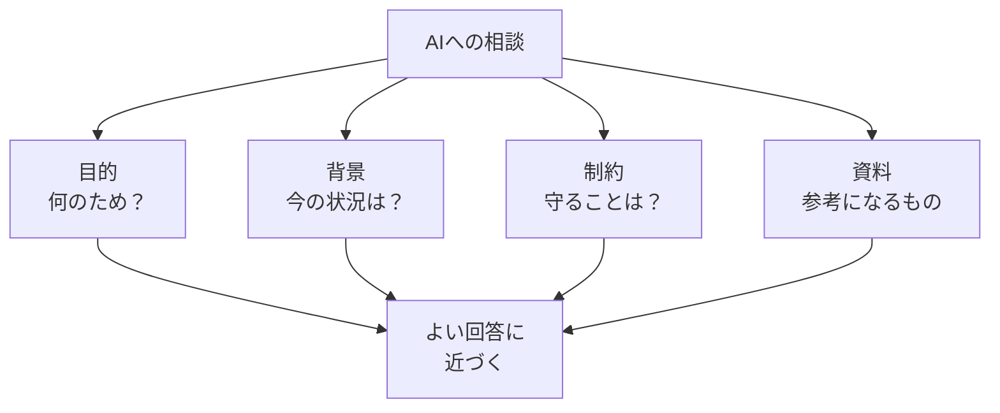

# AIに渡す情報とは

## たとえ話

> 子どもに「何か飲み物を買ってきて」と頼むと、出てくるのは炭酸かもしれないし、温かいお茶かもしれない。けれど「冷蔵庫に入れる、甘くない、500mlの麦茶を二本」と伝えれば、欲しかったものがそのまま戻ってくる。頼み方の細かさが、返ってくる物の中身を決める。

> AIへの相談も、これとそっくりだ。「いい感じにして」とだけ伝えれば、どこにでもある答えが返ってくる。今日学ぶのは、AIに渡す情報のまとめ方だ。なぜ渡し方から学ぶのかというと、AIは賢い箱というより、渡した材料の質を映し返す鏡に近いからだ。

## 今日のゴール

AIに渡す情報（コンテキスト）が「質問文だけ」ではなく「目的・背景・制約・資料」のセットだと説明できる。

## 前提確認

- すでにできる前提：第6章で仕事フォルダと資料の種類を整理した。チャット型AIを触ったことがある（深くなくてよい）
- まだ知らなくてよいこと：高度なプロンプト技法、API連携

## このテーマで伸ばす力

**整理力・構造化・正しく考える力** — AIに渡す前に情報をまとめる力です。

## 学びの段階

今日の完了条件は **「わかった」** です。4択に答え、AIコンテキストを自分の言葉で説明し、「足りなかった情報」メモを書ければOKです。

## なぜ大事か

第2章で学んだように、AIは **増幅装置** です。良い材料を渡せば良い方向に、少ない材料では当たり外れの大きい答えになりやすいです。

例：「サービス一覧を良くして」だけでは、誰向け・何を良くしたい・何文字・どんな雰囲気かがわかりません。お客さまへの案内文でも同じです。

第6章で整えたフォルダは、**渡す資料を選びやすくする**ための土台です。AIが勝手にMacの中を見るわけではありません。

## わからないまま進まないチェック

- **コンテキストという言葉がわからない** →「AIに渡す情報のまとまり」と読み替える
- **過去にAIを使ったことがない** → 下の例文を読んで「もし自分なら」と想像して書く

## 躓いたら戻る先

**第6章 ファイル整理**（資料の種類がわからないとき）  
**第2章 学びの土台**（AIは増幅装置の復習）

## 読んで学ぶ

**AIコンテキスト**（コンテキスト）とは、AIに渡す情報のまとまりです。  
**プロンプト**（お願い文）だけではなく、次の4つをセットにします。

| 項目 | 聞くこと | 例 |
|---|---|---|
| 目的 | 何のため？ | サービス一覧の見出しを分かりやすくしたい |
| 背景 | 今の状況は？ | 新しいサービスが増えて説明が長くなった |
| 制約 | 守ることは？ | 200字以内、やさしいトーン、実名なし |
| 資料 | 参考になるもの | 現行サービス一覧の見出し3つ（匿名） |

**個人情報・機密情報の注意**：例文やメモに、お客さまの名前やパスワードを書かないでください。

### 図解



## 手順

### ステップ1：過去のAI相談を思い出す（5分）

チャット型AIに送ったことがあるメッセージを1つ思い出し、メモに書き写します。使ったことがなければ、次の例を読んでください。

```text
例：「サービス一覧を良くして」
```

### ステップ2：4項目で「足りなかった情報」を書く（10分）

思い出した相談（または例）について、次を各1行で書きます。

```text
【目的】足りなかったこと：
【背景】足りなかったこと：
【制約】足りなかったこと：
【資料】足りなかったこと：
```

30分版：自分の仕事テーマ（サービス一覧の改善やお客さまへの案内など）で、渡すべき情報を4項目すべて埋めてみてください。

### ステップ3：自分の言葉で1文説明する（3分）

```text
AIコンテキストとは、
```

のあとに続けて1文書きます。

### ステップ4：4択チェックに答える（5分）

**1.** AIコンテキストに含まれるものとして最も近いのはどれですか？

- A. 質問1行だけ
- B. 目的・背景・制約・資料のセット
- C. パスワード一覧
- D. お客さまの本名リスト

**2.** 「サービス一覧を良くして」とだけ送ったとき、AIが困りやすい理由は？

- A. 文字が多いから
- B. 目的・対象・制約がわからないから
- C. PDFが嫌いだから
- D. AIは日本語が苦手だから

**3.** 整理した仕事フォルダがAI相談に役立つ理由は？

- A. フォルダを見せれば自動で完璧になる
- B. 渡す資料を選びやすくなる
- C. AIがフォルダを勝手に開く
- D. フォルダ名が魔法の呪文になる

答え合わせはこちら：  
[答えを見る](../../答え/第07章-AI情報設計/01-AIに渡す情報とは-答え.md)

## できたらOK

- 4択チェックに答えた
- 「足りなかった情報」メモ4行を書いた
- AIコンテキストを自分の言葉で1文説明できる
- 実名・機密情報をメモに書いていない

## つまずいたら

**躓いたら戻る先**：第6章 ファイル整理、第2章 学びの土台

| つまずき | 対処 |
|---|---|
| コンテキストがわからない | 「渡す情報のまとまり」と読み替える |
| 4項目が書けない | 目的だけ1行でもOK |
| AIを使ったことがない | 例文で想像して書く |
| 資料が思い浮かばない | 見出し3つだけ書く |

Discordで質問するときは、次のテンプレをコピーして使ってください。

```text
【今やっている教材】
第7章 01 AIに渡す情報とは

【詰まったところ】
（例：4項目の「制約」が書けない）

【試したこと】
（例：文字数だけ書いた）

【スクショやエラー文】
（なくても大丈夫）

【どうなればOKか】
（例：制約の例がほしい）
```

## 今日の成果物

- **4択チェックの回答**（答えページで確認）
- **「足りなかった情報」メモ4行**

## 問い

次にAIに相談するとき、いちばん先に渡したい「背景」は何でしょうか。  
4項目のうち、いちばん足りていなかったのはどれだったでしょうか。
