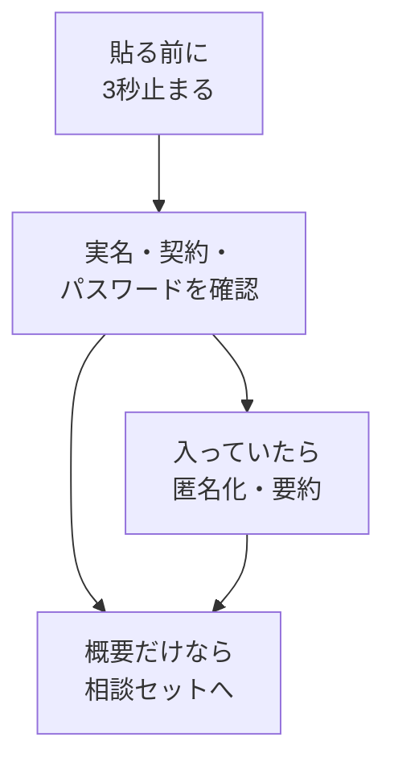

# 渡していい・ダメな情報

## たとえ話

> 道で知らない人に「この近くにおいしい店はありますか」と尋ねるのは、ごく自然なことだ。けれど同じ相手に、財布の中身や家の鍵の隠し場所まで話す人はいない。相手が親切そうかどうかとは別に、渡していい話と手元に残すべき話の線引きを、人は無意識のうちに引いている。

> AIに相談するときも、この線引きがそのまま役に立つ。怖がって何も相談しないのではなく、渡す前に一度だけ立ち止まる。今日学ぶのは、その線引きを自分の言葉で持つことだ。なぜ自分なりの線が要るのかというと、線があるからこそ、安心してAIに頼れるようになるからだ。

## 今日のゴール

AIに渡していい情報とダメな情報を分け、自分の仕事の例を3つずつ書ける。

## 前提確認

- すでにできる前提：テーマ1でAIコンテキスト4項目を知った。第4章でパスワード・フィッシングの基礎
- まだ知らなくてよいこと：法務の詳細、企業向けAI契約

## このテーマで伸ばす力

**正しく考える力・整理力** — 機密と概要を分け、渡す前に判断する力です。

## 学びの段階

今日の完了条件は **「わかった」** です。4択に答え、渡していい例3つ・ダメな例3つを書ければOKです。

## なぜ大事か

「全部ダメならAIが使えないのでは」と感じる人は多いです。実際には、**概要・構成・匿名化した例**は渡せます。ダメなのは、実名・契約の細部・パスワードなどです。

例：サービスの構成案やお店のコンセプト概要は、相談材料にしやすいです。お客さまのフルネームや対応の履歴は渡しません。やりとりの記録も、実名や連絡先が入った全文は渡しません。

**方針：機密情報は入力しない。** 迷ったら止まる。テーマ4で相談セットを作ります。

## わからないまま進まないチェック

- **全部ダメなら使えないのでは** → 概要・匿名化した例は渡せる
- **匿名化の仕方がわからない** → 名前→Aさん、お店の名前→○○、数字→ざっくり範囲

## 躓いたら戻る先

**第4章 ITリテラシー基礎**（パスワード・個人情報）  
[01-AIに渡す情報とは.md](01-AIに渡す情報とは.md)（コンテキスト4項目の復習）

## 読んで学ぶ

### 絶対に渡さないリスト（基本）

- お客さまの **実名** と個別の履歴
- **パスワード**、Wi-Fiパスワード、APIキー
- **契約書の細部**、売上の具体的な数字（そのまま）
- 写真ややりとりの記録の **そのままの全文**

### 渡していい例（匿名化・概要）

- サービスの **構成案**（実名なし）
- お店・サービスの **コンセプト概要**
- 料金の **ざっくりした帯**（「3000円台あり」など）
- 匿名化した相談例（Aさん、悩みの種類のみ）

### 貼る前に3秒止まる

送信ボタンを押す前に、「実名・パスワード・契約の細部が入っていないか」を確認します。

**個人情報・機密情報の注意**：本テーマの中心です。お客さまの記録は特に注意してください。

### 図解



## 手順

### ステップ1：絶対に渡さないリストを読む（3分）

上のリストを読み、自分用に1行足します。

```text
私の仕事で絶対に渡さないもの：
（リストから1つ選ぶ or 自分で1つ足す）
```

### ステップ2：渡していい3つ・ダメ3つを書く（12分）

メモに次の形式で書きます。キーワードだけでもOKです。

```text
【渡していい例】
1.
2.
3.

【ダメな例】
1.
2.
3.
```

例：

- 渡していい：サービス一覧の見出しの案、お店の雰囲気の説明、価格帯の概要
- ダメ：お客さまのフルネーム、対応の履歴の全文、予約アプリのログイン情報

### ステップ3：（30分版）匿名化の練習（5分）

ダメな例のうち1つを、「匿名化したら相談できる形」に書き換えます。

```text
Before：田中さんが、ある商品の使い方で困っていて…
After：Aさんが、あるサービスの使い方で困っていて…
```

### ステップ4：4択チェックに答える（5分）

**1.** AIに渡してはいけないものはどれですか？

- A. サービスの構成案
- B. お客さまのフルネームと対応の履歴
- C. お店のコンセプトの概要
- D. 料金体系の概要（ざっくり）

**2.** お客さまとのやりとりの記録を相談したいとき、まず取るべき行動は？

- A. そのまま全文を貼る
- B. 名前と連絡先を残したまま送る
- C. 匿名化・要約してから送る
- D. 紙に書いて写真を撮って送る

**3.** 「公開してもよい情報」と「社外秘」の見分けとして近いのは？

- A. 全部同じ
- B. 公開OKは概要・ダメは実名と契約内容
- C. AIは全部守ってくれる
- D. 長いほど安全

答え合わせはこちら：  
[答えを見る](../../答え/第07章-AI情報設計/02-渡していい・ダメな情報-答え.md)

## できたらOK

- 4択チェックに答えた
- 渡していい例3つ・ダメな例3つを書いた
- 「貼る前に3秒止まる」を自分の言葉で言える
- 実名・パスワードを例に書いていない

## つまずいたら

**躓いたら戻る先**：第4章 ITリテラシー基礎

| つまずき | 対処 |
|---|---|
| 全部ダメに感じる | 概要・構成は渡していい例に書く |
| 匿名化がわからない | 名前→Aさん、所属先→削除 |
| 仕事の相談ができない気がする | テーマ4で相談セットを作る |
| 怖くてAIを使いたくない | 渡さないリストを守れば使える |

Discordで質問するときは、次のテンプレをコピーして使ってください。

```text
【今やっている教材】
第7章 02 渡していい・ダメな情報

【詰まったところ】
（例：自分の仕事の「渡していい例」が思い浮かばない）

【試したこと】
（例：メニュー構成だけ書いてみた）

【スクショやエラー文】
（なくても大丈夫。具体名は書かない）

【どうなればOKか】
（例：自分の仕事に合う渡していい例がほしい）
```

## 今日の成果物

- **4択チェックの回答**
- **渡していい3つ・ダメ3つのリスト**
- （30分版）**匿名化した相談文1つ**

## 問い

あなたの仕事で、いちばん「渡す前に止まる」情報は何でしょうか。  
「渡さないリスト」に足した1項目は何だったでしょうか。
