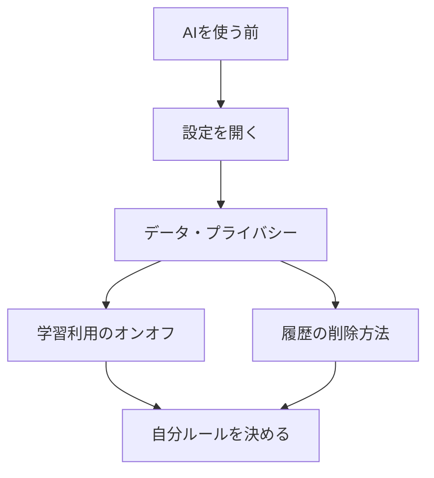

# AIサービス設定と機密・個人情報

## たとえ話

> 新しい家に住み始めるとき、まず窓の鍵がかかるか、カーテンの外から中が見えないかを確かめる人は多い。住んでから不用心に気づくより、入る前にひと通り見ておくほうが、落ち着いて暮らせる。確認は、何かを変える作業ではなく、今どうなっているかを知る作業だ。

> AIサービスを使うときも、これと同じ準備がある。今日することは、設定をいじることではなく、見ることだ。なぜ先に見ておくのかというと、自分の会話がどう扱われるかを知っていれば、何を相談していいかを落ち着いて決められるからだ。わからない項目は、変更しなくてよい。

## 今日のゴール

使っているAIサービスの設定画面を開き、データ・プライバシー関連の項目を確認し、自分用のチェックメモを1つ書く。

## 前提確認

- すでにできる前提：テーマ2で渡していい・ダメな情報を分けた。AIサービスのアカウントを持っている（ChatGPT・Claude・Geminiなどいずれか1つ）
- まだ知らなくてよいこと：企業向けプランの契約、API設定

## このテーマで伸ばす力

**正しく考える力・習慣力** — 使う前に設定を確認し、自分ルールを決める力です。

## 学びの段階

今日の完了条件は **「できる」** です。設定画面を開き、3項目を確認してメモしたところまで進めます。

## なぜ大事か

AIサービスによって、会話がモデルの学習に使われるかどうかが異なります。**AIは自動で秘密を守ってくれるわけではありません。** 入力する前に、自分の設定を知っておくと安心です。

どんな仕事でも、お客さまの情報を入れる前に「学習利用はオフか」「履歴は削除できるか」を確認する習慣が役立ちます。

**方針：機密情報は入力しない。** 設定確認は、それに加える安全策です。

## わからないまま進まないチェック

- **設定が見つからない** → 使っているサービス名をDiscordで聞く。スクショは機密部分を隠す
- **英語でわからない** → 画面の位置（左下・歯車アイコン）を手順で追う。対訳表を参照

## 躓いたら戻る先

**第4章 ITリテラシー基礎**（アカウント・パスワード）  
[02-渡していい・ダメな情報.md](02-渡していい・ダメな情報.md)（何を守るかの復習）

## 読んで学ぶ

### 確認する3項目（全サービス共通）

1. **会話がモデル学習に使われる設定**はオンかオフか
2. **履歴の削除方法**がわかったか
3. **仕事の機密を入れる前に**オフにできるか（またはビジネスプランが必要か）

今日は **見るだけ** が基本です。わからない項目を勝手に変更しないでください。

### 英語UIの対訳（よく出る語）

| 英語 | 意味 |
|---|---|
| Settings | 設定 |
| Data controls | データの管理 |
| Privacy | プライバシー |
| Chat history & training | チャット履歴と学習利用 |
| Delete | 削除 |

### 図解



## 手順

### ステップ1：使うサービスを1つ決める（2分）

ChatGPT、Claude、Geminiのいずれか1つを選び、ブラウザまたはアプリでログインします。

### ステップ2：設定画面を開く（5分）

#### ChatGPT の場合

1. ブラウザで [chat.openai.com](https://chat.openai.com) を開く（またはアプリ）
2. 画面 **左下** のプロフィールアイコンをクリック
3. **設定**（Settings）をクリック
4. **データコントロール**（Data controls）を開く
5. **チャット履歴とトレーニング**（Chat history & training）の状態を確認

**スクショを撮るなら**：設定メニューとデータコントロール画面（メールアドレスは隠す）

#### Claude の場合

1. [claude.ai](https://claude.ai) を開く
2. 左下のプロフィールまたは **設定**（Settings）を開く
3. **プライバシー**（Privacy）またはデータ関連の項目を探す
4. 会話データの扱いを確認

#### Gemini の場合

1. [gemini.google.com](https://gemini.google.com) を開く
2. 左下または右上の **設定** を開く
3. **アクティビティ** や **データとプライバシー** を確認

画面は更新されることがあります。見つからなければ、サービス名をDiscordで聞いてください。

### ステップ3：チェックメモを書く（10分）

```text
【使っているサービス】：
【学習利用の設定】：オン / オフ / わからない
【履歴の削除方法】：わかった / これから調べる
【仕事の機密を入れる前のルール】：（1行。例：学習オフを確認してから相談する）
```

30分版：2つ目のサービスも確認するか、スタッフ向けの「使う前ルール」を1行足します。

### ステップ4：自分ルールを1行決める（5分）

例：

- 「お客さまの実名は入れない。学習利用がオンのときは概要だけ相談する」
- 「履歴は月1で削除する」

## できたらOK

- 設定画面を開けた
- 3項目を確認してメモした
- 自分ルールを1行書いた
- スクショにアカウント情報を写していない

## つまずいたら

**躓いたら戻る先**：第4章 ITリテラシー基礎

| つまずき | 対処 |
|---|---|
| 設定をいじると壊れそう | 今日は見るだけ。変更は任意 |
| 英語がわからない | 対訳表と画面の位置で追う |
| UIが教材と違う | サービス名をDiscordで共有して質問 |
| ログインできない | 第4章のパスワード管理を確認 |

Discordで質問するときは、次のテンプレをコピーして使ってください。

```text
【今やっている教材】
第7章 03 AIサービス設定と機密・個人情報

【詰まったところ】
（例：データコントロールの場所がわからない）

【試したこと】
（例：左下のプロフィールから設定を開いた）

【スクショやエラー文】
（設定画面。メールアドレスは隠す）

【どうなればOKか】
（例：ChatGPTで学習利用の確認場所を教えてほしい）
```

## 今日の成果物

- **プライバシー設定チェックメモ**（サービス名・3項目・自分ルール1行）

## 問い

確認した設定のうち、いちばん安心できた項目は何だったでしょうか。  
一緒に働く人や家族に伝えるなら、どの1行ルールを最初に伝えたいでしょうか。
