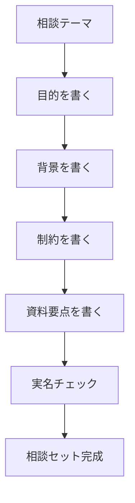

# 目的・背景・制約・資料の相談セット

## たとえ話

> 体の不調で病院へ行くとき、「いつから」「どんなときに痛むか」「気になること」を一言ずつメモして持っていくと、短い診察でも要点が伝わる。何も準備せずに行くと、肝心なことを言い忘れ、家に帰ってから思い出すことになる。準備のメモは、うまい文章である必要はない。

> AIへの相談も、これと同じだ。今日作るのは、目的・背景・制約・資料の四つを並べた下書きである。なぜ下書きから始めるのかというと、送る前に自分の頭の中が整理され、渡してはいけない情報にも気づけるからだ。きれいな文章はいらない。まず埋めることが先になる。

## 今日のゴール

自分の仕事の相談テーマ1つについて、目的・背景・制約・資料の4項目を埋めた相談セットを1つ作る。

## 前提確認

- すでにできる前提：テーマ1〜3でコンテキスト・安全・設定を学んだ。第6章の仕事フォルダがある
- まだ知らなくてよいこと：Cursorへのプロンプト設計（第12章以降）

## このテーマで伸ばす力

**整理力・構造化・相談する力** — AIに送る前に情報をまとめる力です。

## 学びの段階

今日の完了条件は **「できる」** です。4項目すべて埋まり、ファイルとして保存したところまで進めます。

## なぜ大事か

相談セットは、AIへの **下書き** です。送る前に自分の頭の中を整理でき、実名チェックもしやすくなります。

例：サービス一覧の見出し改善や、お客さまへの案内文づくりなど。どれも第6章で整えた資料の要点を使えます。

**方針：機密情報は入力しない。** 保存前に実名・パスワードが入っていないか必ず確認してください。

## わからないまま進まないチェック

- **背景が書けない** →「なぜ今やるのか」を1文だけ。完璧でなくてよい
- **資料がない** → サービス一覧の「今の見出し3つだけ」を書く

## 躓いたら戻る先

[01-AIに渡す情報とは.md](01-AIに渡す情報とは.md)（4項目の意味）  
[02-渡していい・ダメな情報.md](02-渡していい・ダメな情報.md)（匿名化）  
**第6章 ファイル整理**（資料の場所）

## 読んで学ぶ

相談セットのテンプレートです。各2〜3行、合計15行以内を目安にします。箇条書きでOKです。

```text
【目的】何を決めたい・作りたいか：

【背景】今の状況・困っていること：

【制約】守ること（文字数、トーン、渡さない情報）：

【資料】参考にするファイルの要点（実名なし）：
```

### 図解



## 手順

### ステップ1：相談テーマを1つ決める（3分）

次のどちらか1つを選びます（自分のテーマでもOK）。

- サービス一覧の見出しを分かりやすくしたい
- お客さまへの案内文を短くわかりやすくしたい

メモに1行書きます。

```text
相談テーマ：
```

### ステップ2：4項目を埋める（12分）

テンプレに沿って記入します。各1行でも完了可です。

**記入例**

```text
【目的】サービス一覧の見出しを、初めてのお客さまにも伝わる形にしたい
【背景】新しいサービスを追加したら説明が長くなり、一覧が読みにくくなった
【制約】各見出し30字以内、やさしいトーン、お客さまの名前や価格の具体数字は書かない
【資料】現行見出し：「○○コース」「○○ケア」「○○サポート」
```

### ステップ3：実名チェック（3分）

読み返し、次を確認します。

- [ ] お客さまの実名が入っていない
- [ ] パスワード・連絡先が入っていない
- [ ] 売上・料金の具体数字をそのまま書いていない

### ステップ4：ファイルとして保存する（7分）

1. Macの **テキストエディット** を開く（アプリケーション → テキストエディット）
2. 相談セットを貼り付ける
3. 「ファイル」→「保存」
4. 保存先：`書類` → `仕事` フォルダ
5. ファイル名（第6章の命名ルールに沿う）：`2026-06_相談セット_サービス見出し.txt` など

第8章では、同じ内容をエディタ（Cursor）で保存する方法を学びます。

## できたらOK

- 相談テーマを1つ決めた
- 4項目すべて埋まっている（各1行でもOK）
- 実名・機密情報が入っていない
- テキストファイルとして仕事フォルダに保存した

## つまずいたら

**躓いたら戻る先**：第6章、第7章テーマ1〜2

| つまずき | 対処 |
|---|---|
| うまい文章が書けない | 箇条書き・キーワードだけでOK |
| 15行を超えそう | 各項目1行に減らす |
| 資料が思い浮かばない | 見出し3つだけ書く |
| 保存先がわからない | 書類 → 仕事 フォルダ |

Discordで質問するときは、次のテンプレをコピーして使ってください。

```text
【今やっている教材】
第7章 04 相談セットを作る

【詰まったところ】
（例：制約の書き方がわからない）

【試したこと】
（例：文字数だけ書いた）

【スクショやエラー文】
（なくても大丈夫。相談セット本文は貼らない）

【どうなればOKか】
（例：制約の例がほしい）
```

## 今日の成果物

- **完成した相談セット1つ**（テキストファイル、仕事フォルダ内）

## 問い

4項目のうち、いちばん書くのに時間がかかったのはどれだったでしょうか。  
この相談セットを、明日の自分が読んで意味がわかりそうでしょうか。
