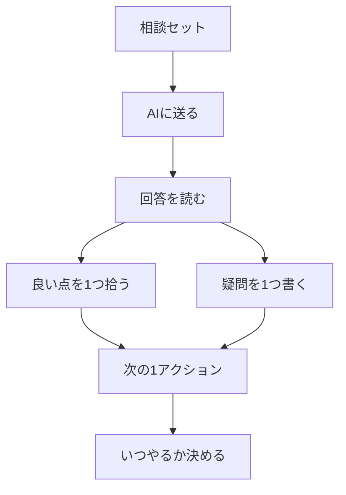

# AI相談を次の行動に変える

## たとえ話

> 詳しい人に「健康のために何をすればいいか」と尋ねると、運動・食事・睡眠と、よかれと思って十も助言が返ってくることがある。全部いっぺんに始めようとした人ほど三日で力尽き、「まず夜に十分だけ歩く」とひとつに絞った人のほうが続いていく。助言の数より、今日動かせる一歩の数が、結果を決める。

> AIの答えも、これとよく似ている。たくさんの案が返ってきても、それは参考資料であって、命令ではない。今日学ぶのは、回答から「次の一手」をひとつだけ選ぶことだ。なぜひとつに絞るのかというと、相談は行動に変わって初めて意味を持つからだ。

## 今日のゴール

相談セットをAIに送り（または想像で回答を得）、回答から「自分が次にやる1アクション」を決めてメモする。

## 前提確認

- すでにできる前提：テーマ4で相談セットを1つ作った
- まだ知らなくてよいこと：AI回答の自動検証ツール、複数AIの比較

## このテーマで伸ばす力

**進める力・判断する力・相談する力** — AI回答から自分の行動を1つに絞る力です。

## 学びの段階

今日の完了条件は **「できる」** です。AIに相談（または代替）し、次の1アクションを15分以内の具体行動として書いたところまで進めます。

## なぜ大事か

AIは増幅装置です。良い回答も出ますが、**そのまま採用していいとは限りません。** 自分の判断を優先し、「次の1アクション」に落とすと、相談が行動につながります。

例：見出し案を3つもらっても、今日は1つだけメモ帳に書き写す。案内文なら1段落だけ直す、という具合です。

**方針：機密情報は入力しない。** 送信前に相談セットを再チェックしてください。

## わからないまま進まないチェック

- **AIの回答が長すぎてわからない** → 最初の3行だけ読む。良い点を1つだけ拾う
- **全部実践できない** → 1アクションだけ。残りは保留リストへ
- **AIの答えが間違っている気がする** → 疑問欄に書く。自分の判断を優先する

## 躓いたら戻る先

[04-目的・背景・制約・資料の相談セット.md](04-目的・背景・制約・資料の相談セット.md)（相談セットがないとき）  
**第2章 学びの土台**（AIは増幅装置）  
**第1章 目標と習慣**（次の1アクションの習慣）

## 読んで学ぶ

AI相談の流れは次のとおりです。

1. 相談セットを送る（実名チェック済み）
2. 回答を読む
3. **良い点1つ・疑問1つ・次の1アクション1つ** をメモする
4. 次の1アクションは **15分以内** でできる大きさにする

AIを使わない場合の代替：相談セットを読み、「もしAIならこう答えそう」と3行書いて、同じメモテンプレに進みます。

### 図解



## 手順

### ステップ1：相談セットを再チェック（5分）

テーマ4で作ったファイルを開き、次を確認します。

- [ ] 実名・パスワード・連絡先が入っていない
- [ ] テーマ3で確認したプライバシー設定を思い出した

不安な情報があれば、削除または匿名化してから進みます。

### ステップ2：AIに送信する（7分）

1. 使うAIの **新規チャット** を開く
2. 相談セットの全文をコピーして貼り付け
3. 送信

**スクショを撮るなら**：送信画面（個人情報はマスク）

#### AIを使わない場合

相談セットを読み、次を3行書きます。

```text
もしAIなら、こう答えそう：
1.
2.
3.
```

### ステップ3：回答メモを書く（10分）

回答を読み（または想像し）、次のテンプレを埋めます。

```text
【AI回答で良かった点】：

【まだ確認したい点】：

【次の1アクション（15分以内でできること）】：

【いつやるか】：
```

次の1アクションの例：

- 「サービス一覧の見出しを1つ、紙に書き直す」
- 「お客さまへの案内文の1段落を、メモ帳で短く書き直す」

30分版：「いつやるか」まで具体的に書きます（例：「明日の開店前15分」）。

### ステップ4：メモを保存する（3分）

1. テキストエディットまたはメモ帳で `2026-06_相談メモ_サービス見出し.txt` などの名前で保存
2. 保存先：`書類` → `仕事` フォルダ

## できたらOK

- 相談セットを送信した（または代替で3行書いた）
- 良い点・疑問・次の1アクション・いつやるかをメモした
- 次の1アクションが15分以内の具体行動になっている
- 実名・機密情報をAIに送っていない

## つまずいたら

**躓いたら戻る先**：第7章テーマ4、第2章、第1章

| つまずき | 対処 |
|---|---|
| 回答が長すぎる | 最初の3行だけ読む |
| 全部やりたくなる | 1アクションだけ選ぶ |
| 答えが信用できない | 疑問欄に書く。採用は自分で決める |
| AIに送るのが怖い | 代替手順でメモまで進める |

Discordで質問するときは、次のテンプレをコピーして使ってください。

```text
【今やっている教材】
第7章 05 AI相談を次の行動に変える

【詰まったところ】
（例：次の1アクションに絞れない）

【試したこと】
（例：良い点を1つ書いた）

【スクショやエラー文】
（AI回答の一部。個人情報は隠す）

【どうなればOKか】
（例：1アクションの例がほしい）
```

## 今日の成果物

- **AI相談メモ**（良い点・疑問・次の1アクション・いつやるか）

## 問い

決めた「次の1アクション」は、15分で終わりそうでしょうか。  
AIの回答をそのまま使わず、自分で確認したい点は何でしょうか。
