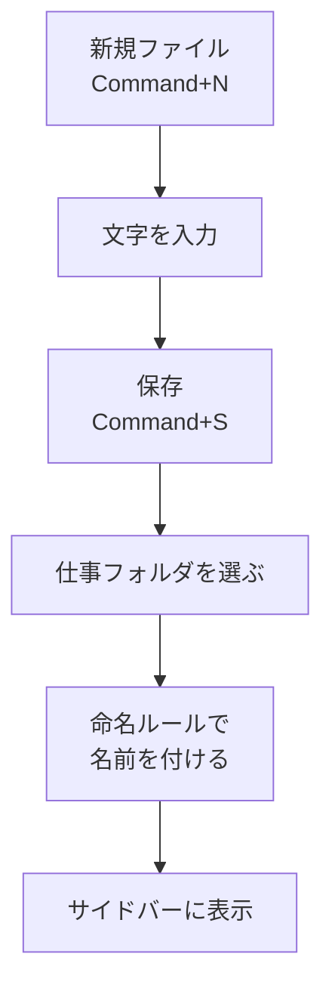

# ファイルを作る・保存する（Cursor/VS Code）

## たとえ話

> 料理の途中で、思いついた段取りを近くの紙に書きとめることがある。だがその紙を、調理台のどこに置いたか決めずに走り書きしてしまうと、後で見返したいときに見つからない。書くという行為と、決めた場所にしまうという行為は、本当は別のひと手間だ。書いただけでは、まだ「残った」とは言えない。

> パソコンでの作業も、これと同じだ。エディタに文字を打っただけでは、それはまだ机の上の走り書きにすぎない。決めた場所に名前をつけて「保存」して、はじめて後から開けるファイルになる。今日学ぶのは、新しいファイルを作り、決めた場所に名前をつけてしまう、その一連の流れだ。打つことと残すことは別、とわかると、書いたものを失わずに済むようになる。

## 今日のゴール

エディタで新しいテキストファイルを作り、第6章の命名ルールに沿った名前で `仕事` フォルダの中に保存する。

## 前提確認

- すでにできる前提：第8章テーマ1で `仕事` フォルダをエディタで開いた
- まだ知らなくてよいこと：AIチャット、ターミナル、Git操作

## このテーマで伸ばす力

**作る力・進める力** — 自分のメモをファイルとして残し、後から開ける形にする力です。

## 学びの段階

今日の完了条件は **「できる」** です。新規ファイルを作り、文字を入力し、決めた場所に名前をつけて保存し、サイドバーにそのファイルが出たところまで進めます。

## なぜ大事か

メモアプリと違い、エディタなら **`仕事` フォルダに直接ファイルを残せます**。置き場所を自分で決められるので、後から探す手間が減ります。

これは第7章の相談セット作りや、第12章でCursorに下書きを頼むときの土台になります。「どこに保存されたか」を自分で言える状態が、その後の作業を軽くします。

例：「お客さまの記録」を整理する前のメモや、「サービス一覧」で直したい見出しの控えを、仕事フォルダの中に1つのファイルとして残せます。

## わからないまま進まないチェック

- **保存先がわからない** → 必ず、いま開いている `仕事` フォルダの中です。保存ダイアログ上部のパス（場所の表示）で確認できます
- **未保存かどうかわからない** → タブ（上部のファイル名）に丸い点があれば未保存。保存すると消えます

## 躓いたら戻る先

**第8章テーマ1 フォルダを開く**（フォルダが開いていないとき）  
**第6章 命名ルール**（ファイル名の付け方）  
**第3章 Macとファイルの基礎**（書類フォルダの場所）

## 読んで学ぶ

**保存** とは、いま打った文字をファイルとしてディスクに残すことです。イメージは「走り書きを、決めた引き出しにしまう」です。

**タブ** とは、エディタ上部に並ぶファイル名の見出しです。タブに **丸い点** が付いているときは「まだ保存していない（未保存）」の合図です。保存すると、丸い点は **×（閉じるボタン）** に変わります。

今日触るのは **ファイルメニュー** と **キーボード操作** だけです。AIチャットパネルは開かなくて大丈夫です。

**個人情報・機密情報の注意**：メモにお客さまの実名は書かないでください。スクショにも実名が写らないよう確認します。

### 図解



## 手順

### 1. 仕事フォルダが開いているか確認

1. エディタの左サイドバーに `仕事` フォルダの中身（`01_サービス・料金` など）が見えているか確認します
2. 見えていない場合は、テーマ1の手順で **ファイル → フォルダを開く…** からやり直します

### 2. 新しいファイルを作る

1. キーボードで **`Command + N`** を押す（またはメニューの **ファイル → 新規ファイル**）
2. 新しい空のタブが開きます

### 3. 3行だけ入力する

次の3行を打ってみます。中身は自分の仕事に合わせて自由に変えてOKです。

```text
# 今日のメモ
- 直したい見出し：
- 次にやること：
```

### 4. 保存する

1. キーボードで **`Command + S`** を押す（またはメニューの **ファイル → 保存**）
2. 保存ダイアログが出たら、上部の場所が **`仕事` フォルダ（または中の適切なサブフォルダ）** になっているか確認します
3. ファイル名に **`2026-06_作業メモ.txt`** と入力します（第6章の命名ルールに合わせます）
4. **保存** をクリックします

**スクショを撮るなら**：新規ファイルの空タブ、保存ダイアログ、保存後のサイドバー

### 5. 保存できたか確認

1. タブの **丸い点が消えている**（=保存済み）ことを確認します
2. 左サイドバーに **`2026-06_作業メモ.txt`** が表示されていることを確認します

### もう少しやれそうなら（30分版）

- メモの中身を、自分の仕事向けに書き足してみます。たとえば「サービス一覧で直したい順番」「お客さまへの案内文の下書き」など
- 書き足したら、また **`Command + S`** で保存します

## できたらOK

- エディタで新しいファイルを作れた
- 3行ほど入力できた
- `仕事` フォルダの中に、命名ルールに沿った名前で保存できた
- タブの丸い点が消え、サイドバーにファイルが見える

## つまずいたら

**躓いたら戻る先**：第8章テーマ1 フォルダを開く、第6章 命名ルール

| つまずき | 対処 |
|---|---|
| どこに保存されたかわからない | 保存ダイアログ上部の場所表示を見る。次回から `仕事` フォルダを選ぶ |
| 保存せずに閉じそうになった | 閉じる前に `Command + S`。これを習慣にする |
| ファイル名のつけ方に迷う | 第6章の命名ルール（日付＋内容）に合わせる |
| タブの丸い点が消えない | もう一度 `Command + S` を押す |

Discordで質問するときは、次のテンプレをコピーして使ってください。

```text
【今やっている教材】
第8章 02 ファイルを作る・保存する

【詰まったところ】
（例：保存したファイルがどこに行ったかわからない）

【試したこと】
（例：Command+S を押した）

【スクショやエラー文】
（エディタ画面。ファイル名は隠してOK）

【どうなればOKか】
（例：仕事フォルダに保存できたか確認したい）
```

## 今日の成果物

- **保存済みのファイル1つ**（`仕事` フォルダ内の `.txt` または `.md`）

## 問い

メモアプリで書いたものと、フォルダに保存したファイル。後から探しやすいのは、あなたにとってどちらでしょうか。  
今日保存したファイルは、Finderで開いても同じ場所に見えるか、確かめてみるとどうでしょうか。
