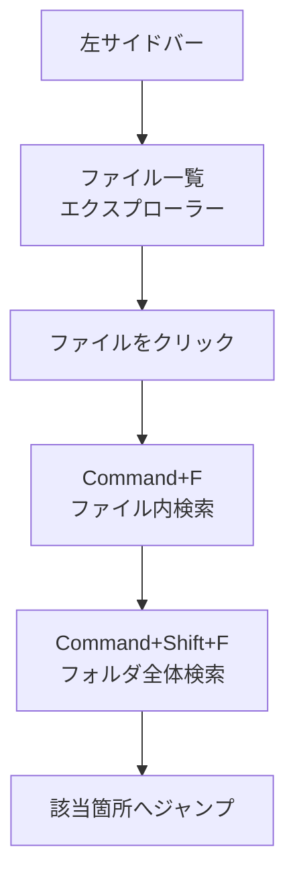

# 左サイドバーと検索（Cursor/VS Code）

## たとえ話

> 棚に資料が増えてくると、目的の1枚を背表紙だけで探すのは骨が折れる。慣れた人は、まず全体の並びをざっと見渡し、それでも見つからないときは「あのキーワードが書いてあるはず」と中身から探す。並びを見るのと、中身で探すのは、別々の道具だ。どちらか片方しか使えないと、探し物に時間を取られてしまう。

> パソコンでの作業も、これと同じだ。左サイドバーはフォルダの「並びを見渡す棚」で、検索は「中身から一気に探す道具」だ。今日学ぶのは、この2つを使い分けて、目的のファイルや一行にすばやくたどり着く方法だ。ファイルが増えても探せる、という安心が、その後の作業を続けやすくする。

## 今日のゴール

左サイドバーでファイルを開き閉じし、フォルダの中の文字を検索して、その箇所まで移動できる状態にする。

## 前提確認

- すでにできる前提：第8章テーマ1〜2でフォルダを開き、ファイルを保存した
- まだ知らなくてよいこと：AIチャット、ターミナル、Git操作

## このテーマで伸ばす力

**整える力・進める力** — たくさんのファイルの中から、必要な1つ・1行を見つけ出す力です。

## 学びの段階

今日の完了条件は **「できる」** です。左サイドバーでファイルを開閉し、`Command + F` でファイルの中を検索して該当箇所に移動したところまで進めます。

## なぜ大事か

ファイルが増えると、Finderで1つずつ開いて確認するのは大変です。エディタの検索を使うと、**「どのファイルのどこに、その言葉が書いてあるか」を一気に見つけられます**。

例：「サービス一覧」の古い表記がどのファイルに残っているか、「お客さまの記録」の中の特定のキーワードがどこにあるか、といった探し物がすぐ終わります。探す時間が減ると、直す作業に集中できます。

## わからないまま進まないチェック

- **サイドバーが消えた** → 左端のアイコン列を確認します。または **表示メニュー → エクスプローラー** で戻せます
- **検索で何も出ない** → キーワードを短くしてみます。そのファイルにその文字が本当に含まれているかも確認します

## 躓いたら戻る先

**第8章テーマ1 フォルダを開く**（フォルダが開いていないとき）  
**第8章テーマ2 ファイルを作る・保存する**（検索するファイルがないとき）  
**第6章 ファイル整理**

## 読んで学ぶ

**エクスプローラー** とは、左サイドバー最上部にある **ファイル一覧** のことです。イメージは「机の上に広げたフォルダの目次」です。

検索には2種類あります。

- **ファイル内検索（`Command + F`）**：いま開いている1つのファイルの中を探す
- **フォルダ全体検索（`Command + Shift + F`）**：開いているフォルダの全ファイルをまとめて探す

今日触るのは **エクスプローラー** と **検索バー** だけです。アイコンがたくさん並んでいますが、AIチャットパネルは今日は開きません。エクスプローラー（ファイル型のアイコン）だけ使えば大丈夫です。

**個人情報・機密情報の注意**：検索結果のスクショに、お客さまの実名が写らないよう確認してください。

### 図解



## 手順

### 1. エクスプローラーを開く

1. 左端のアイコン列の中から、**ファイルが2枚重なったアイコン（エクスプローラー）** をクリックします（多くの場合いちばん上です）
2. `仕事` フォルダの中身が一覧で表示されます

### 2. ファイルを開いて閉じる

1. フォルダ名（`01_サービス・料金` など）の左の **三角** をクリックして展開します
2. 中のファイルを1つクリックすると、右側に内容が表示されます
3. もう一度 **三角** をクリックすると、フォルダを折りたたんで隠せます

**スクショを撮るなら**：エクスプローラー、フォルダを展開した状態

### 3. ファイルの中を検索する（15分版はここまで）

1. テーマ2で作った `2026-06_作業メモ.txt` を開きます
2. **`Command + F`** を押すと、右上に検索バーが出ます
3. 自分が入れた言葉（例：「メモ」）を入力します
4. **Enter** または検索バーの **↓** で次の該当箇所へ移動できます

**スクショを撮るなら**：`Command + F` の検索バー

### 4. フォルダ全体を検索する（30分版）

1. **`Command + Shift + F`** を押します（左サイドバーが検索表示に変わります）
2. 検索欄に、探したいキーワード（例：自分が入れた言葉）を入力します
3. `仕事` フォルダ全体の結果が、ファイルごとに一覧で出ます
4. 結果の行をクリックすると、その **ファイルの該当行へジャンプ** します
5. 見つけた **ファイル名と行番号** を、テーマ2のメモに1行だけ控えます

**スクショを撮るなら**：`Command + Shift + F` の結果一覧

## できたらOK

- エクスプローラーでファイルを開閉できた
- `Command + F` でファイルの中を検索し、該当箇所に移動できた
- （30分版）`Command + Shift + F` でフォルダ全体を検索し、結果からジャンプできた

## つまずいたら

**躓いたら戻る先**：第8章テーマ1・2、第6章 ファイル整理

| つまずき | 対処 |
|---|---|
| アイコンが多くて迷う | 今日触るのはエクスプローラー（ファイル2枚のアイコン）だけ |
| AIパネルが開いてしまった | 閉じてOK。エクスプローラーに戻る |
| 検索バーが見つからない | ファイルを開いてから `Command + F` |
| 全体検索の結果が多すぎる | キーワードを長く・具体的にする |

Discordで質問するときは、次のテンプレをコピーして使ってください。

```text
【今やっている教材】
第8章 03 左サイドバーと検索

【詰まったところ】
（例：Command+F で検索しても移動できない）

【試したこと】
（例：作業メモを開いて「メモ」で検索した）

【スクショやエラー文】
（エディタ画面。ファイル名は隠してOK）

【どうなればOKか】
（例：検索結果から該当箇所に飛びたい）
```

## 今日の成果物

- **検索で見つけたファイル名と行番号のメモ1行**（テーマ2のファイルに追記でOK）

## 問い

Finderの検索と、エディタの検索。あなたの探し物には、どちらが合っていると感じたでしょうか。  
よく探す言葉が決まっているとしたら、それは何でしょうか。
