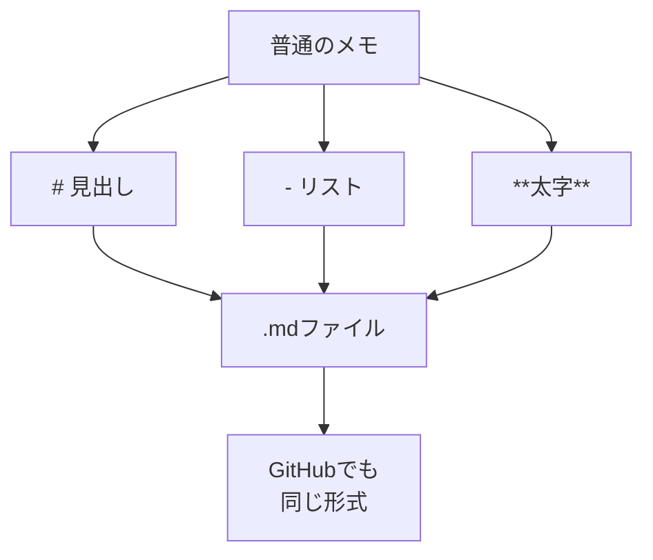

# Markdownを書く（Cursor/VS Code）

## たとえ話

> 買い物のメモを走り書きするとき、ただ品名を並べるより、「飲み物」「日用品」と見出しをつけ、その下に丸印で品物を並べたほうが、店に着いてから見やすい。大事なものには下線を引くこともある。書き方に少しだけ約束を決めておくと、同じ情報でも、後から読む人にとってぐっと扱いやすくなる。

> パソコンのメモも、これと同じだ。記号をほんの少し決めておくだけで、見出し・箇条書き・強調が伝わる形になる。それがMarkdown（マークダウン）という、メモの書き方のルールだ。コードのように見えて身構えてしまうかもしれないが、覚える記号は今日はたった3つでいい。なぜ学ぶかと言えば、Rebuild AI Guildの教材そのものも、この書き方で書かれているからだ。

## 今日のゴール

`.md` ファイルに、見出し・箇条書き・太字を使って、自分の仕事メモを1つ書く。

## 前提確認

- すでにできる前提：第8章テーマ2で `.txt` ファイルを保存した
- まだ知らなくてよいこと：HTML、プログラミング、AIチャット

## このテーマで伸ばす力

**作る力・整える力** — 情報に見出しと区切りをつけて、後から読みやすい形に整える力です。

## 学びの段階

今日の完了条件は **「できる」** です。`.md` ファイルに、見出し（`#`）・箇条書き（`-`）・太字（`**`）の3種類を使って保存したところまで進めます。

## なぜ大事か

Markdownは **「見た目の飾りつけ」より「中身を書くこと」に集中できる** メモの書き方です。記号を少し足すだけで、見出しや箇条書きが整います。

そしてこれは、Rebuild AI Guildの教材や、GitHub（第10章）で読むファイルと **同じ形式** です。「自分も同じ書き方で書ける」とわかると、教材を読む側から、整理して書く側へ一歩進めます。第7章の相談セットも、この書き方で整えられます。

## わからないまま進まないチェック

- **記号の意味がわからない** → 今日は3つだけです。`#` は見出し、`-` は箇条書き、`**` は太字
- **プレビューが開けない** → プレビューは任意です。記法が書けて保存できればOKです

## 躓いたら戻る先

**第8章テーマ2 ファイルを作る・保存する**（保存の基本）  
**第7章 相談セット**（テキストファイルの延長として）

## 読んで学ぶ

**Markdown（マークダウン）** とは、記号で見出しや箇条書きを表す、メモの書き方ルールです。専門用語に聞こえますが、中身は「メモの書き方の約束ごと」にすぎません。

今日使う記号は3つだけです。

| やりたいこと | 記号 | 書き方の例 |
|---|---|---|
| 見出しを作る | `#` | `# 大見出し` / `## 中見出し` |
| 箇条書きにする | `-` | `- 項目` |
| 太字で強調する | `**` | `**おすすめ**` |

`#` のあとや `-` のあとには **半角スペースを1つ** 入れます。太字は強調したい言葉を `**` で **前後からはさみます**。

**個人情報・機密情報の注意**：メモにお客さまの実名は書かないでください。

### 図解



## 手順

### 1. Markdownファイルを作る

1. テーマ2の手順で **`Command + N`** → 新規ファイルを作ります
2. **`Command + S`** で保存します。ファイル名は **`2026-06_仕事メモ.md`**（拡張子を `.md` にするのがポイント）
3. 保存先は `仕事` フォルダの中の、内容に合うサブフォルダにします

### 2. 3種類の記法を写して書く

下のひな型をコピーして、自分の仕事の内容に書き換えます。

```markdown
# サービス改善メモ

## 今日直したいこと
- 説明文をやさしくする
- 価格の見せ方
- **おすすめ**の印の付け方

## メモ
ここに気づいたことを書く
```

書き換えの例：
- 見出しを「お客さまへの案内メモ」に変える
- 箇条書きを、自分が直したい「サービス一覧」の項目に変える
- いちばん大事な1語を `**` ではさんで太字にする

### 3. 保存する

1. **`Command + S`** で保存します
2. タブの丸い点が消えれば保存済みです

**スクショを撮るなら**：Markdownを書いた編集画面

### 4. プレビューで見た目を確認する（30分版）

1. **`Command + Shift + V`** を押します（または編集画面右上の **プレビューアイコン**）
2. `#` が大きな見出しに、`-` が箇条書きに、`**` が太字になって表示されます
3. GitHubで教材を読むときと同じ見た目になることに気づきます

**スクショを撮るなら**：プレビュー画面

## できたらOK

- `.md` ファイルを作って保存できた
- 見出し（`#`）・箇条書き（`-`）・太字（`**`）の3種類を使えた
- （30分版）プレビューで見た目を確認できた

## つまずいたら

**躓いたら戻る先**：第8章テーマ2 ファイルを作る・保存する、第7章 相談セット

| つまずき | 対処 |
|---|---|
| 記号がそのまま表示される | プレビューを開く。記法どおり書けていればOK |
| 太字にならない | `**` が前後2つずつあるか確認 |
| 見出しが効かない | `#` のあとに半角スペースを入れる |
| コードみたいで怖い | 今日は3記号だけ。例をコピペして書き換える |

Discordで質問するときは、次のテンプレをコピーして使ってください。

```text
【今やっている教材】
第8章 04 Markdownを書く

【詰まったところ】
（例：太字にしたのに反映されない）

【試したこと】
（例：おすすめを ** ではさんだ）

【スクショやエラー文】
（編集画面とプレビュー。ファイル名は隠してOK）

【どうなればOKか】
（例：3つの記法が使えたか確認したい）
```

## 今日の成果物

- **`2026-06_仕事メモ.md`**（見出し・箇条書き・太字を含む）

## 問い

3つの記法のうち、あなたの仕事メモでいちばん使いそうなのはどれでしょうか。  
Rebuildの教材が同じ書き方だと知って、書く側に回ることへの距離は少し縮まったでしょうか。
