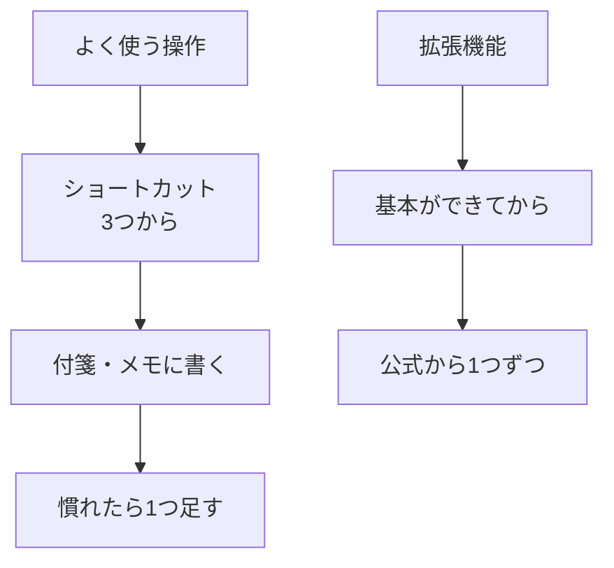

# ショートカットと拡張機能の考え方（Cursor/VS Code）

## たとえ話

> 道具をたくさん持っている人ほど、実際の作業で手に取るのは決まった数本だ、とよく言われる。最初から全部の使い方を覚えようとすると、かえって手が止まる。よく使う道具を数本だけ手元に置き、必要になったらもう一本だけ足していく。そのほうが、結局は作業が速くなっていく。

> パソコンの操作も、これと同じだ。ショートカット（キー操作の近道）は何百もあるが、全部を暗記する必要はない。毎日使う数個から始め、慣れたら一つ足す。拡張機能（あとから足せる便利な部品）も同じで、基本ができる前に増やすと、かえって混乱しやすい。今日学ぶのは、近道と部品をどう「選んで」いくか、という考え方だ。覚える量を絞るほど、続けやすくなる。

## 今日のゴール

自分がよく使う操作3つと、そのショートカットをメモにまとめ、拡張機能は「今は急いで入れなくてよい」と自分の言葉で説明できるようにする。

## 前提確認

- すでにできる前提：第8章テーマ1〜4で `Command + N / S / F` などを使った
- まだ知らなくてよいこと：拡張機能のインストール、AI関連の拡張、設定の細かい変更

## このテーマで伸ばす力

**進める力・続ける力** — 覚えることを絞り、無理なく操作を増やしていく力です。

## 学びの段階

今日の完了条件は **「わかった」** です。4択に答え、自分用ショートカット3つを書き、拡張機能は「基本のあとから足すもの」と説明できたところまで進めます。

## なぜ大事か

ショートカットも拡張機能も、「全部やろう」とすると、それ自体が負担になって続きません。**よく使うものから少しずつ** が、いちばん身につきます。

毎日の「サービス一覧の編集」「お客さまの記録の検索」で使う操作が速くなれば、本来やりたい仕事に時間を回せます。拡張機能は便利ですが、基本が手になじむ前に増やすと、何が原因で迷っているのか分からなくなります。だから今日は「選び方」を決めます。

## わからないまま進まないチェック

- **ショートカットが覚えられない** → 今日は保存（`Command + S`）だけでも十分です。付箋に貼っておきます
- **拡張機能を入れたくなった** → 第8章では「見るだけ」が安心です。入れるなら公式マーケットプレイスの1つまでにします

## 躓いたら戻る先

**第8章テーマ1〜4**（基本操作の復習）  
**第6章 ファイル整理**

## 読んで学ぶ

**ショートカット** とは、メニューを開かずにキー操作で同じことをする「近道」です。たとえば保存は、メニューをたどらなくても `Command + S` で済みます。

**拡張機能（Extension）** とは、エディタに **あとから機能を足せる部品** です。日本語表示やMarkdown支援など、いろいろあります。Mac自体を速くする道具ではなく、ウイルスでもありません。ただし、出どころの怪しいものは避け、**公式マーケットプレイス** のものだけにします。

第8章の時点では、拡張機能は **見るだけ** で大丈夫です。基本操作（開く・保存・検索・Markdown）が手になじむことが先です。AI関連の拡張は、第12章でCursorのAIを扱うときに触れます。

### この章までで使うショートカット

| 操作 | Mac |
|---|---|
| 新規ファイル | `Command + N` |
| 保存 | `Command + S` |
| ファイル内検索 | `Command + F` |
| フォルダ全体検索 | `Command + Shift + F` |
| フォルダを開く | メニューから（ショートカットは覚えなくてOK） |

### 図解



## 手順

### 1. 自分のショートカットカードを作る

1. テーマ4のやり方で、`仕事` フォルダに `2026-06_ショートカットメモ.md` を作ります
2. これまで使った操作の中から、**自分がよく使う3つ** を選んで書きます

例（このまま使っても、書き換えてもOK）：

```markdown
# わたしのショートカット

- 保存：Command + S
- ファイル内検索：Command + F
- 新規ファイル：Command + N
```

3. **`Command + S`** で保存します

### 2. 拡張機能パネルを見るだけ見てみる（30分版・任意）

1. 左端のアイコン列の中の、**四角が4つ並んだアイコン（拡張機能）** をクリックします
2. たくさんの部品が並んでいるのを **見るだけ** にします
3. 「日本語化（Japanese Language Pack）」のような拡張があることだけ知っておきます
4. **今日はインストールしません**。入れたくなったら、慣れてから公式のものを1つだけ

**スクショを撮るなら**：拡張機能パネルを開いた画面（30分版・見るだけ）

## できたらOK

- 自分用ショートカット3つを書いたメモがある
- 拡張機能は「基本のあとから、公式で1つずつ」と説明できる
- 4択チェックに答えた

## 4択チェック

次の3問に答えてみてください。答えは本文には書かず、別ページにまとめています。

1. ショートカットを覚えるいちばん続きやすい方法は？
   - A. 一覧を100個まとめて暗記する
   - B. よく使う操作から3つずつ増やす
   - C. ショートカットは使わない
   - D. すべてAIに任せる

2. 拡張機能とは何か？
   - A. ウイルスの一種
   - B. エディタの機能を足す部品
   - C. Macを速くする道具
   - D. フォルダを消す道具

3. 第8章の時点で、拡張機能をたくさん入れるべき？
   - A. はい、多いほどよい
   - B. いいえ、基本操作が先
   - C. AI拡張だけ10個入れる
   - D. 拡張がないと使えない

答え合わせはこちら：  
[答えを見る](../../答え/第08章-エディタ基礎/05-ショートカットと拡張機能の考え方-答え.md)

## つまずいたら

**躓いたら戻る先**：第8章テーマ1〜4、第6章 ファイル整理

| つまずき | 対処 |
|---|---|
| ショートカットが多くて覚えられない | まず `Command + S` の1つだけでOK |
| 拡張機能を入れて壊しそう | 今日は見るだけ。入れない |
| 拡張のアイコンが見つからない | 左端の四角4つのアイコン |
| どれを覚えればいいか迷う | 自分が毎日使う操作から3つ |

Discordで質問するときは、次のテンプレをコピーして使ってください。

```text
【今やっている教材】
第8章 05 ショートカットと拡張機能の考え方

【詰まったところ】
（例：拡張機能を入れるか迷っている）

【試したこと】
（例：ショートカットを3つメモした）

【スクショやエラー文】
（必要なら画面。ファイル名は隠してOK）

【どうなればOKか】
（例：今は入れなくていいか確認したい）
```

## 今日の成果物

- **ショートカットカード**（`2026-06_ショートカットメモ.md` または紙のメモ）
- 4択チェックの回答

## 問い

あなたがいちばん使いたいショートカットは、すでに手になじんでいるでしょうか。  
道具を増やすより、まず数本を使い込む。その考え方は、ほかのどんな場面に当てはまりそうでしょうか。
