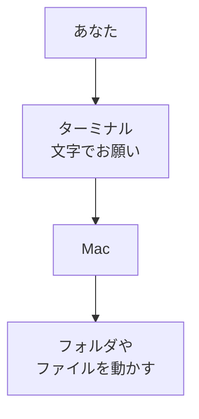

# ターミナルを開く

## たとえ話

> 初めて訪れた役所や図書館で、目的の棚を自分で探し回る人もいれば、窓口で「これこれをお願いします」と言葉で頼む人もいる。最初は窓口のほうが少し緊張するが、慣れると、言葉ひとつで欲しいものにまっすぐたどり着けるようになる。新しい窓口は、怖いのではなく、ただまだ慣れていないだけだ。

> パソコンの「ターミナル」も、この言葉で頼む窓口にあたる。Finderが棚を自分の手で探す道具なら、ターミナルは文字でお願いを伝える窓口だ。今日することは、中身を覚えることではない。なぜまず開くだけでいいのかというと、新しい窓口は一度開いて触れてみるだけで、ぐっと身近になるからだ。

## 今日のゴール

- Macの **ターミナル** を開き、文字が入力できる状態にする。

## この教材で伸ばす力

**進める力** — 新しい画面に慣れ、次の操作の土台を作る

## 学びの段階

完了条件は **「できる」** — ターミナルが開き、カーソルが点滅していること

## 前提確認

- すでにできる前提：Macの電源が入っている。第3章で `Rebuild練習用` フォルダを作っている（なくても今日は進められます）
- まだ知らなくてよいこと：`pwd` や `ls` などのコマンド（次の教材から）

## なぜ大事か

CursorやGit、サーバー公開など、これから出てくる作業の多くがターミナルとつながります。
Finderは「見えるものを触る」道具。ターミナルは「名前で頼む」道具です。
今日は中身を覚えなくてよい。**開けること**だけがゴールです。

## 読んで学ぶ

### ターミナルとは

**ターミナル**（ターミナル）とは、Macに文字の命令（あとで学ぶ **コマンド**）を送るアプリです。
画面は黒っぽく、白や緑の文字が並びます。エディタのように文章を書く場所ではなく、**1行ずつお願いを送る**場所です。

たとえば「今日の予約一覧を出して」「在庫リストを見せて」と、言葉で頼むイメージです。

### 図解



## 手順

### 1. Spotlightでターミナルを開く

1. キーボードで **Command + スペース** を押す（Spotlight検索が開きます）。
2. 「**ターミナル**」と入力する。
3. 表示された **ターミナル** をクリックする（または Enter）。

### 2. 開けたか確認する

1. 黒っぽい（または白っぽい）ウィンドウが開きます。
2. 最後の行に **カーソル**（縦棒が点滅）があることを確認します。
3. 行の先頭には、だいたい次のような文字が見えます：
   ```
   あなたのMac名:~ ユーザー名$
   ```
   または `%` で終わる行です。どちらでも問題ありません。

### 3. 1文字だけ試す（Enterで送る）

1. キーボードで `echo` と入力し、スペースを1つ入れ、`hello` と入力します。
   ```
   echo hello
   ```
2. **Enter** を押します。
3. 次の行に `hello` と表示されれば、ターミナルは動いています。

> **スクショ案内**：`hello` が表示された画面を撮っておくと、達成の記録になります。  
> 撮り方：`Shift + Command + 4` で範囲を選んで撮影。

### 4. ウィンドウを閉じない

- 今日のあとでまた使います。**赤い丸で閉じず**、Dockに残したままにしておくとよいです。
- 間違えて閉じても、手順1から開き直せば大丈夫です。

## わからないまま進まないチェック

- 「ターミナルが見つからない」→ Spotlightで「terminal」と英語でも検索してみる
- 「文字が打てない」→ ターミナルウィンドウを一度クリックしてから入力する
- 「赤い文字や英語が出た」→ 今日は `echo hello` だけ試せばOK。エラー文はスクショしてDiscordで共有できる材料です

## できたらOK

- [ ] ターミナルを開けた
- [ ] `echo hello` と入力して Enter を押した
- [ ] 画面に `hello` と表示された

## つまずいたら

| 症状 | 試すこと |
|---|---|
| Spotlightが出ない | 画面右上の虫眼鏡アイコンをクリック |
| 何も表示されない | ウィンドウをクリックしてから入力 |
| 怖くて閉じてしまった | もう一度 Spotlight → ターミナル で開く |

### 躓いたら戻る先

- [第6章：ファイル整理](../../第06章-ファイル整理/)（Macの中の「住所」がわからないとき）
- [第3章：Macの基礎](../../第03章-Macとファイル/)（Finderの操作に不安があるとき）

```text
【今やっている教材】第9章 01-open-terminal

【詰まったところ】

【試したこと】

【どうなればOKか】ターミナルが開き、echo hello が表示されればOK
```

## 今日の成果物

- ターミナルが開いた状態（または `hello` が表示された画面のスクショ）

## 問い

ターミナルを開いたとき、**いちばん不安に感じたこと**は何だったでしょうか。1行で書いてみてください。（例：「黒い画面が怖い」「何を打てばいいかわからない」）
