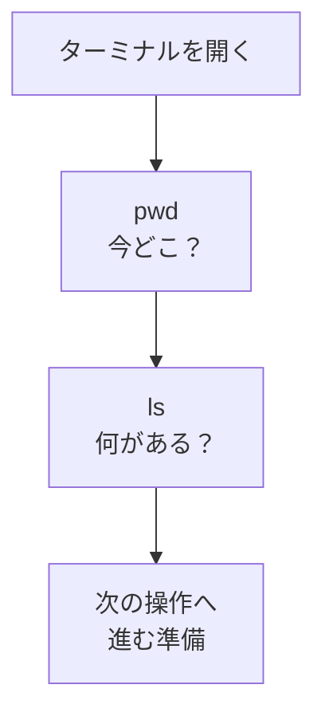

# pwdとls — 今どこにいて、何があるか

## たとえ話

> 知らない街を歩くとき、慣れた人はまず地図の「現在地」を確かめ、それから周りに何があるかを見回す。今いる場所がわからないまま歩き出すと、せっかく進んでも見当違いの方向だった、ということになりかねない。最初に立ち位置を確かめる人ほど、遠回りをしない。

> ターミナルでの作業も、これと同じだ。文字だけの画面では、自分が今どのフォルダにいるのかが目では見えない。今日覚える二つの言葉は、「今どこにいるか」と「ここに何があるか」を確かめるためのものだ。なぜ毎回ここから始めるのかというと、立ち位置がわかってこそ、次の一歩を落ち着いて踏み出せるからだ。

## 今日のゴール

- `pwd` で **今いるフォルダの場所** を表示できる。
- `ls` で **そのフォルダの中身の一覧** を表示できる。

## この教材で伸ばす力

**正しく考える力** — 「今どこにいるか」を確認してから次に進む

## 学びの段階

完了条件は **「できる」** — `pwd` と `ls` を実行し、結果を読めること

## 前提確認

- すでにできる前提：ターミナルを開ける（第9章 01-open-terminal）
- まだ知らなくてよいこと：`cd` で移動（次の教材）

## なぜ大事か

ターミナルで作業するとき、いちばん多いミスは **知らないうちに別の場所にいる** ことです。
たとえば、メモを `Rebuild練習用` に保存したつもりが別フォルダにあった、探している資料があるのに別の場所にいた、ということが起きます。

`pwd` は「今の住所」、`ls` は「この部屋の中身」です。毎回ここから始める癖がつくと、あとが楽になります。

## 読んで学ぶ

### pwd（ピーダブリューディー）

**pwd** は **Print Working Directory** の略で、「今いるフォルダのパス（住所）」を表示します。

入力例：
```
pwd
```
Enter を押すと、例えば次のように表示されます：
```
/Users/あなたのユーザー名
```

### ls（エルエス）

**ls** は **list** の略で、今いるフォルダの中身の名前を一覧表示します。

入力例：
```
ls
```

### 図解



## 手順

### 1. ターミナルを開く

1. **Command + スペース** →「ターミナル」→ Enter。

### 2. pwd を実行する

1. `pwd` と入力して **Enter**。
2. 表示されたパスを読む。`/` で区切られた文字列が「住所」です。
3. だいたい `/Users/（あなたの名前）` で終わっていれば、ホームフォルダにいます。

### 3. ls を実行する

1. `ls` と入力して **Enter**。
2. フォルダ名やファイル名が横に並んで表示されます。
3. `Desktop` `Documents` `Downloads` など、英語名が見えることが多いです（書類＝Documents など）。

### 4. もう一度 pwd → ls を繰り返す

1. 慣れるまで、開いたら **pwd** → **ls** の順で2回試す。
2. 表示が変わらなくても問題ありません。同じ場所にいるだけです。

> **スクショ案内**：`pwd` と `ls` の結果が両方見える画面を撮っておくと、Discordで質問するときに役立ちます。

## わからないまま進まないチェック

- 「pwd と打ったら command not found」→ 綴りを確認。小文字の `pwd` です
- 「ls の結果が空っぽ」→ フォルダに何もないだけのこともあります。`pwd` で場所を確認
- 「英語の名前がわからない」→ `Documents` は書類、`Desktop` はデスクトップと覚えれば今日は十分

## できたらOK

- [ ] `pwd` を実行して、パスが表示された
- [ ] `ls` を実行して、一覧が表示された
- [ ] 「pwd＝今どこ、ls＝中身」と言える

## つまずいたら

| 症状 | 試すこと |
|---|---|
| 前の行の文字が残っている | 新しい行で `pwd` から打ち直す |
| 変な記号がたくさん出る | そのままスクショしてDiscordで共有 |
| ターミナルが閉じた | 01-open-terminal の手順で開き直す |

### 躓いたら戻る先

- [第6章：ファイル整理](../../第06章-ファイル整理/)（フォルダの考え方）
- [01-open-terminal：ターミナルを開く](./01-ターミナルを開く.md)

```text
【今やっている教材】第9章 02-pwd-ls

【詰まったところ】

【試したこと】

【どうなればOKか】pwd と ls の結果が表示されればOK
```

## 今日の成果物

- `pwd` と `ls` を実行した画面（スクショまたは頭の中でOK）

## 問い

`ls` の結果に、**仕事でよく使うフォルダらしき名前**はあったでしょうか。なければ、次に整理したい場所を1つ書いてみてください。
