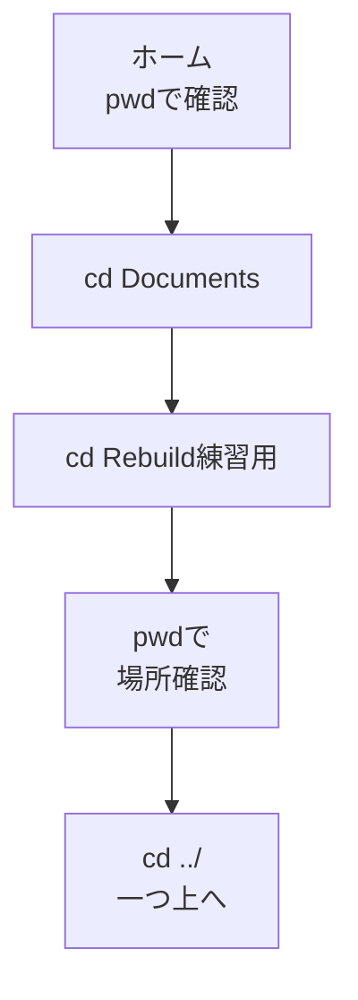

# cdとcd ../ — フォルダを移動する

## たとえ話

> 大きな建物の中を進むとき、人は一歩ずつ「この部屋に入る」「ひとつ上の階に戻る」と移動していく。いきなり最上階の奥の部屋へ飛び込もうとすると、自分が今どこにいるのかわからなくなる。入る、確かめる、戻る——この区切りがあるからこそ、迷わずに動ける。

> ターミナルでフォルダを移動するのも、この建物の出入りと同じだ。今日覚える言葉は、「そのフォルダに入る」と「ひとつ上に戻る」の二つ。なぜ入るたびに今いる場所を確かめるのかというと、立ち位置を見失わないことが、その後のすべての作業の出発点になるからだ。

## 今日のゴール

- `cd Documents` で書類フォルダに移動できる。
- `cd Rebuild練習用` で練習用フォルダに入れる。
- `cd ../` で **一つ上のフォルダ** に戻れる。

## この教材で伸ばす力

**分解する力** — 場所を段階的に移動し、今どこにいるか確認する

## 学びの段階

完了条件は **「できる」** — 指定フォルダに入り、`pwd` で場所を確認し、一つ上に戻れること

## 前提確認

- すでにできる前提：`pwd` と `ls` が使える（02-pwd-ls）
- まだ知らなくてよいこと：Tab補完（次の教材）、`mkdir`（その次）

## なぜ大事か

ファイル操作やGitは「どのフォルダで作業しているか」がすべての出発点です。
いきなり深い場所に入ると迷子になりやすいので、**入る → pwdで確認 → 戻る** の順を体に覚えます。

## 読んで学ぶ

### cd（チェンジディレクトリ）

**cd** は **change directory** の略で、フォルダを移動します。

| コマンド | 意味 |
|---|---|
| `cd Documents` | 書類フォルダに入る |
| `cd Rebuild練習用` | Rebuild練習用フォルダに入る |
| `cd ../` | 一つ上のフォルダに戻る |

`../` は「一つ上の階層」という記号です。Finderでウィンドウ左上の **＜** を押して戻るのと同じ動きです。

### 図解



## 手順

### 1. ホームから始める

1. ターミナルを開く。
2. `pwd` と入力して Enter。ホーム（`/Users/あなたの名前`）にいることを確認。

### 2. 書類フォルダに入る

1. 次を入力して Enter：
   ```
   cd Documents
   ```
2. `pwd` を実行。パスに `Documents` が含まれていれば成功です。
3. `ls` を実行。`Rebuild練習用` が見えるか確認します。

### 3. Rebuild練習用に入る

1. 次を入力して Enter：
   ```
   cd Rebuild練習用
   ```
2. `pwd` で、パスに `Rebuild練習用` が含まれることを確認。
3. `ls` を実行。中身が空でも問題ありません。

> **Rebuild練習用がない場合**：第3章または第6章でフォルダを作ってから戻ってきてください。または次の教材 05-mkdir で作ります。

### 4. 一つ上に戻る

1. 次を入力して Enter：
   ```
   cd ../
   ```
2. `pwd` を実行。`Documents` で止まっているはずです（Rebuild練習用の一つ上）。

### 5. もう一度ホームに戻る（おまけ）

1. もう一度 `cd ../` と入力して Enter。
2. `pwd` でホームに戻ったか確認。

## わからないまま進まないチェック

- 「No such file or directory」と出る → フォルダ名の綴りを確認。大文字小文字も一致させる
- 「どこにいるかわからなくなった」→ いったん `pwd` を実行。それでも不安ならターミナルを閉じて開き直し、`pwd` からやり直す
- 「Rebuild練習用がない」→ 第6章のフォルダ整理を見直すか、05-mkdir を先にやる

## できたらOK

- [ ] `cd Documents` で書類に入れた
- [ ] `cd Rebuild練習用` で練習用フォルダに入れた
- [ ] `cd ../` で一つ上に戻れた
- [ ] 移動のたびに `pwd` で確認した

## つまずいたら

| 症状 | 試すこと |
|---|---|
| フォルダ名にスペースがある | 今日の練習フォルダはスペースなし。別名のフォルダは後の章で扱う |
| cd と打つと何も起きない | 正常です。表示が変わらなくても移動している。`pwd` で確認 |
| 英語名が不安 | `Documents` だけ今日は覚える |

### 躓いたら戻る先

- [第6章：ファイル整理](../../第06章-ファイル整理/)
- [02-pwd-ls](./02-pwdとls.md)

```text
【今やっている教材】第9章 03-cd

【詰まったところ】

【試したこと】

【どうなればOKか】Rebuild練習用に入り、cd ../ で戻れればOK
```

## 今日の成果物

- `pwd` の結果が `Rebuild練習用` を含む行（スクショ推奨）

## 問い

仕事のファイルで、ターミナルから入りたいフォルダは **どこ** でしょうか。1つ名前を書いてみてください。
