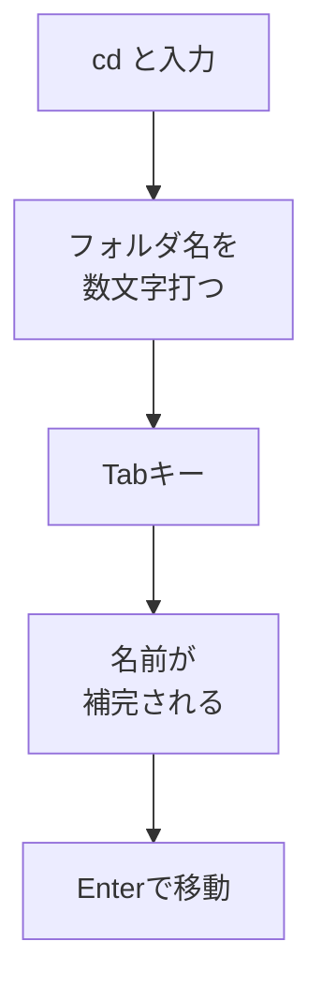

# Tab補完 — フォルダ名を途中まで打って完成させる

## たとえ話

> スマートフォンで文字を打つとき、「あり」と入力しただけで「ありがとうございます」と候補が出る。最後まで打たなくても用が足りるし、打ち間違いも減る。慣れた人ほど、すべてを手で打つのではなく、機械が出してくれる続きをうまく使っている。

> ターミナルにも、これとそっくりな仕組みがある。フォルダ名を途中まで打ってキーをひとつ押すと、残りを機械が補ってくれる。今日覚えるのは、その「続きを任せる」操作だ。なぜこれを先に覚えるのかというと、打ち間違いという小さなつまずきが減るだけで、ターミナルがぐっと怖くなくなるからだ。

## 今日のゴール

- フォルダ名を **途中まで入力** し、**Tab** で補完できる。
- 候補が複数あるとき、Tabを **もう一度** 押して選べる。

## この教材で伸ばす力

**試行錯誤する力** — 打ち間違いを減らし、少しずつコマンドに慣れる

## 学びの段階

完了条件は **「できる」** — `cd Doc` + Tab で `Documents` に補完し、移動できること

## 前提確認

- すでにできる前提：`cd` でフォルダ移動ができる（03-cd）
- まだ知らなくてよいこと：すべてのコマンドの名前を覚えること

## なぜ大事か

ターミナルでは打ち間違いが「そんなフォルダはない」というエラーになります。
Tab補完を使うと、**正しい名前を選んでくれる** ので、迷子になりにくくなります。
時間が経つほど、長いパスを手で全部打たなくてよくなります。

## 読んで学ぶ

### Tab補完とは

**Tab補完**（タブほかん）とは、入力の途中で **Tab** キーを押すと、Macが続きの文字を提案する機能です。

例：
- `cd Doc` と打って **Tab** → `cd Documents` まで伸びることが多い
- `cd Reb` と打って **Tab** → `cd Rebuild練習用` まで伸びる（フォルダがある場合）

候補が複数あるときは、Tabを2回押すと一覧が表示されることがあります。

### 図解



## 手順

### 1. ホームに戻る

1. ターミナルを開く。
2. `cd` とだけ入力して Enter（引数なしの `cd` はホームに戻る便利な使い方です）。
3. `pwd` でホームにいることを確認。

### 2. Documents を Tab で補完する

1. `cd Doc` まで入力する（まだ Enter は押さない）。
2. **Tab** キーを1回押す。
3. 行が `cd Documents` のように伸びたら成功です。
4. **Enter** を押して移動。
5. `pwd` で `Documents` にいることを確認。

### 3. Rebuild練習用 を Tab で補完する

1. `cd Reb` まで入力する。
2. **Tab** を押す。
3. `Rebuild練習用` まで補完されたら Enter。
4. `pwd` で場所を確認。

> **フォルダがない場合**：第3章・第6章で `Rebuild練習用` を作ってから試してください。

### 4. ls でも Tab を試す（おまけ）

1. `cd ../` で Documents に戻る。
2. `ls R` と入力し、**Tab** を押す。
3. `Rebuild練習用` が補完されれば、Enter で一覧の一部として実行されます（`ls Rebuild練習用` になる）。

## わからないまま進まないチェック

- 「Tabを押しても何も起きない」→ もう一度 Tab。それでもダメなら綴りが合っているか `ls` で確認
- 「変な音がするだけ」→ 候補がないときの合図のこともあります。`ls` で正しい名前を見る
- 「日本語フォルダが補完されない」→ 最初の数文字を正確に打つ。それでも難しければ手入力でOK

## できたらOK

- [ ] `cd Doc` + Tab で Documents に移動した
- [ ] `cd Reb` + Tab で Rebuild練習用 に入れた（フォルダがある場合）
- [ ] Tab補完が「打ち間違いを減らす道具」だと言える

## つまずいたら

| 症状 | 試すこと |
|---|---|
| 補完が途中で止まる | Tabをもう一度。候補一覧から選ぶ |
| Documents に入れない | `cd Documents` を手で全部打って Enter（Tabはあとで慣れる） |

### 躓いたら戻る先

- [第6章：ファイル整理](../../第06章-ファイル整理/)
- [03-cd](./03-cdとcd-dot-dot.md)

```text
【今やっている教材】第9章 04-tab-complete

【詰まったところ】

【試したこと】

【どうなればOKか】Tabでフォルダ名が伸びて移動できればOK
```

## 今日の成果物

- Tab補完で移動できた画面のスクショ（任意）

## 問い

Tab補完を使うと、**どんな打ち間違いが減りそう**でしょうか。仕事のフォルダ名を1つ思い浮かべてみてください。
