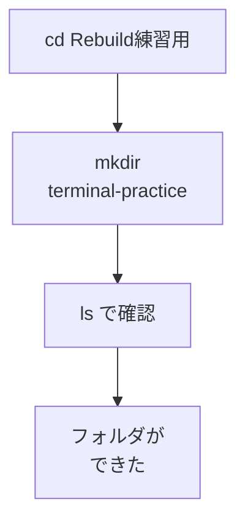

# mkdir — ターミナルでフォルダを作る

## たとえ話

> 物が増えてきたとき、人は新しい棚や箱を用意して置き場所を増やす。置き場所を作るのに、特別な技術はいらない。空いた場所に棚をひとつ据えるだけで、散らかっていた物に居場所ができる。場所を作れる人は、増えていく物に振り回されにくい。

> ターミナルでフォルダを作るのも、この「棚をひとつ増やす」のと同じだ。これまではFinderで作っていた置き場所を、今日は文字の命令ひとつで作ってみる。なぜ同じことをわざわざターミナルでやるのかというと、次の章で出てくる作業が文字の命令でつながっていくからだ。ここで一度作っておくと、その流れに乗りやすくなる。

## 今日のゴール

- `mkdir` でフォルダを1つ作る。
- `ls` で作れたことを確認する。

## この教材で伸ばす力

**作る力** — ターミナルから「置き場所」を自分で増やす

## 学びの段階

完了条件は **「できる」** — 指定名のフォルダが `Rebuild練習用` の中に存在すること

## 前提確認

- すでにできる前提：`cd` で `Rebuild練習用` に入れる（03-cd）
- まだ知らなくてよいこと：`rm`（削除）、`mv`（移動）、`cp`（コピー）— この章では扱いません

## なぜ大事か

第10章のGitでは、プロジェクト用のフォルダを作ってそこで作業します。
Finderでも作れますが、ターミナルで `mkdir` ができると、**手順のつながり**がスムーズになります。
たとえば `お客さま写真_練習` や `やりとり記録_練習` といったフォルダを、仕事用に増やすイメージです。

## 読んで学ぶ

### mkdir

**mkdir** は新しいフォルダを作ります。

```
mkdir フォルダ名
```

今日作るフォルダ名は **`terminal-practice`** です（英数字とハイフンだけなので、打ち間違いが少ない名前にしています）。

### 図解



## 手順

### 1. Rebuild練習用に移動する

1. ターミナルを開く。
2. 次を順に実行（Tab補完が使えれば使ってよい）：
   ```
   cd Documents
   cd Rebuild練習用
   ```
3. `pwd` で `Rebuild練習用` にいることを確認。

### 2. フォルダを作る

1. 次を入力して Enter：
   ```
   mkdir terminal-practice
   ```
2. 何も表示されなくても正常です（エラー文が出なければOK）。

### 3. 確認する

1. `ls` を実行。
2. 一覧に `terminal-practice` が見えれば成功です。

### 4. 中に入ってみる（おまけ）

1. `cd terminal-practice` と入力して Enter。
2. `pwd` でパスに `terminal-practice` が含まれることを確認。
3. `ls` は空で問題ありません。

> **スクショ案内**：`ls` で `terminal-practice` が見えている画面を撮っておきましょう。

## わからないまま進まないチェック

- 「File exists」と出る → すでに同名フォルダがある。`ls` で確認。作れていれば今日のゴールは達成
- 「Permission denied」→ 別の場所にいる可能性。`pwd` で `Rebuild練習用` か確認
- 「スペース入りの名前を作りたい」→ 今日は英数字だけの名前で練習。スペース入りは発展で扱う

## できたらOK

- [ ] `mkdir terminal-practice` を実行した
- [ ] `ls` でフォルダ名が見えた
- [ ] フォルダの中に `cd` で入れた

## つまずいたら

| 症状 | 試すこと |
|---|---|
| Rebuild練習用がない | 第3章 03-create-folder で先に作成 |
| フォルダ名を間違えた | 別名で新しく作る。削除（rm）はこの章では扱わない |
| どこに作ったかわからない | `pwd` と `ls` を実行 |

### 躓いたら戻る先

- [第6章：ファイル整理](../../第06章-ファイル整理/)
- [03-cd](./03-cdとcd-dot-dot.md)

```text
【今やっている教材】第9章 05-mkdir

【詰まったところ】

【試したこと】

【どうなればOKか】terminal-practice フォルダが ls で見えればOK
```

## 今日の成果物

- `書類/Rebuild練習用/terminal-practice` フォルダ（Macの中に残ります）

## 問い

第10章のGit練習でもフォルダを使います。`terminal-practice` のほかに、**仕事用に作りたい練習フォルダ名**を1つ考えてみてください。
