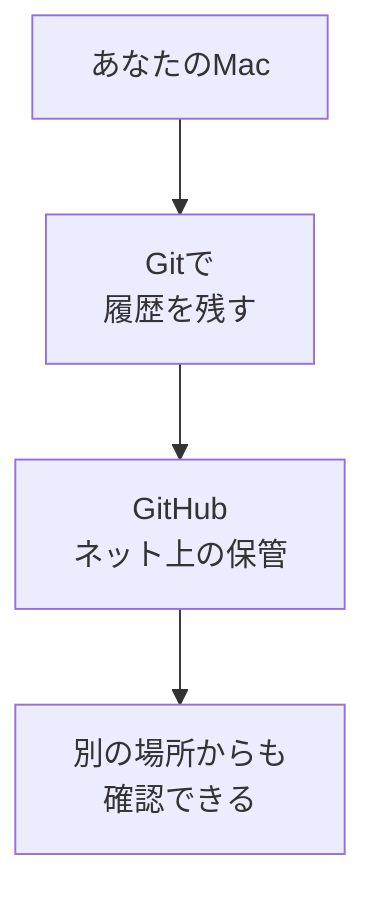

# GitHubアカウントを作る

## たとえ話

> 大事な書類や思い出の品を、家の中だけに置いておくのは少し心もとない。火事や水漏れで一度に失うこともあるからだ。だから人は、銀行の貸金庫や貸し倉庫を借りて、控えを別の場所に預ける。預け先の鍵を一度作っておけば、いざというとき落ち着いて取り出せる。

> パソコンのファイルにも、同じ「外の預け先」がある。今日作るGitHubのアカウントは、その預け先に入るための鍵にあたる。なぜまず鍵を作るだけでいいのかというと、預け先の入り口さえ用意できれば、大事なファイルを守る準備は半分終わったようなものだからだ。難しい設定は後回しでよい。

## 今日のゴール

- **GitHub** にアカウントを作成し、ログインできる状態にする。

## この教材で伸ばす力

**進める力** — 新しいサービスの入り口を自分で作る

## 学びの段階

完了条件は **「できる」** — GitHubにログインし、自分のホーム画面が見えること

## 前提確認

- すでにできる前提：メールアドレスを受け取れる。パスワードの基本（第4章）
- まだ知らなくてよいこと：Gitのコマンド（次の教材以降）

## なぜ大事か

第10章では、Macの中のファイル変更を **Git** で記録し、**GitHub** にバックアップします。
アカウントがないと、ネット上の保管場所を使えません。
お客さまの記録やサービス案のように、**消えたら困るもの**を守る第一歩です。

## 読んで学ぶ

### GitHubとは（今日の範囲）

**GitHub**（ギットハブ）は、インターネット上のファイル保管サービスです。
今日覚えるのは次の2つだけです。

- **アカウント** … あなた専用の入り口（第4章の「鍵」の考え方と同じ）
- **リポジトリ** … プロジェクトごとの「保管箱」（次の教材以降で使います）

### 図解



## 手順

### 1. GitHubのサイトを開く

1. ブラウザ（Safariなど）を開く。
2. アドレスバーに `https://github.com` と入力して Enter。

### 2. アカウント作成を始める

1. 画面右上の **Sign up**（サインアップ）をクリック。
2. メールアドレスを入力する（仕事用・個人用どちらでもよいが、**普段見るメール**がおすすめ）。
3. パスワードを設定する（第4章のルール：推測されにくく、他と使い回さない）。
4. ユーザー名を決める（英数字とハイフン。後からURLに使われます。例：`yamada-shop` `tanaka-works`）。

### 3. 認証を完了する

1. 画面の指示に従い、メール認証やパズル認証を行う。
2. 無料プラン（Free）のままで問題ありません。有料は選ばなくてよいです。

### 4. ログインできたか確認する

1. ログイン後、右上に自分のアイコン（またはユーザー名）が見えることを確認。
2. 画面左上に **GitHub** ロゴと、自分向けのホームが表示されればOK。

> **スクショ案内**：ログイン後のホーム画面（個人情報が写らない範囲）を撮っておくと、つまずいたときに共有しやすいです。メールアドレスは写さないでください。

### 5. パスワードは人に教えない

- GitHubから「パスワードを教えて」とメールが来ても、第4章と同様 **教えません**。
- 2段階認証は後から設定できます（第4章 02-two-factor-auth を参照）。

## わからないまま進まないチェック

- 「ユーザー名が取れない」→ 別の名前を試す。店名＋地域など
- 「メールが届かない」→ 迷惑メールフォルダを確認。数分待ってから再送
- 「英語画面が不安」→ ブラウザの翻訳機能を使ってもよい。操作の流れは上記の順番

## できたらOK

- [ ] GitHubアカウントを作った
- [ ] ログインしてホーム画面が見える
- [ ] ユーザー名をメモした（パスワードは安全な場所に）

## つまずいたら

| 症状 | 試すこと |
|---|---|
| パスワードが弱いと言われる | 長めの語句＋数字。使い回しはしない |
| すでにアカウントがある | ログインして次の教材へ |

### 躓いたら戻る先

- [第4章：ITリテラシー](../../第04章-ITリテラシー/)（アカウント・パスワード）
- [第9章：ターミナル基礎](../../第09章-ターミナル基礎/)

```text
【今やっている教材】第10章 01-github-account

【詰まったところ】

【試したこと】

【どうなればOKか】GitHubにログインできればOK
```

## 今日の成果物

- GitHubアカウント（ユーザー名をメモ）

## 問い

GitHubに最初に保管したいのは、**どんな仕事のファイル**でしょうか。1行で書いてみてください。（まだアップロードしなくて大丈夫です）
