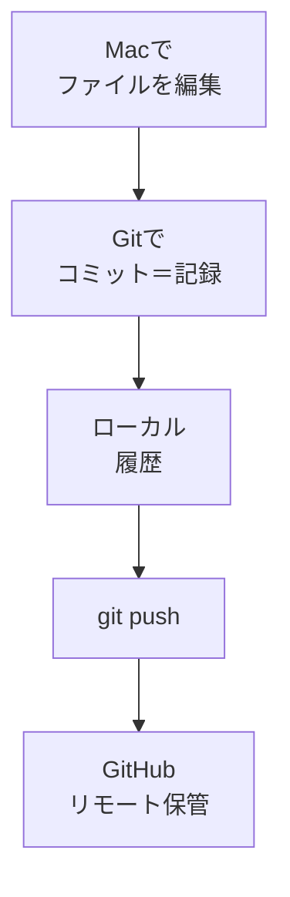

# Gitとは何か — 履歴を残す道具

## たとえ話

> ゲームをする人なら、難しい場面の前に「セーブ」をしておく感覚を知っている。失敗しても、最後に保存したところからやり直せるとわかっていれば、思い切って挑戦できる。セーブの記録が一本の流れとして残っているから、「あのときの状態に戻る」ができる。

> ファイル作りにも、このセーブにあたる仕組みがある。今日学ぶGitは、変更のたびに「いつ・何を変えたか」を一コマずつ記録していく道具だ。なぜ履歴を残すことから学ぶのかというと、戻れる安心があると、人は迷わず手を加えられるようになるからだ。「最終版2」「本当の最終」と名前で苦労する必要も、もうなくなる。

## 今日のゴール

- GitとGitHub、ローカルとリモートの違いを理解し、4択チェック3問に答える。

## この教材で伸ばす力

**正しく考える力** — ファイルの「版」と「保管場所」を区別して考える

## 学びの段階

完了条件は **「知った」** — 4択チェックに答え、答えページで確認できたこと

## 前提確認

- すでにできる前提：GitHubアカウントがある（01-github-account）。第6章でフォルダ整理の考え方を学んだ
- まだ知らなくてよいこと：`git status` などのコマンド（次の教材）

## なぜ大事か

仕事の文案、価格表、案内資料——「前の版に戻したい」「いつ変えたか知りたい」はよくある場面です。
Gitはプログラマーだけの道具ではなく、**変更の記録を残す習慣**の土台になります。
GitHubは、その記録をネット上にも置いておく場所です。

## 読んで学ぶ

### Gitとは

**Git** は、ファイルの変更を **コミット**（記録の1コマ）として残すシステムです。
サービス一覧を直すたびに「いつ・何を変えたか」のメモが積み重なります。

### GitHubとは

**GitHub** は、Gitの履歴を **インターネット上** に置けるサービスです。
Macが壊れても、GitHubに送ってあれば履歴を取り戻しやすくなります。

### ローカルとリモート

| 言葉 | 意味 | 例え |
|---|---|---|
| **ローカル** | 自分のMacの中 | 店舗のノート |
| **リモート** | ネット上（GitHub） | 倉庫のコピー保管 |

### 仕事での例

| 仕事 | Gitで残すイメージ |
|---|---|
| サービス一覧の改訂 | 価格変更のたびにコミット |
| お客さまへの案内文 | 文言を直すたびに履歴 |
| やりとり用のシート | 質問項目を追加した記録 |

### 図解



## わからないまま進まないチェック

- 「GitとGitHubがごちゃごちゃ」→ Git＝履歴を残す道具、GitHub＝ネット上の置き場、と分ける
- 「プログラムが書けないと無理？」→ テキストファイル1つから始められます
- 「全部公開される？」→ リポジトリを非公開にできる。個人情報は入れないのが原則（第7章）

## 4択チェック

1. Gitの役割として、いちばん近いのはどれですか？
   - A. 写真をきれいに加工する
   - B. ファイルの変更履歴を残す
   - C. ウイルスを消す
   - D. メールを送る

2. 「リモート」が指すのは、だいたいどれですか？
   - A. 自分のMacの中だけ
   - B. ネット上のGitHubなどの保管場所
   - C. プリンター
   - D. ゴミ箱

3. GitHubアカウントを作った主な理由として、第10章でいちばん近いのはどれですか？
   - A. 外部サービスのフォロワーを増やすため
   - B. 変更履歴をネット上にも保管するため
   - C. パソコンを速くするため
   - D. ウイルス対策ソフトの代わり

答え合わせはこちら：  
[答えを見る](../../答え/第10章-GitとGitHub/02-Gitとは何か-答え.md)

## できたらOK

- [ ] 3問に自分の答えを選んだ
- [ ] 答えページで確認した
- [ ] 「Git＝履歴、GitHub＝ネット上の保管」と言える

## つまずいたら

### 躓いたら戻る先

- [第6章：ファイル整理](../../第06章-ファイル整理/)
- [01-github-account](./01-GitHubアカウントを作る.md)

```text
【今やっている教材】第10章 02-git-concept

【詰まったところ】

【試したこと】

【どうなればOKか】4択に答えて答えページを見られればOK
```

## 今日の成果物

- 4択チェックの回答（頭の中またはメモでOK）

## 問い

あなたの仕事で、「前の版に戻したい」と思ったファイルは **何** でしょうか。1つ挙げてみてください。
