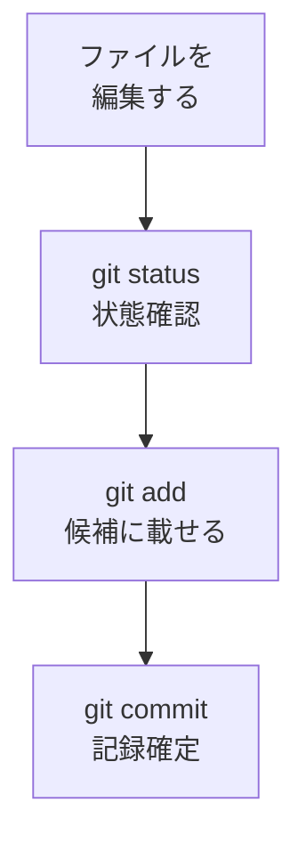

# git status / add / commit — 変更を記録する

## たとえ話

> 旅をする人は、節目ごとに写真を撮り、一言そえてアルバムに貼っていく。何でもかんでも残すのではなく、これはと思った場面を選んで、「○○の朝」と短く書きそえる。あとから見返したとき、選んで言葉を添えた一枚ほど、そのときの記憶をはっきり連れ戻してくれる。

> Gitで変更を記録するのも、このアルバム作りに似ている。今いる状態を見て、残したい変更を選び、一言そえて確定する——この三つの動きが基本の型だ。なぜわざわざ一言そえるのかというと、後から履歴をたどる自分にとって、その短いメモが「いつ・何を変えたか」の道しるべになるからだ。

## 今日のゴール

- 練習用フォルダでGitを始め、ファイルを1つ編集する。
- `git status` → `git add` → `git commit` の順で実行する。

## この教材で伸ばす力

**整える力** — 変更を「記録する流れ」に乗せる

## 学びの段階

完了条件は **「できる」** — 1回以上 commit が成功し、メッセージ付きの記録が残ること

## 前提確認

- すでにできる前提：ターミナルで `cd` と `mkdir` が使える（第9章）。Gitの概念（02-git-concept）
- まだ知らなくてよいこと：GitHubへの push（次の教材）

## なぜ大事か

「保存」はファイルの中身を残すこと。Gitの **commit** は「この時点の版」にラベルを付けることです。
あとから「いつ・何を変えたか」を追いやすくなります。

## 読んで学ぶ

### 3つのコマンド

| コマンド | 役割 |
|---|---|
| `git status` | 今の変更状況を表示 |
| `git add ファイル名` | そのファイルを次の commit 候補にする |
| `git commit -m "メッセージ"` | 記録を確定（メッセージは日本語でOK） |

### 図解



## 手順

### 1. 練習フォルダを用意する

1. ターミナルを開く。
2. 次を実行：
   ```
   mkdir -p ~/Documents/Rebuild練習用
   cd ~/Documents/Rebuild練習用
   mkdir -p git-practice
   cd git-practice
   pwd
   ls
   ```
3. `pwd` で `~/Documents/Rebuild練習用/git-practice` にいることを確認。

### 2. Gitをこのフォルダで始める

1. 次を実行：
   ```
   git init
   ```
2. `Initialized empty Git repository` のような表示が出ればOK。

### 3. ファイルを1つ作る

1. テキストエディットで新規ファイルを作り、次の1行を書く（例）：
   ```
   サービス一覧ドラフト v1
   ```
2. **書類/git-practice** に `memo.txt` という名前で保存する。
3. ターミナルで `ls` を実行し、`memo.txt` が見えることを確認。

### 4. status → add → commit

1. 状態確認：
   ```
   git status
   ```
   `memo.txt` が赤や「Untracked」と出れば、Gitがまだ記録していない状態です。

2. 候補に載せる：
   ```
   git add memo.txt
   ```

3. もう一度状態確認（任意）：
   ```
   git status
   ```
   緑や「staged」と変わればOK。

4. 記録を確定：
   ```
   git commit -m "最初のメモを追加"
   ```

5. 成功すると `1 file changed` のような表示が出ます。

### 5. 変更してもう1回 commit（おまけ）

1. `memo.txt` に1行足す（例：`価格は後で確認`）。
2. 保存する。
3. 再度：
   ```
   git status
   git add memo.txt
   git commit -m "価格メモを追加"
   ```

> **スクショ案内**：2回目の `git commit` が成功した画面を撮っておきましょう。

## わからないまま進まないチェック

- 「git: command not found」→ MacにGitが入っていない可能性。Xcode Command Line Tools のインストールが必要な場合あり。Discordで相談
- 「nothing to commit」→ `git add` を忘れていないか。ファイルを保存したか確認
- 「Author identity unknown」→ 名前とメールの設定が必要です。個人メールの公開が不安な場合は、GitHubの noreply メールを使えます。どれを使うか迷ったら、設定前にDiscordで確認してください。
  ```
  git config --global user.name "あなたの名前"
  git config --global user.email "your@email.com"
  ```
  GitHub noreply の例：`12345678+username@users.noreply.github.com`

## できたらOK

- [ ] `git init` した
- [ ] `memo.txt` を作った
- [ ] `git status` / `git add` / `git commit` を1回以上成功した

## つまずいたら

| 症状 | 試すこと |
|---|---|
| ファイルが見えない | `pwd` と `ls`。保存場所が git-practice か確認 |
| commit メッセージの `"` がエラー | 半角の `"` で囲む。日本語メッセージでOK |

### 躓いたら戻る先

- [第9章：ターミナル基礎](../../第09章-ターミナル基礎/)
- [02-git-concept](./02-Gitとは何か.md)

```text
【今やっている教材】第10章 03-status-add-commit

【詰まったところ】

【試したこと】

【どうなればOKか】git commit が1回成功すればOK
```

## 今日の成果物

- `~/Documents/Rebuild練習用/git-practice` フォルダと、commit 済みの `memo.txt`

## 問い

commit メッセージを日本語で書きました。あなたの仕事なら、**どんな一言**を残したいでしょうか。（例：「春キャンペーン価格を更新」）
