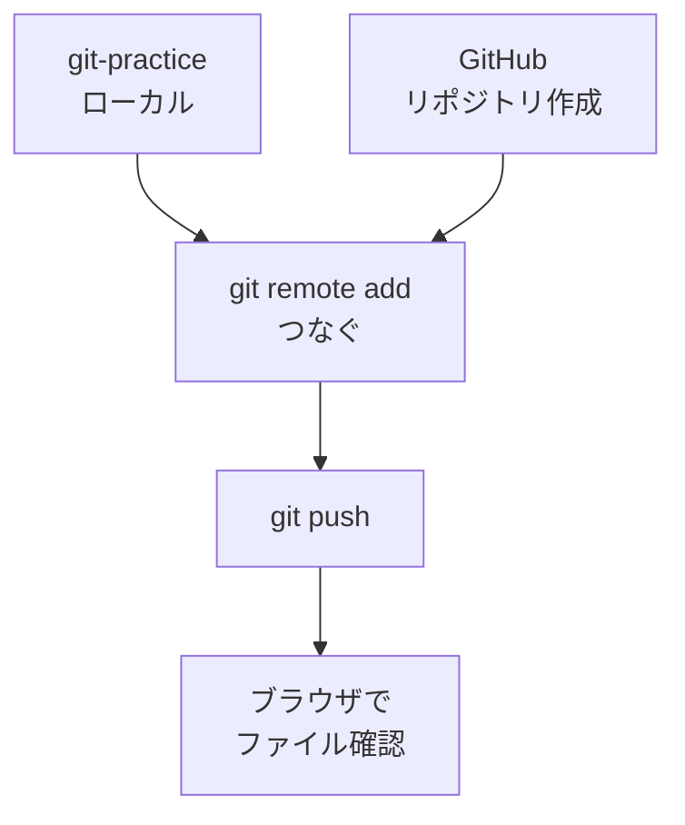

# リポジトリを作って push する

## たとえ話

> 手元の大切なノートを、火事や紛失に備えて、離れた場所の金庫にも預けておく人がいる。一度預け先を決めて最初の一冊を運び込めば、あとは新しいページが増えるたび、同じ場所へ足していくだけでいい。最初の一回さえ越えれば、続きはずっと楽になる。

> Gitの記録をGitHubへ送る「push」も、この最初の預け入れにあたる。今日することは、ネット上に保管箱をひとつ用意し、手元の練習フォルダを初めてそこへ送ることだ。なぜ最初の一回を丁寧にやるのかというと、ここで道がつながってしまえば、次からは送るだけで控えが積み上がっていくからだ。

## 今日のゴール

- GitHubで **リポジトリ** を1つ作る。
- ローカルの `git-practice` を GitHubに **push** する。

## この教材で伸ばす力

**進める力** — ローカルの作業をネット上の保管場所につなぐ

## 学びの段階

完了条件は **「できる」** — GitHubのブラウザで `memo.txt` が見えること

## 前提確認

- すでにできる前提：GitHubアカウント（01）。`git-practice` で commit 済み（03-status-add-commit）
- まだ知らなくてよいこと：Pull Request、GitHub Pages

## なぜ大事か

ローカルだけだと、Macの故障や誤削除で履歴ごと失うリスクがあります。
push すると、**別の場所から確認・復元**しやすくなります。
小規模事業でも「大切な文案の履歴」を守る手段になります。

## 読んで学ぶ

### リポジトリとは

**リポジトリ**（レポジトリ）は、プロジェクト用の保管箱です。
GitHub上に1つ作り、Macのフォルダと **つなげます**。

### push の流れ

1. GitHubで空のリポジトリを作る  
2. Mac側で「どのリポジトリか」を登録（`git remote add`）  
3. `git push` で送る  

### 図解



## 手順

### 1. GitHubでリポジトリを作る

1. ブラウザで GitHub にログイン。
2. 右上の **＋** → **New repository**（新しいリポジトリ）をクリック。
3. **Repository name** に `git-practice` と入力。
4. **Private**（非公開）を選ぶ（練習でも個人用は非公開がおすすめ）。
5. 「Add a README file」などは **チェックしない**（空で作る）。
6. **Create repository** をクリック。

### 2. 表示されたURLをコピーする

1. 作成後の画面に `https://github.com/あなたのユーザー名/git-practice.git` のようなURLがあります。
2. **Code** ボタン近くのURLをコピーしておきます。

### 3. ターミナルでローカルとつなぐ

1. ターミナルで練習フォルダに移動：
   ```
   cd ~/Documents/Rebuild練習用/git-practice
   pwd
   ls
   ```
2. `pwd` に `/Documents/Rebuild練習用/git-practice` が含まれ、`ls` に `memo.txt` が見えることを確認します。違う場所なら、この先のremote設定は実行しません。
3. すでに登録済みの接続先がないか確認：
   ```
   git remote -v
   ```
   何か表示された場合は、URLが自分の `git-practice` か確認します。迷ったらDiscordで相談してから進めます。
4. リモートを登録（URLは自分のものに置き換える）：
   ```
   git remote add origin https://github.com/あなたのユーザー名/git-practice.git
   ```
5. ブランチ名を確認（多くの場合 `main`）：
   ```
   git branch
   ```
   `main` でなければ、次を実行：
   ```
   git branch -M main
   ```

### 4. push する

1. 次を実行：
   ```
   git push -u origin main
   ```
2. 初回は GitHubの **ユーザー名とパスワード（またはトークン）** を聞かれることがあります。
   - パスワードの代わりに **Personal Access Token** が必要な場合があります（GitHub Docs参照）。
3. 成功すると、進捗バーや `main -> main` の表示が出ます。

> **スクショ案内**：push 成功後、GitHubの画面で `memo.txt` が見えているところを撮りましょう。

### 5. ブラウザで確認する

1. GitHubの `git-practice` リポジトリページを更新（再読み込み）。
2. `memo.txt` が一覧に見えれば成功です。

## 15分版 / 30分版

- **15分版**：`~/Documents/Rebuild練習用/git-practice` にいることを `pwd` / `ls` で確認し、commit済みの状態を確認できれば完了です。認証で止まったら、commitまででOKです。
- **30分版**：GitHubにPrivateリポジトリを作り、remote確認後にpushして `memo.txt` が見えるところまで進みます。
- **今日はここで止まってOK**：GitHub認証、トークン、remote設定で不安になったら先に進まず、スクショをDiscordへ送れる形にして完了です。

## わからないまま進まないチェック

- 「remote origin already exists」→ すでに登録済み。`git remote -v` で確認。間違っていればDiscordで相談
- 「Authentication failed」→ ログイン情報またはトークンを再確認
- 「repository not found」→ URLのユーザー名・リポジトリ名の typo を確認

## できたらOK

- [ ] GitHubに `git-practice` リポジトリを作った
- [ ] `git push` が成功した
- [ ] ブラウザで `memo.txt` が見える

## つまずいたら

| 症状 | 試すこと |
|---|---|
| push で止まる | エラー全文をスクショ。03の commit があるか `git log` で確認 |
| 公開リポジトリにしてしまった | Settings から Private に変更可能 |

### 躓いたら戻る先

- [03-status-add-commit](./03-git-status-add-commit.md)
- [第9章：ターミナル基礎](../../第09章-ターミナル基礎/)

```text
【今やっている教材】第10章 04-create-repo-push

【詰まったところ】

【試したこと】

【どうなればOKか】GitHubで memo.txt が見えればOK
```

## 今日の成果物

- GitHub上の `git-practice` リポジトリ（URLをメモ）

## 問い

GitHubにファイルが見えたとき、**安心感と不安**のどちらが強かったでしょうか。理由を1行で書いてみてください。
