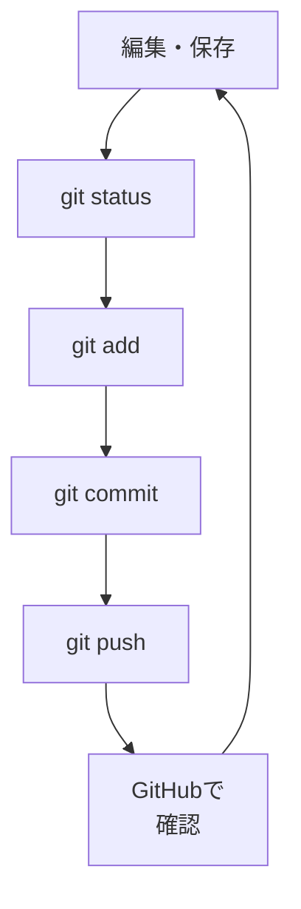

# 変更 → commit → push の一連練習

## たとえ話

> 自転車に初めて乗れた日、多くの人は一度で安心したりしない。次の日もまたがり、こいでみて、止まってみて、同じ動きを繰り返すうちに、考えなくても体が動くようになる。一回できたことと、いつでもできることの間には、繰り返しという橋がかかっている。

> Gitの「直す・記録する・送る」も同じだ。一度通せた流れでも、二度目で手が止まる人は少なくない。今日することは、同じ型をもう一度、自分の手でなぞることだ。なぜ繰り返すのかというと、迷わず通せる型がひとつ身につくと、それがこの先の作業すべての支えになるからだ。

## 今日のゴール

- `memo.txt` を編集し、`git status` → `git add` → `git commit` → `git push` まで一通り実行する。

## この教材で伸ばす力

**続ける力** — 同じ型を繰り返し、迷わず進める

## 学びの段階

完了条件は **「できる」** — GitHub上で更新内容が反映されていること

## 前提確認

- すでにできる前提：`git-practice` を push 済み（04-create-repo-push）
- まだ知らなくてよいこと：ブランチの分岐、Pull Request

## なぜ大事か

1回できても、2回目で止まる人は多いです。
たとえば、キャンペーンの文言を直すたび、お客さまへの案内の日程を直すたびに、同じ手順を通します。
**型を体に覚える**と、第14章のLP公開までの土台になります。

## 読んで学ぶ

### 繰り返しの型

```text
1. ファイルを編集して保存
2. git status
3. git add ファイル名
4. git commit -m "何を変えたか"
5. git push
6. GitHubで確認
```

### 図解



## 手順

### 1. 準備

1. ターミナルで移動：
   ```
   cd ~/Documents/Rebuild練習用/git-practice
   pwd
   ls
   ```
2. `pwd` に `/Documents/Rebuild練習用/git-practice` が含まれ、`ls` に `memo.txt` が見えることを確認します。
3. remoteの接続先を確認：
   ```
   git remote -v
   ```
   自分の `git-practice` リポジトリが表示されればOKです。違うURLや知らないURLなら、pushせずDiscordで相談します。
4. `git status` を実行。「nothing to commit」なら問題ありません。

### 2. ファイルを編集する

1. `memo.txt` をテキストエディットで開く。
2. 次の1行を **足す**（例）：
   ```
   4月キャンペーン：10%オフ案
   ```
3. 保存する。

### 3. status → add → commit

1. ```
   git status
   ```
   `memo.txt` が変更されたと出ることを確認。

2. ```
   git add memo.txt
   ```

3. ```
   git commit -m "キャンペーン案を追記"
   ```
   メッセージは内容に合わせて変えてよいです。

### 4. push する

1. ```
   git push
   ```
   （前回 `-u origin main` 済みなら、これだけでよいことが多いです）

2. エラーが出なければ成功です。GitHub認証で止まった場合は、今日はcommitまででOKです。エラー文や認証画面のスクショを残してDiscordで相談します。

### 5. GitHubで確認する

1. ブラウザで `git-practice` リポジトリを開く。
2. `memo.txt` をクリックし、追記した行が見えることを確認。

### 6. もう1周（任意・時間があれば）

1. もう1行だけ足して、同じ型をもう一度実行。
2. Discordに「2回 push できた」と一言共有してもよいです。

## 15分版 / 30分版

- **15分版**：`pwd` / `ls` / `git remote -v` で場所と接続先を確認し、`git commit` までできれば完了です。認証で止まったらpushは次回でOKです。
- **30分版**：`git push` まで実行し、GitHub上で追記した行が見えるところまで進みます。
- **今日はここで止まってOK**：認証、remote、pushエラーで止まった場合は、エラー文をコピーしてDiscordへ送れる形にできれば完了です。

## わからないまま進まないチェック

- 「push はしたが GitHub に反映されない」→ ブラウザを再読み込み。別アカウントで見ていないか確認
- 「commit したが push していない」→ `git status` で「Your branch is ahead」と出ていないか確認
- 「何を書けばいいかわからない」→ 練習なので架空の文言でOK。実名・電話番号は入れない

## できたらOK

- [ ] ファイルを編集して保存した
- [ ] commit が1回成功した
- [ ] push が1回成功した
- [ ] GitHubで変更が見える

## つまずいたら

| 症状 | 試すこと |
|---|---|
| 同じエラーが続く | エラー全文のスクショをDiscordへ |
| 手順を忘れた | 上の「繰り返しの型」をメモに写す |
| remoteのURLが違う | pushせず `git remote -v` のスクショをDiscordへ |
| 認証で止まる | commitまででOK。認証画面のスクショを残す |

### 躓いたら戻る先

- [03-status-add-commit](./03-git-status-add-commit.md)
- [04-create-repo-push](./04-リポジトリを作ってpushする.md)

```text
【今やっている教材】第10章 05-practice-round

【詰まったところ】

【試したこと】

【どうなればOKか】GitHubで追記した行が見えればOK
```

## 今日の成果物

- GitHub上で更新された `memo.txt`
- 自分用の「変更→commit→push」メモ（任意）

## 問い

この型を、あなたの仕事の **どのファイル** に最初に使いたいでしょうか。1つ書いてみてください。
