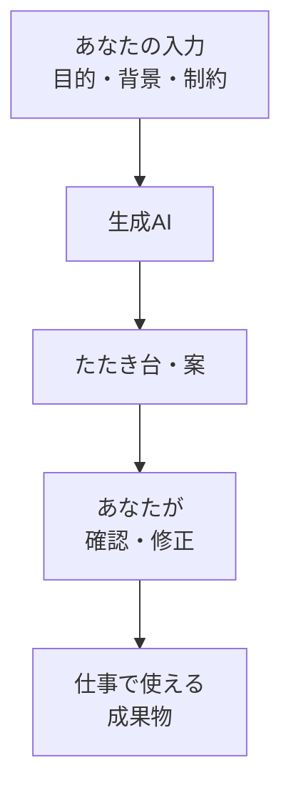

# 生成AIとは何か

## たとえ話

> 料理の下ごしらえを手伝ってくれる人がいるとする。冷蔵庫にある材料を渡すと、その人はパッと一皿の案を出してくれる。味付けの方向も、盛り付けの形も、ひとまず形にはなっている。便利だが、出てきた皿をそのまま客に出す人はいない。塩加減を確かめ、足りなければ直し、最後は自分の舌で判断する。手伝いが速いほど、確かめる目のほうが大事になっていく。
>
> 新しく文章や案を作るAIも、これとよく似ている。渡した材料から、その場で一皿の「たたき台」を組み立ててくれる。けれど、出てきたものが正しいとは限らないし、あなたの仕事の味付けまでは知らない。だから今日は、いきなり使い方を覚える前に、この道具が何をしていて、どこが苦手なのかを知っておく。仕組みと限界がわかると、安心して任せられる範囲を、自分で決められるようになるからだ。

## 今日のゴール

- 生成AIのざっくりした仕組みと限界を理解し、4択チェック3問に答える。

## この教材で伸ばす力

**正しく考える力** — AIの得意・不得意を見極め、期待値を合わせる

## 学びの段階

完了条件は **「知った」** — 4択に答え、答えページで確認できたこと

## 前提確認

- すでにできる前提：第7章でAIに渡す情報（コンテキスト）の考え方。チャット型AIを1回以上触った
- まだ知らなくてよいこと：高度なプロンプト技法（この章で少しずつ）

## なぜ大事か

生成AIは「なんでも正確に知っている先生」ではありません。
**たたき台を速く作る相棒**として使うと、小規模事業の文案・相談・発想に役立ちます。
限界を知らないと、間違いをそのまま使ってしまうリスクがあります。

## 読んで学ぶ

### 生成AIとは

**生成AI** は、入力（あなたの質問や資料）をもとに、文章・案・要約などを **新しく生成** するAIです。
検索エンジンのように「既存ページへのリンク」を返すだけではなく、**その場で文を組み立てます**。

### 第2章の復習：増幅装置

AIは **増幅装置** です。渡す情報の質と、あなたの判断が、そのまま出力に反映されます。
丸投げすると、平均的で当たり外れの大きい答えになりやすいです。

### 得意・不得意（今日の範囲）

| 得意なこと | 不得意なこと |
|---|---|
| 文案のたたき台 | 最新の店内価格の正確な確認 |
| 構成案・箇条書き | 顧客の個人情報の正確な記憶 |
| 言い換え・要約 | あなたの代わりの最終判断 |

### 図解



## わからないまま進まないチェック

- 「検索と同じ？」→ 検索は既存情報への道。生成AIはその場で文を作る
- 「全部うそ？」→ 幻覚（もっともらいな誤り）がある。必ず確認する
- 「個人情報を入れていい？」→ 第7章の通り、本名・電話・顧客データは入れない

## 4択チェック

1. 生成AIの説明として、いちばん近いのはどれですか？
   - A. インターネットのリンク一覧だけを返す
   - B. 入力をもとに新しい文章や案を作る
   - C. パソコンのウイルスを自動で消す
   - D. 予約アプリの代わりに予約を取る

2. Guildが言う「増幅装置」の意味として、いちばん近いのはどれですか？
   - A. AIが全部正しくやってくれる
   - B. 渡す情報と判断の質が、出力にも反映される
   - C. AIを使うと勉強しなくてよい
   - D. 入力が短いほどよい答えになる

3. 生成AIの答えをそのまま使う前に、いちばん大切なのはどれですか？
   - A. すぐ外部に公開する
   - B. 内容を自分の目で確認し、事実は別途チェックする
   - C. 長いほどそのまま使う
   - D. 顧客の本名を入れて精度を上げる

答え合わせはこちら：  
[答えを見る](../../答え/第11章-汎用AI活用/01-生成AIとは何か-答え.md)

## できたらOK

- [ ] 3問に答えた
- [ ] 答えページで確認した
- [ ] 「たたき台＋自分の確認」と言える

## つまずいたら

### 躓いたら戻る先

- [第7章：AIに渡す情報設計](../../第07章-AI情報設計/)
- [第2章：学びの土台](../../第02章-学びの土台/)

```text
【今やっている教材】第11章 01-what-is-genai

【詰まったところ】

【試したこと】

【どうなればOKか】4択に答えて答えページを見られればOK
```

## 今日の成果物

- 4択チェックの回答

## 問い

もしAIにたたき台を1つ作ってもらえるとしたら、あなたの仕事のどんな場面で頼んでみたいでしょうか。1つ書いてみてください。
